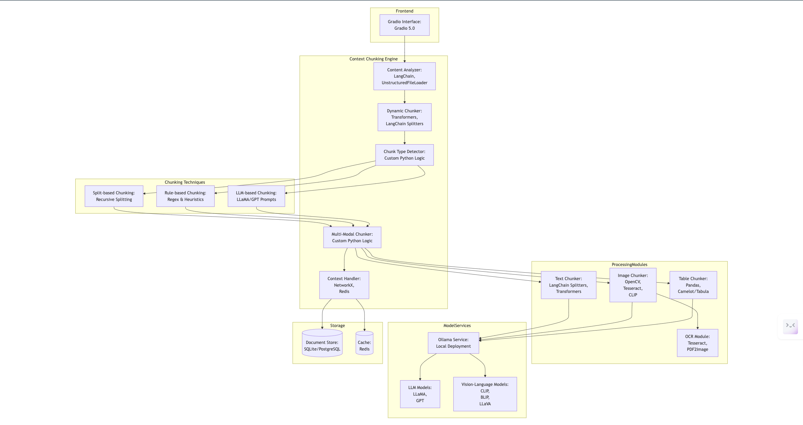

# **Contextual Chunking Engine**
## **Chunking**

### **1. Dynamic Chunk Sizing**

- **Requirement**: Adjust chunk size based on content type (e.g., technical vs. conversational) and use transformer-based context windows.
- **Technologies**:
    - **Transformers**: Hugging Face Transformers (e.g., BERT, GPT) for identifying semantic breakpoints.
    - **LangChain**: For text splitting using `RecursiveCharacterTextSplitter` or similar tools.
    - **Custom Python Logic**: For dynamic chunk size adjustment based on document type.
    - **Chunk Type Detector (CTD)**: Determines the content type (e.g., Technical, Conversational, Mixed) and routes to appropriate chunking techniques.

### **2. Multi-Modal Chunking**

- **Requirement**: Handle text, images, and tables seamlessly.
- **Technologies**:
    - **OCR for Images**:
        - Tesseract or PyTesseract for extracting text from images.
        - PDF2Image for converting PDFs with images into an analyzable format.
    - **Table Extraction**:
        - Pandas for structured data extraction.
        - Camelot or Tabula for extracting tables from PDFs.
    - **Vision-Language Models (VLMs)**:
        - Use Ollama's VLMs like LLaVA or BLIP for image understanding and context extraction.

### **3. Rule-Based, Split-Based, and LLM-Based Chunking Techniques**

- **Requirement**: Support multiple chunking techniques for better adaptability to content types.
- **Technologies**:
    - **Split-Based Chunking (SCD)**:
        - Fixed-length splitting using LangChain's `RecursiveCharacterTextSplitter`.
        - Sentence-based or paragraph-based splitting logic.
    - **Rule-Based Chunking (RBC)**:
        - Custom rules using regex and heuristics for specific patterns (e.g., code blocks, headings).
        - Ideal for technical documents or structured content like programming code.
    - **LLM-Based Chunking (LLCB)**:
        - Uses LLMs like LLaMA or GPT to identify semantic boundaries dynamically.
        - Context-aware chunking with high accuracy for complex documents (e.g., medical reports).

### **4. Integration with LLMs and VLMs**

- **Requirement**: Use Ollama to serve LLMs for text processing and VLMs for image chunking.
- **Technologies**:
    - Ollama Service: Local deployment of LLaMA models for text chunking.
    - Vision-Language Models (e.g., LLaVA, CLIP): For image-to-text conversion and context extraction.

## **Workflow**

### **1. Document Upload**

- **Requirement**: User uploads documents via a web interface.
- **Technology**:
    - Gradio 5.0: Simple Python-based web interface for uploading documents (text, images, tables).

### **2. Content Analysis**

- **Requirement**: Analyze document type (technical, conversational, or mixed).
- **Technologies**:
    - LangChain's `UnstructuredFileLoader` for loading documents.
    - Custom Python logic to classify document types based on structure and content.

### **3. Chunk Type Detection**

- **Requirement**: Detect content type and route to appropriate chunking techniques (Split-Based, Rule-Based, or LLM-Based).
- **Technologies**:
    - Custom Python Logic: Determines content type using heuristics or machine learning models.

### **4. Dynamic Chunking**

- **Requirement**: Process content using appropriate chunking techniques based on detected type.
- For Split-Based Chunking:
    - Recursive splitting into fixed-length chunks using LangChain tools.
- For Rule-Based Chunking:
    - Regex patterns and heuristics to split content into meaningful chunks (e.g., code blocks, paragraphs).
- For LLM-Based Chunking:
    - Use transformer-based models like LLaMA or GPT to identify semantic boundaries.

### **5. Multi-Modal Chunking**

- For Text:
    - Use LLMs (e.g., LLaMA via Ollama) to process text chunks while preserving semantic coherence.
- For Images:
    - Use OCR (Tesseract) to extract text from images.
    - Use VLMs (e.g., CLIP or BLIP) via Ollama for image context extraction.
- For Tables:
    - Use Pandas or Camelot/Tabula to extract structured data from tables.

### **6. Output**

- **Requirement**: Return semantically coherent chunks with cross-references between figures, tables, and text.
- **Technologies**:
    - NetworkX: To maintain relationships between chunks in a graph structure.
    - Redis Cache: To store intermediate results for faster access.

## Summarized Workflow

1. The user uploads a document via the Gradio interface 
2. The `Content Analyzer` analyzes the document structure and type .
3. The `Dynamic Chunker` routes the content to the `Chunk Type Detector` .
4. The `Chunk Type Detector` determines the content type and selects the appropriate chunking technique .
5. The selected technique processes the content into chunks and passes them to the `Multi-Modal Chunker` .
6. The `Multi-Modal Chunker` handles multi-modal content (text, images, tables) by routing it to specialized modules .
7. Text chunks are processed by LLMs via Ollama, while image chunks are processed by VLMs .
8. The `Context Handler` maintains relationships between chunks and stores them in a database with caching support .

## Technologies Overview

| Component | Technologies |
| --- | --- |
| Frontend | Gradio 5.0 |
| Content Analyzer | LangChain, UnstructuredFileLoader |
| Dynamic Chunker | Transformers, LangChain Splitters |
| Chunk Type Detector | Custom Python Logic |
| Split-Based Chunking | RecursiveCharacterTextSplitter |
| Rule-Based Chunking | Regex Patterns, Heuristics |
| LLM-Based Chunking | Hugging Face Transformers (LLaMA/GPT) |
| OCR Module | Tesseract, PDF2Image |
| Table Extraction | Pandas, Camelot/Tabula |
| Vision-Language Models | CLIP, BLIP, LLaVA |
| Context Handler | NetworkX, Redis |
| Storage | SQLite/PostgreSQL (Document Store), Redis Cache |

## Project Structure
Contextual Chunking Engine/
│
│ ├── frontend/
│ │ ├── init.py
│ │ └── app.py  # Gradio interface
│ │
│ ├── chunking_engine/
│ │ ├── init.py
│ │ ├── content_analyzer.py  # Loads documents using LangChain, etc.
│ │ ├── dynamic_chunker.py  # Handles dynamic sizing and routing
│ │ ├── chunk_type_detector.py  # Determines content type & selects technique
│ │ ├── multi_modal_chunker.py  # Merges output from techniques
│ │ └── context_handler.py  # Maintains relationships (using NetworkX, Redis)
│ │
│ ├── processing_modules/
│ │ ├── init.py
│ │ ├── text_chunker.py  # Text processing (LangChain, Transformers)
│ │ ├── image_chunker.py  # Image processing (OpenCV, Tesseract, CLIP)
│ │ ├── table_chunker.py  # Table extraction (Pandas, Camelot/Tabula)
│ │ └── ocr_module.py  # OCR functionality (Tesseract, PDF2Image)
│ │
│ ├── model_services/
│ │ ├── init.py
│ │ └── ollama_service.py  # Integrates Ollama, LLMs (LLaMA/GPT), & VLMs (CLIP, BLIP)
│ │
│ └── storage/
│ ├── init.py
│ └── database.py  # Simple document store (SQLite/PostgreSQL) and Redis Cache operations
│
├── tests/
│ └── test.py  # Basic tests covering main functionalities
│
├── requirements.txt  # Combined project dependencies
└── main.py  # Entry point for the application

## System Design

