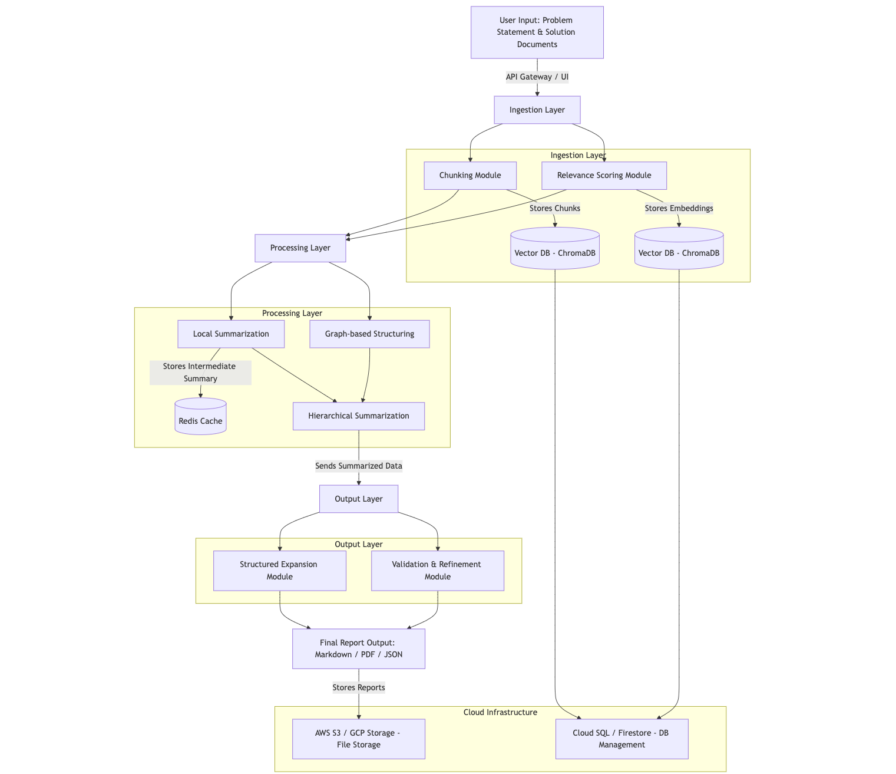

# Final Project Report: AI Assistant Development at Humanitarians AI × Stellis Labs
**January 6 - April 30, 2025**

## Executive Summary

This report documents the four-month project details with Humanitarians AI in partnership with Stellis Labs, spanning January through April 2025. During period, I contributed to five projects developing the organization's AI assistant capabilities and research infrastructure:

1. **AI Assistant Agents**: Developed specialized AI assistants (Lucy and Julia) with an orchestration system enabling seamless collaboration between different agent types.

2. **Simulation Engine**: Created a comprehensive evaluation framework for AI agents, including base architecture, replication engine, and simulation environment for testing agent performance.

3. **SuperAgent Solution Merger**: Designed an architecture to integrate disparate agent systems, focusing on modular design with adapter patterns to ensure interoperability.

4. **SuperAgent Infrastructure**: Researched and implemented key infrastructure components, including local memory systems and Model Context Protocol (MCP) integration.

5. **Deep Research Agent**: Developed a research assistant with web retrieval capabilities, RAG implementation, and report generation functionality.

Throughout the project, I delivered multiple successful demonstrations and created comprehensive documentation to ensure project sustainability.

## Project Timeline and Contributions

### AI Assistant Agents (January 6 - January 31)
- Set up development environment with Langflow, OpenWebUI, and Milvus Vector DB
- Created documentation for local system setup
- Developed Lucy (Course AI Assistant) with RAG implementation
- Built Julia (AI Flashcards Chatbot) for interactive learning support
- Implemented orchestrator agent architecture for agent communication
- Integrated shared memory system and vector databases for knowledge retrieval

#### Lucy: AI Course Chatbot
**Goal:** Build a functional AI Course Chatbot with basic RAG capabilities, LMS integration, and self-updating knowledge.

**Phase 1: Core Functionality**
- Set up RAG pipeline to ingest course materials (syllabi, textbooks, lecture notes)
- Implemented prompt-based interface for querying the chatbot
- Trained the model to answer basic questions about course content
- Tested the chatbot with sample student queries and refined accuracy
- **Outcome:** A working prototype of Lucy capable of answering questions using course materials

#### Julia: AI Flashcards Chatbot
**Goal:** Build a functional flashcard generator with concept summarization, spaced repetition, and multimedia support.

**Phase 1: Core Flashcard Generation**
- Set up pipeline to extract key concepts from course materials
- Generated concise summaries for each concept formatted as flashcards
- Implemented simple interface for students to view and interact with flashcards
- Tested the system with sample course materials and refined the output
- **Outcome:** A working prototype of Julia that generates basic flashcards from course content

### Simulation Engine (February 1 - February 28)
- Created system design documentation for simulation architecture
- Developed base agent component with modular interfaces
- Built replication engine with resource management controls
- Integrated components into a functional simulation engine MVP
- Implemented configuration import module for replicating base agents
- Created test suite and feedback analysis structure with critic agent
- Added custom inference LLM selection capability
- Integrated knowledge base RAG with real-life test prompts

#### Simulation Engine with Feedback Loops & Continuous Improvement

**Goal:** Enable large-scale testing and iterative improvement of agents through a comprehensive simulation environment.

**Key Features Implemented:**

1. **Agent Replication & Sandboxing:**
   - Created isolated replicas of agents with identical resources (LLM access, knowledge base, memory)
   - Cloned target agent's full state (prompts, configurations, LLM access)
   - Designed sandboxed environment to prevent interference with live systems
   - Integrated primary LLM (LLaMA) for replica execution and secondary "critic" LLM (DeepSeek) for feedback

2. **Feedback-Driven Improvement Loop:**
   - Used critic LLM to evaluate simulation results and identify weaknesses
   - Generated automated improvement proposals:
     - Rewritten prompts with clearer instructions
     - Adjusted configurations (temperature, token limits)
     - Recommendations for knowledge base enhancements

### SuperAgent Solution Merger (March 1 - March 14)
- Led research effort to identify integration requirements
- Created system design documentation with architecture diagrams
- Defined project structure and technology stack
- Designed modular architecture with adapter patterns
- Delivered design presentation and began MVP development

### SuperAgent Infrastructure (March 15 - March 28)
- Researched infrastructure requirements
- Implemented Model Context Protocol (MCP)
- Explored memory systems (long-term, short-term, episodic) using Mem0
- Investigated web retrieval mechanisms and search integration
- Researched unified memory interface

### Deep Research Agent (March 29 - April 25)
- Developed agent with web retrieval and report generation capabilities
- Implemented Anthropic Model Context Protocol (MCP) for deep research
- Created robust context management system
- Implemented query refinement strategies for improved search results
- Built asynchronous processing model for retrieval requests
- Developed RAG system for storing and retrieving web research results
- Created UI for problem statement input and decomposition
- Implemented content-aware chunking module
- Implemented summarization with source tracking

## Technical Architecture

### Solution Merger Module - Detailed Design

The Solution Merger Module represents a key component of the project, designed to integrate multiple solution documents into a coherent final output.

#### System Components

1. **Ingestion Layer**
   - **Chunking Module**: Splits large solutions into manageable pieces
   - **Relevance Scoring Module**: Evaluates chunks based on similarity to the problem statement

2. **Processing Layer**
   - **Local Summarization**: Compresses each chunk
   - **Graph-based Structuring**: Identifies key concepts and relationships
   - **Hierarchical Summarization**: Merges information into a coherent summary

3. **Output Layer**
   - **Structured Expansion Module**: Expands summaries into detailed sections
   - **Validation & Refinement Module**: Ensures completeness and correctness

#### Detailed Architecture 

#### Technology Stack

| Component | Technology/Model |
|-----------|------------------|
| **Chunking** | LangChain |
| **Embeddings** | sentence-transformers, nomic-ai/nomic-embed-text, mxbai-embed-large, text-embedding-ada-002 |
| **LLMs** | DeepSeek-R1, Llama 3, Mistral (small LLM) |
| **Graph Processing** | Neo4j |
| **API Framework** | FastAPI |
| **Caching** | Redis/SQLite |
| **Storage** | PostgreSQL/vectorDB (chromaDB) |

### Overall Project Architecture

The projects developed during this work follow a modular, service-oriented architecture:

1. **Agent Framework**:
   - Base agent architecture with standardized interfaces
   - RAG capabilities for knowledge retrieval and grounding
   - Orchestration layer for agent collaboration
   - LLM integration with adapter patterns for multiple model support

2. **Simulation Infrastructure**:
   - Replication engine for generating agent instances
   - Configuration management for experiment reproducibility
   - Feedback analysis system with critic agents

3. **Research Infrastructure**:
   - Model Context Protocol (MCP) implementation for tool use
   - Web retrieval and search integration
   - Content-aware chunking for efficient storage
   - Multi-stage summarization pipeline
   - Hybrid retrieval strategies for optimal information access

## Implementation Details

### RAG Implementation
Used vector embeddings with Milvus DB for efficient knowledge retrieval with context-aware chunking strategies to balance semantic understanding with storage efficiency. Applied this in both Lucy (for course material access) and the Deep Research Agent.

### Orchestration System
Implemented a state management system allowing multiple specialized agents to collaborate on complex tasks with shared memory. This enabled Lucy providing course content understanding and Julia generating flashcards from the same knowledge base.

### MCP Integration
Developed a client-server architecture using Anthropic's Model Context Protocol to enable tool use for web retrieval and complex reasoning tasks. This was crucial for the Deep Research Agent's capabilities.

### Memory Systems
Researched unified memory interface supporting multiple memory types (short-term, long-term, episodic) to improve context retention across conversations. Implemented in the SuperAgent Infrastructure to enhance context awareness.

### Web Retrieval
Created architecture with query refinement strategies to optimize search results while respecting API constraints. This powered the Deep Research Agent's ability to gather and synthesize information from various sources.

### Simulation Workflow
Developed a comprehensive simulation workflow consisting of:
1. **Setup**: Replicating target agents with access to resources (LLM, KB, STM)
2. **Simulation**: Running agents on domain-specific test cases with logging
3. **Feedback**: Using critic LLM to evaluate performance and provide improvement suggestions
4. **Improvement**: Refining prompts, adjusting configurations, and optimizing knowledge base access
5. **Save and Deploy**: Versioning improved agents and deploying for further testing or integration

## Challenges and Solutions

### Integration Challenges
- **Challenge**: Complex integration requirements between different agent architectures led to compatibility issues.
- **Solution**: Implemented modular design with adapter patterns to standardize interfaces.

### RAG Performance
- **Challenge**: Performance bottlenecks in RAG implementation with large knowledge bases.
- **Solution**: Implemented chunking and indexing optimizations to improve retrieval.

### Context Retention
- **Challenge**: Initial performance showed issues with context retention.
- **Solution**: Implemented specific memory system and improved context management.

### Web Retrieval Quality
- **Challenge**: Web retrieval quality varied based on search queries and sources.
- **Solution**: Implemented query refinement strategies and content-aware filtering.

## Results and Impact

### Successful Project Deliveries
- Completed and documented AI assistant agents with orchestration
- Delivered comprehensive evaluation framework for systematic testing
- Implemented key infrastructure components including MCP integration
- Created research assistant with web retrieval capabilities

### Demonstrations
- Conducted multiple successful stakeholder demonstrations
- Received positive feedback on web retrieval integration
- Demonstrated MCP server/client setup, highlighting architectural flexibility

### Documentation
- Created comprehensive technical documentation for projects
- Organized project assets and code for future reference

## Skills Acquired

### Technical Skills
- Advanced prompt engineering, RAG implementation, and agent orchestration
- System design, modular architecture, and integration patterns
- API integration, web retrieval methods, and content processing
- MCP implementation, memory systems, and scalable architectures
- Technical documentation and architecture diagramming

### Professional Skills
- Project management, timeline management, and resource allocation
- Technical presentations, stakeholder demonstrations, and team collaboration
- Complex system debugging, performance optimization, and architecture refinement
- Technical research methodologies and technology evaluation
- Leading research efforts and cross-team collaboration

## Recommendations for Future Work

### Technical Recommendations
1. **Web Retrieval Optimization**: Further refine ranking algorithms for improved research quality, incorporating domain-specific knowledge.

2. **Enhanced Memory Systems**: Expand memory systems to handle more complex interaction patterns, including temporal awareness.

3. **MCP Tool Expansion**: Develop additional specialized tools for the MCP framework for specific research needs.

4. **Evaluation Framework**: Integrate comprehensive evaluation metrics for continuous agent improvement.

5. **Knowledge Base Expansion**: Enhance RAG systems with more sophisticated information retrieval mechanisms.

### Process Recommendations
1. **Documentation Templates**: Create standardized templates for technical specifications.

2. **Performance Monitoring**: Implement continuous monitoring of agent performance metrics.

3. **User Feedback Loop**: Establish formal mechanisms for collecting and incorporating user feedback.

4. **Knowledge Sharing**: Continue regular knowledge transfer sessions.

5. **Cross-Team Collaboration**: Maintain close collaboration between research and engineering teams.

## Conclusion

This project with Humanitarians AI × Stellis Labs provided valuable experience in developing cutting-edge AI assistant systems with real-world applications. The projects undertaken represent significant advancements in agent architecture, simulation capabilities, and research infrastructure.

The skills gained and lessons learned throughout this project have not only contributed to the organization's mission but have also provided a solid foundation for future professional growth in the AI field.
