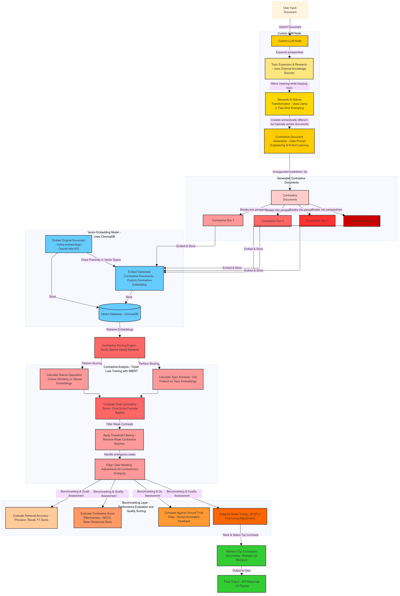

# Bi-Weekly Report 2
**Name**: Samhita Kolluri   
**Date Range**: February 13 - February 27, 2025

## Summary of Work Completed
- Finalized the **five-layer modular architecture** for the Contrastive Ideas Search Module, incorporating LLM generation, document structuring, dual-vector embedding, contrastive scoring, and benchmarking layers.
- Defined clear **interfaces and data flow contracts** between system components to enable independent development and testing.
- Created initial placeholder modules with function stubs and internal docstrings:
  - `llm_handler.py` → for LLM-based contrastive text generation.
  - `vectorizer.py` → for dual embedding (topic + stance) generation.
  - `contrastive_score.py` → for calculating final contrastive relevance scores.
- Authored `docs/system_design.md` and integrated the system pipeline diagram to visualize component interactions and handoffs.

## Challenges Encountered
**Challenge 1:**  
Designing a modular system that distinctly separates **topic relevance** and **stance opposition**, while keeping the architecture efficient and scalable.

**Solution 1:**  
Planned a two-stage hybrid embedding strategy:
- Used `mixedbread-ai/mxbai-embed-large-v1` to compute topic-aligned embeddings.
- Proposed a second embedding stream (stance) using a fine-tuned contrastive model.
- Designed the pipeline to **filter candidates by topic** in the first pass and **rank by opposition** in the second pass, enforcing clean separation of concerns.

## Goals for the Next Two Weeks
- Begin implementing `llm_handler.py` for contrastive document generation.
- Integrate sentence transformer for generating dual embeddings (topic + stance).
- Set up basic ChromaDB schema for multi-vector storage.

## Hours Contributed During this Period
40 hours
