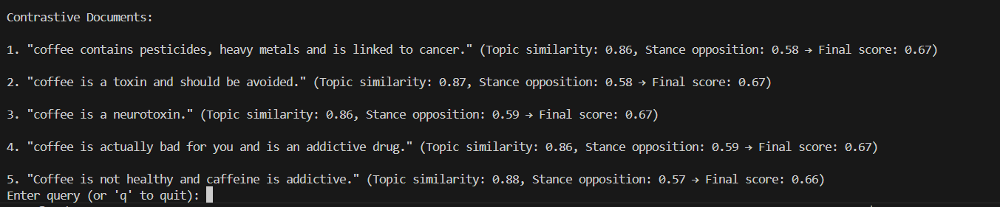

# Bi-Weekly Report 7
**Name**: Samhita Kolluri   
**Date Range**: April 24 - May 02, 2025

## Summary of Work Completed
- Finalized project deliverables, including:
  - `Final_Report.md`: comprehensive report documenting the system design, model training, contrastive scoring, and results.
  - `README.md`: updated with installation steps, system architecture, usage instructions, and model links.
  - Architecture diagrams added to `/docs` and linked within project documentation.
- Completed clean-up of all source code modules and ensured function-level documentation was in place.
- Created a reproducible demo showcasing the full contrastive retrieval flow — from input prompt to ranked contrasting outputs.

## Final Deliverables

- Hugging Face Model: [`llama-contrastive-module-stance`](https://huggingface.co/Samhita-kolluri/llama-contrastive-module-stance)  
- Medium Article: [**Devil’s Advocating into NLP: Building a Contrastive Ideas Search Module**](https://medium.com/@samhitakolluri/devils-advocating-into-nlp-contrastive-search-stance-ai-logic-explained-2b79caa71b54)  
- Live Demo (GitHub + Notebook): [**Contrastive Ideas Search Module Demo**](https://www.youtube.com/watch?v=zM32nVTdbbo)

---
**Input**:
"Coffee is healthy"

**Output**:

## Hours Contributed During this Period
20 hours
