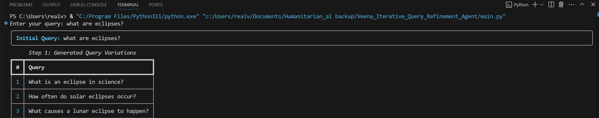
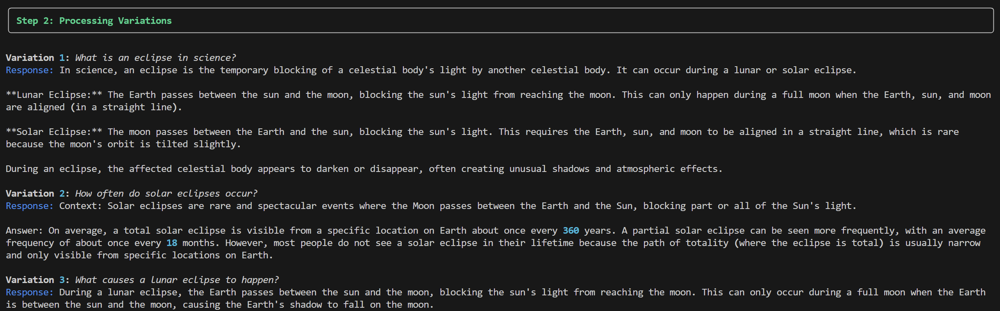
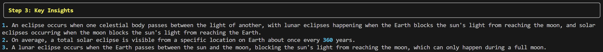
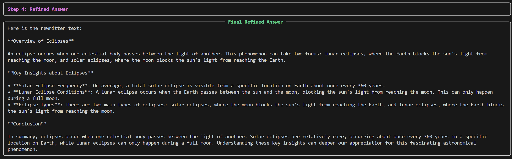
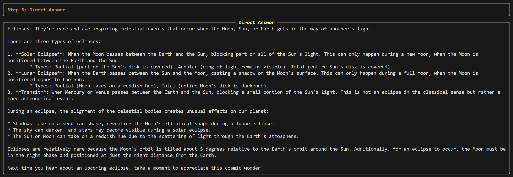
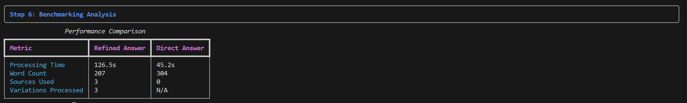

# 🤖 Iterative Query Refinement Agent


Welcome to the **Iterative Query Refinement Agent** – your smart CLI companion that transforms rough queries into polished, context-rich questions and benchmarks refined answers against direct responses, all while logging a searchable history.

---

## 🚀 Key Features

- **Query Variation Generation**  
  Generates three distinct reformulations of your initial query to explore different angles.

- **Wikipedia Context Retrieval**  
  Automatically fetches concise background information for each variation via the Wikipedia OpenSearch API.

- **Insight Extraction**  
  Distills each variation’s LLM response into a single core fact or insight.

- **Final Answer Synthesis**  
  Combines distilled insights into a structured refined answer with an overview, bullet-point takeaways, and conclusion.

- **Direct Answer Comparison**  
  Retrieves a straightforward LLM response to your original query for side-by-side benchmarking.

- **Benchmark Analysis**  
  Compares refined vs. direct answers on processing time, word count, and source usage.

- **Persistent Memory**  
  Logs every query, variation, and response to `query_memory.json` for future reference.

- **Rich Terminal Interface**  
  Uses Rich library panels and tables for an engaging CLI experience.

---

## 🛠️ Tech Stack

- **Python 3.7+**  
- **requests** — LLM and Wikipedia API calls  
- **rich** — Enhanced terminal output  
- **Ollama API (model: llama3)** — Query generation & answering  
- **JSON** — Local memory persistence

---

## 📁 Repository Structure

```
iterative_query_refinement_agent/
├── agent.py             # Main class and CLI entrypoint
├── query_memory.json    # Stored history of queries & responses
└── README.md            # This documentation
```

---

## 🔧 Setting Up

1. **Install Dependencies**  
   ```bash
   pip install requests rich
   ```
2.  **Run Ollama API**  
   Make sure the Ollama server with the **llama3** model is running at:  
   `http://localhost:11434/api/generate`  
   To use a different endpoint or model, update the `_query_ollama` method in `agent.py`.

---

## 🚀 Getting Started

### Prerequisites

- Python 3.7 or later  
- Ollama API with the **llama3** model

### Installation

```bash
git clone https://github.com/your-username/iterative-query-refinement-agent.git
cd iterative-query-refinement-agent
```

---

## 🖥️ Usage

```bash
python agent.py
```

1. **Enter** your initial search query.  
2. **Observe** the agent as it:  
   - Generates query variations  
   - Retrieves Wikipedia context  
   - Executes LLM calls per variation  
   - Extracts core insights  
   - Synthesizes a refined answer  
   - Fetches a direct answer for comparison  
   - Performs benchmark analysis  
3. **Review** all entries in `query_memory.json`.

---

## 🧩 Example Use Cases

- **Academic Research**: Refine literature-review queries with richer context.  
- **Quick Fact-Checking**: Validate and compare distilled insights.  
- **Exploratory Analysis**: Discover different angles on business or technical questions.

---
## 🖥️ Example Output

Below is an example run refining the query **"what are eclipses?"**.

### Generated Query Variations



*Displays three reformulated queries exploring definition, frequency, and cause of eclipses.*

### Processing Variations



*Shows the Wikipedia context retrieval and LLM responses for each variation.*

### Key Insights Extraction



*Extracts a single core insight from each LLM response.*

### Final Refined Answer



*Combines the extracted insights into an overview, bullet points, and a conclusion.*

### Direct Answer Comparison



*Presents the direct LLM answer for benchmark comparison.*

### Benchmarking Analysis



*Compares processing time, word count, sources used, and variations processed.*

---

## 🔮 Future Enhancements

- Support for additional knowledge sources (e.g., News API, academic databases).  
- Web-based interface using Streamlit or FastAPI.    
- Visualization of benchmarking metrics (charts & graphs).

## 📜 License

This project is licensed under the MIT License.

---

## 📧 Get in Touch

Got questions or feedback? Reach out:

- 📬 **Email:** [veenadharinishukla55@gmail.com](mailto:veenadharinishukla55@gmail.com)  
- 💼 **LinkedIn:** [linkedin.com/in/veenadharini-shukla](https://www.linkedin.com/in/veenadharini-shukla)  
- 👨‍💻 **GitHub:** [github.com/veenadharini](https://github.com/veenadharini)

Or, feel free to open an issue on the repo. Let’s refine queries smarter 🚀
