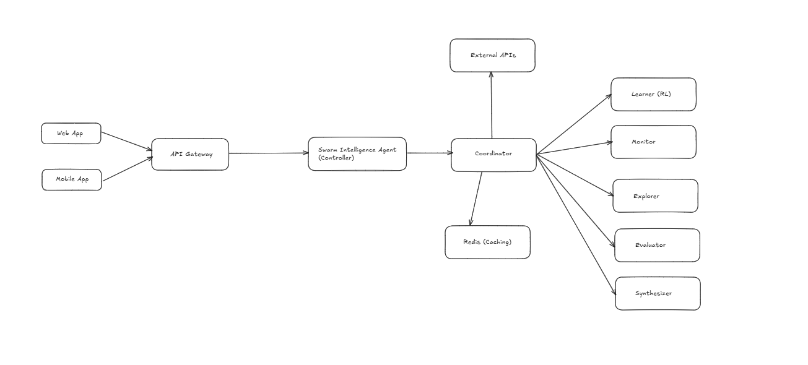
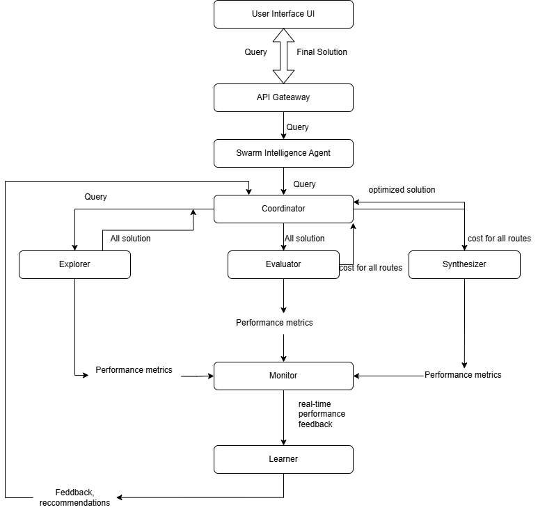

# 🧠 Swarm Intelligence Agent

A modular, AI-powered system that mimics swarm behavior (like ants and birds) to **explore**, **evaluate**, and **synthesize** optimal solutions using the Gemini API and reinforcement learning. Ideal for dynamic problem-solving environments where performance, scalability, and real-time feedback are key.

---

## 📌 Features

- ✅ **Swarm Architecture**: Inspired by collective intelligence
- ⚙️ **Non-Colinear Execution**: Parallel processing via independent agents
- 🚀 **Reinforcement Learning (RL)**: Adaptive performance improvement
- 🔄 **Continuous Feedback Loop**: Real-time self-learning
- 💾 **Redis Integration**: Caching for faster responses

---

## 🧱 System Architecture

### 🔹 Block Diagram



### 🔹 Flow Diagram



---

## 🧪 Components

| Component             | Description                                                                 |
|----------------------|-----------------------------------------------------------------------------|
| `UI` (Streamlit)     | Takes user input, displays final output                                     |
| `API Gateway`        | Routes query from UI to the Swarm Agent                                     |
| `SwarmIntelligenceAgent` | Main orchestrator                                                         |
| `Coordinator`        | Manages tasks to/from worker agents                                         |
| `Explorer`           | Uses Gemini API to find all possible solutions                              |
| `Evaluator`          | Scores each solution using Gemini-suggested metrics                         |
| `Synthesizer`        | Chooses top-N and combines them into an optimal response                    |
| `Monitor`            | Logs agent performance                                                      |
| `Learner`            | Reinforces learning via real-time feedback                                  |
| `Redis`              | Stores frequently used solutions to improve response time                   |

---

## 🛠️ Technologies Used

| Layer       | Tech                     |
|------------|--------------------------|
| UI         | Streamlit                |
| Backend    | Python, FastAPI          |
| AI/ML      | Gemini API, RL (Q-Learning) |
| Storage    | Redis (In-memory caching)|
| Versioning | Git, GitHub              |

---

## 🧪 How It Works

1. **User** submits a query via the UI.
2. The **API Gateway** routes it to the **Swarm Intelligence Agent**.
3. The **Coordinator** delegates:
    - **Explorer** → generates multiple potential solutions.
    - **Evaluator** → assigns scores based on relevance and constraints.
    - **Synthesizer** → selects top-N and combines for optimal result.
4. The **Monitor** collects performance metrics.
5. The **Learner** updates strategies using real-time feedback.
6. **Redis** caches previous queries and solutions for speed.
7. Final result is returned to the user.

---

## ▶️ Running the App (via Streamlit)

### 1️⃣ Clone the Repository

```bash
git clone https://github.com/stellis-labs/Agents.git
cd Agents/Swarm_Intelligence_Agent
```
### 2️⃣ Install Dependencies
```bash
pip install -r requirements.txt
```
### 3️⃣ Set Up Environment Variables
 - Create a .env file in the root folder with your Gemini API key:
```bash
GEMINI_API_KEY=your_api_key_here
```
### 4️⃣ Run Streamlit Interface
```bash
streamlit run streamlit.py
```
### 📦 Example (Python)
```bash
problem = "Optimize better way to travel from Boston to New York City"
constraints = "Must be cost-effective and relatively quick."

agent = SwarmIntelligenceAgent(problem, constraints)
final_result = agent.solve()

print(final_result)
```

### GitHub Repository
