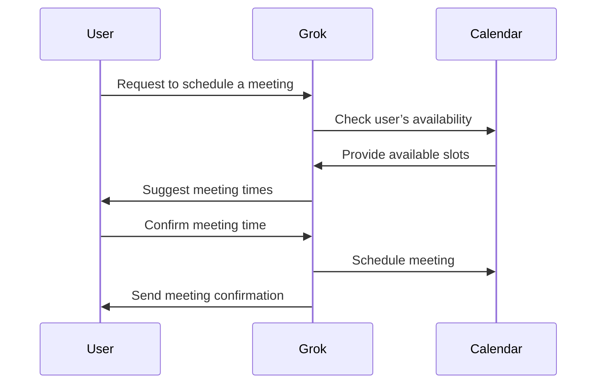
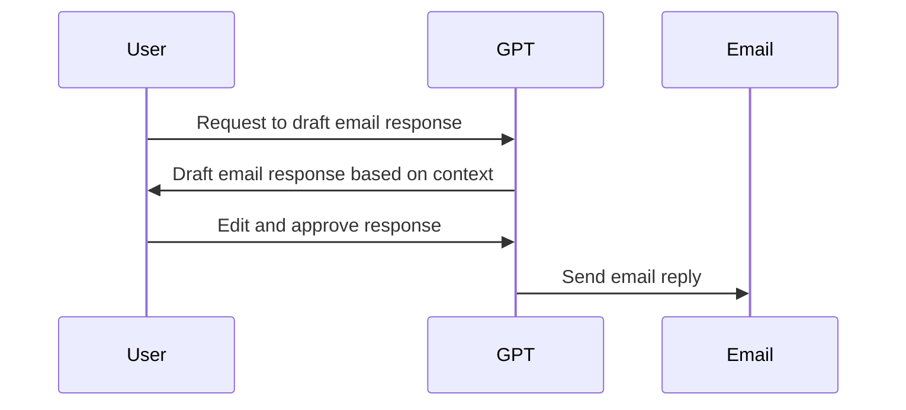
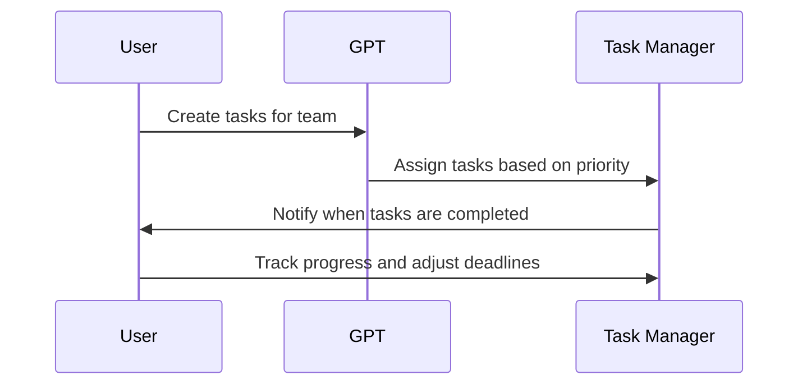
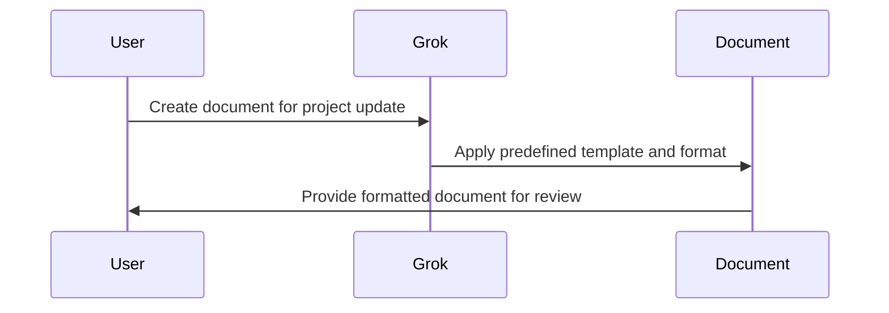

In today’s fast-paced world, managing administrative tasks can be both overwhelming and time-consuming. Whether you are scheduling meetings, responding to emails, or handling document management, these mundane yet essential tasks can take up significant portions of your day. The good news is that advancements in Artificial Intelligence (AI) have introduced powerful virtual assistants, such as **Grok** and **custom GPTs**, which can seamlessly handle administrative work, automate routine tasks, and enhance productivity.

In this blog, we’ll explore how AI-powered virtual assistants can transform administrative work, focusing on their ability to manage tasks like scheduling, email management, document formatting, and much more.

## Why Use AI-Powered Virtual Assistants for Administrative Work?

AI-powered virtual assistants offer several benefits when it comes to handling administrative tasks:

- **Time Savings:** Automate repetitive tasks, freeing up time for higher-value work.
- **Error Reduction:** Minimize human errors in tasks like scheduling, data entry, and email communication.
- **24/7 Availability:** AI assistants can work around the clock, handling tasks at any time.
- **Customization:** Tailor virtual assistants to meet your unique workflow requirements and improve efficiency.
- **Better Decision Making:** AI can analyze and process information faster, assisting with decision-making tasks.

Let’s take a closer look at two AI-powered virtual assistants—**Grok** and **Custom GPTs**—and how they can transform your administrative workflow.

## 1. **Grok: The Ultimate AI Assistant for Administrative Tasks**

**Grok**, an AI-powered virtual assistant, is designed to handle a wide range of administrative tasks. It is known for its deep learning capabilities and can integrate seamlessly with different platforms to help streamline your operations. Grok is particularly useful for scheduling meetings, handling document tasks, managing emails, and even assisting with customer service.

### How Grok Works

- **Scheduling and Calendar Management:** Grok syncs with your calendar and can schedule meetings based on your availability. It also handles rescheduling and sends reminders.
- **Email Management:** Grok can automate responses to common queries, flag important emails, and categorize incoming messages for easier management.
- **Document Management:** It can create, format, and organize documents, saving you the hassle of manually editing and updating files.
- **Task Management:** Grok can create, assign, and track tasks, ensuring that nothing is missed and deadlines are met.

#### Benefits of Using Grok:
- **Reduced Cognitive Load:** You can focus on strategic tasks while Grok handles repetitive ones.
- **Seamless Integration:** Grok works with popular tools such as Google Calendar, Microsoft Office, and Slack, integrating into your existing workflow.
- **Proactive Assistance:** Grok can anticipate your needs, automatically scheduling meetings and sending reminders without you needing to ask.

**Example of Automating Tasks with Grok:**

[**Grok**](https://www.openai.com/grok)

## 2. **Custom GPTs: Tailored AI Assistants for Your Workflow**

**Custom GPTs** offer a more flexible solution for automating administrative work. These AI assistants are based on OpenAI’s GPT models but can be customized to fit your specific needs. You can create GPT-based assistants for various administrative tasks such as data entry, document processing, content creation, and more.

### How Custom GPTs Work

Custom GPTs are designed to be adaptable to a wide range of administrative tasks. Some use cases include:

- **Email Drafting and Response:** Create a custom GPT that understands your communication style and automatically drafts responses to emails based on the subject and context.
- **Meeting Scheduling:** Customize a GPT to automate meeting scheduling based on specific parameters, such as participant preferences, meeting length, and preferred time zones.
- **Report Generation:** A custom GPT can assist in generating detailed reports, pulling data from various sources and formatting them according to your specifications.

#### Benefits of Using Custom GPTs:
- **Highly Customizable:** Tailor the assistant to your unique business needs, making it more relevant and efficient.
- **Scalable:** As your administrative workload grows, custom GPTs can be scaled to handle more tasks.
- **Cost-Effective:** Compared to hiring additional administrative personnel, GPT-based assistants are a more affordable solution.

**Example of Automating Email Responses with Custom GPT:**

[**Custom GPT**](https://platform.openai.com/docs/guides/gpt)

## 3. **Task Management with AI Assistants**

AI-powered virtual assistants like Grok and Custom GPTs are also excellent at managing and organizing tasks. Whether it’s assigning projects, tracking deadlines, or sending reminders, these tools help keep everything on track.

### How AI Helps in Task Management:
- **Automating Task Assignments:** AI assistants can automatically assign tasks based on team members' availability and workloads.
- **Tracking Progress:** They can send reminders, track progress, and even escalate tasks if they’re falling behind.
- **Prioritization:** AI assistants help prioritize tasks based on deadlines and project importance, ensuring that critical work gets done on time.

#### Example of Task Management Automation:

[**Trello**](https://trello.com)  
[**Asana**](https://asana.com)

## 4. **Managing Documents and Data with Grok and GPTs**

Another essential administrative task that can be automated with AI is document management. AI assistants can generate, format, and organize documents, saving you time and effort. This includes tasks like:

- **Document Generation:** Grok and GPTs can create documents based on templates, filling in the necessary details automatically.
- **Formatting:** These assistants can format documents, ensuring consistency in font size, headings, and layout.
- **Organizing:** AI can organize files by categories, ensuring quick retrieval of important documents.

#### Example of Automating Document Formatting:

[**Google Docs**](https://www.google.com/docs)  
[**Microsoft Word**](https://www.microsoft.com/word)

## 5. **The Future of AI in Administrative Work**

The future of AI-powered virtual assistants in administrative work is incredibly promising. With continual advancements in machine learning and natural language processing, AI assistants will only become more intuitive and capable of handling a broader range of tasks.

### Possible Future Applications:
- **Personalized Virtual Assistants:** AI that understands your preferences, work habits, and communication style, providing a more personalized experience.
- **Advanced Decision Support:** AI assistants that not only handle tasks but also help in making decisions by analyzing data and offering recommendations.
- **Automated Collaboration:** Virtual assistants that can automatically facilitate collaboration between team members, scheduling meetings and managing shared tasks.

## Conclusion

AI-powered virtual assistants like **Grok** and **Custom GPTs** are revolutionizing administrative work. From scheduling meetings and managing emails to organizing documents and generating reports, these virtual assistants automate tasks that typically consume a lot of time. By incorporating AI into your administrative processes, you can significantly boost productivity, reduce human errors, and free up time for more critical activities. Whether you are an individual professional or part of a large team, AI assistants are becoming essential tools in modern workplace efficiency.
