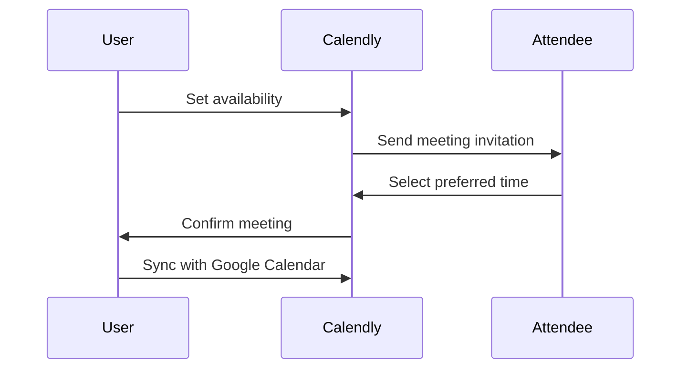
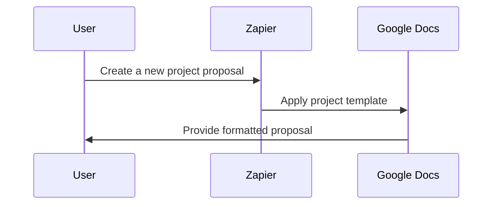
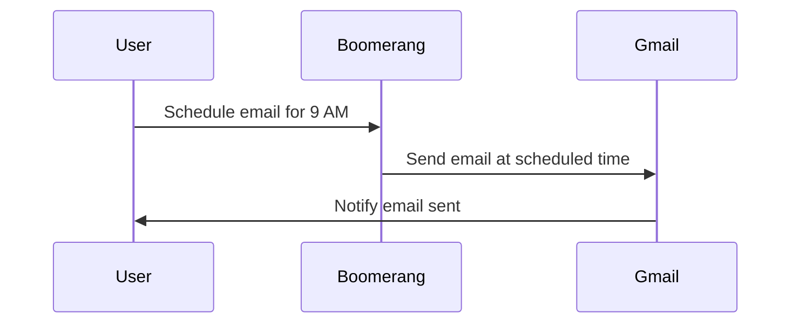
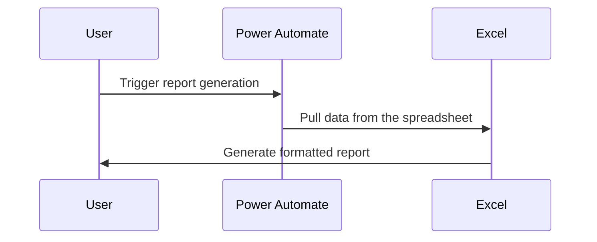
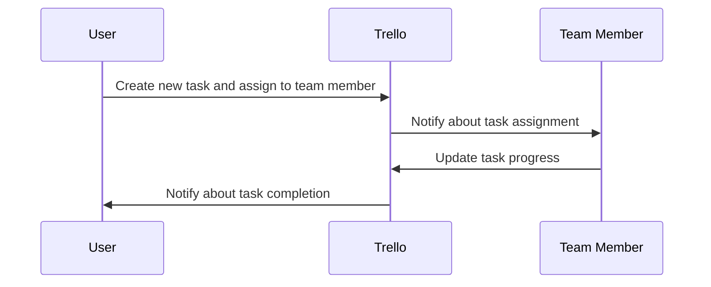

Administrative tasks, while essential for keeping businesses and organizations running smoothly, are often time-consuming and repetitive. Tasks like scheduling meetings, formatting documents, or managing emails can easily take up a significant portion of your workday, leaving little time for more strategic work. Fortunately, with the rise of AI and automation tools, it’s now easier than ever to streamline these repetitive tasks and free up valuable time for more important activities.

In this blog, we’ll explore how automation can transform administrative work, focusing on tasks like scheduling, document formatting, email management, and more. By leveraging powerful automation tools, you can increase productivity, reduce errors, and reclaim time for high-priority projects.

## Why Automate Administrative Tasks?

Administrative tasks, though necessary, can often be mundane and mentally taxing. They include activities such as:

- Scheduling meetings and appointments.
- Formatting and organizing documents.
- Managing emails and reminders.
- Handling data entry and organizing spreadsheets.
- Generating reports and summaries.

These tasks can be repetitive, leading to burnout and inefficiency over time. Automation helps eliminate manual work, reduce human errors, and ensure consistency. By automating administrative processes, you can:

- **Save Time:** Automate routine tasks to focus on more strategic responsibilities.
- **Reduce Errors:** Automate repetitive processes to reduce human errors.
- **Improve Efficiency:** Ensure that workflows are consistent and processes are completed on time.
- **Enhance Collaboration:** Spend less time on administrative tasks and more time collaborating with your team.

## 1. **Automating Scheduling and Appointments**

Scheduling meetings is often a manual and tedious process, especially when coordinating with multiple people across different time zones. Tools like **Calendly** and **Doodle** automate the scheduling process by syncing with your calendar and providing participants with available time slots to choose from.

### How It Works

- **Calendly** allows users to set their availability, automatically suggesting meeting times to others. When someone schedules a meeting, it automatically syncs with your calendar.
- **Doodle** enables users to create polls where participants can select their available times, helping to streamline the decision-making process.

#### Benefits:
- No more back-and-forth emails to find suitable meeting times.
- Integration with calendars (Google Calendar, Outlook, etc.) for real-time availability updates.
- Automatic reminders and rescheduling.

**Example of Automating Scheduling with Calendly:**

[**Calendly**](https://calendly.com)  
[**Doodle**](https://doodle.com)

## 2. **Automating Document Formatting**

Formatting documents is another area where automation can be a real game-changer. Whether it’s ensuring consistent fonts, adjusting margins, or creating standardized headers and footers, automating the formatting process saves you time and ensures consistency.

### Tools to Automate Document Formatting:
- **Grammarly**: While it's widely known for grammar checking, it also helps with formatting by offering suggestions for sentence structure, style, and clarity.
- **Zapier**: By connecting tools like Google Docs and Microsoft Word with other apps (e.g., Google Sheets, Trello), you can automate formatting tasks such as generating standardized reports, creating presentation slides, or formatting project proposals.

#### Example of Automating Document Formatting with Zapier:

[**Zapier**](https://zapier.com)  
[**Grammarly**](https://www.grammarly.com)

## 3. **Automating Email Management**

Emails can pile up quickly, especially when you're handling multiple clients or managing a team. **Email automation tools** like **Mailchimp**, **Outlook’s Quick Steps**, or **Boomerang** for Gmail can help streamline email responses, follow-ups, and management.

### How It Works:
- **Mailchimp** automates email campaigns, sends follow-up emails, and tracks user engagement, freeing up your time from having to send individual emails.
- **Outlook’s Quick Steps** allows you to automate repetitive email actions such as moving emails to folders, sending replies, or creating new tasks.
- **Boomerang for Gmail** lets you schedule emails, set reminders for follow-ups, and automate responses.

#### Benefits:
- Automates repetitive responses and emails.
- Schedules emails to be sent at optimal times.
- Sets reminders for important follow-up tasks.

**Example of Automating Emails with Boomerang:**

[**Boomerang**](https://www.boomeranggmail.com)  
[**Mailchimp**](https://mailchimp.com)

## 4. **Automating Data Entry and Report Generation**

Data entry and report generation can be time-consuming, especially if the data comes from multiple sources. Automating these tasks ensures accurate, consistent, and timely reports.

### Tools for Data Entry Automation:
- **Zapier**: Use Zapier to connect data sources (like Google Sheets, Salesforce, or Trello) to automate data entry tasks. You can set up workflows that automatically transfer data from one platform to another, reducing the need for manual updates.
- **Microsoft Power Automate**: This tool allows users to automate workflows across multiple apps, such as pulling data from spreadsheets, updating CRM systems, or generating weekly reports.

#### Benefits:
- Reduces human error in data entry.
- Automatically generates weekly, monthly, or quarterly reports.
- Saves hours of manual data manipulation.

**Example of Automating Report Generation with Power Automate:**

[**Power Automate**](https://flow.microsoft.com)  
[**Zapier**](https://zapier.com)

## 5. **Automating Task Management**

Task management is essential for staying organized, but manually tracking tasks can become overwhelming. Tools like **Trello** and **Asana** can automate the creation of tasks, assignments, and reminders, ensuring that you and your team stay on top of deadlines.

### How It Works:
- **Trello** automates task assignments and sends notifications when tasks are due.
- **Asana** lets you create recurring tasks and automatically assign them to team members.
- **Monday.com** can trigger task updates, progress tracking, and notifications, all based on your predefined workflow.

#### Benefits:
- Automates task creation and assignment.
- Sends notifications and reminders for upcoming deadlines.
- Tracks task progress and completion.

**Example of Automating Task Management with Trello:**

[**Trello**](https://trello.com)  
[**Asana**](https://asana.com)

## Conclusion

Automating repetitive administrative tasks such as scheduling, document formatting, email management, and task creation allows you to reclaim precious time and focus on higher-value work. With tools like **Calendly**, **Zapier**, **Grammarly**, **Boomerang**, and **Microsoft Power Automate**, businesses can streamline their workflows, reduce errors, and improve productivity.

By embracing automation, companies can not only enhance internal efficiency but also create a better work-life balance for employees, allowing them to spend more time on creative, strategic, and impactful projects.
