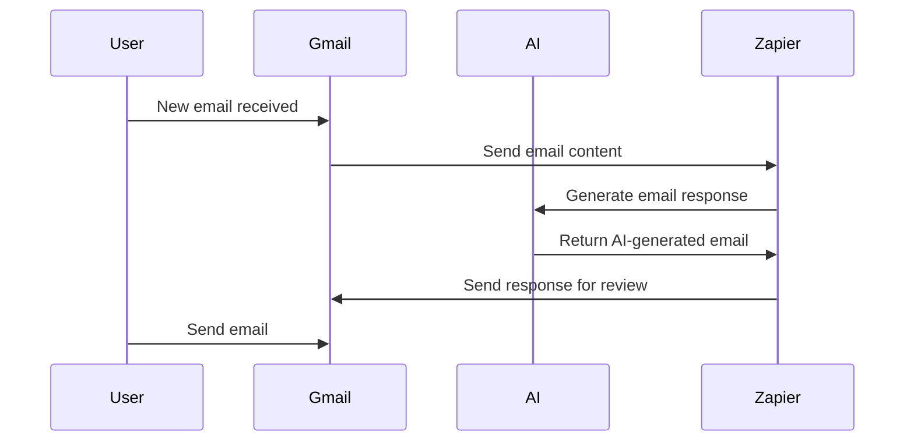
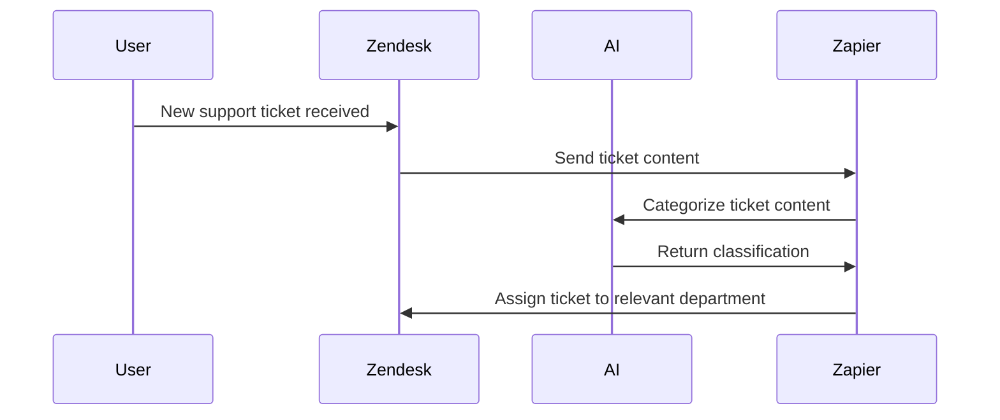
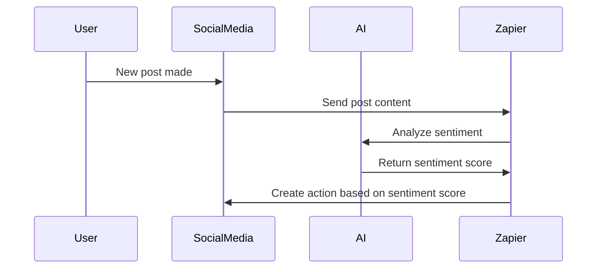
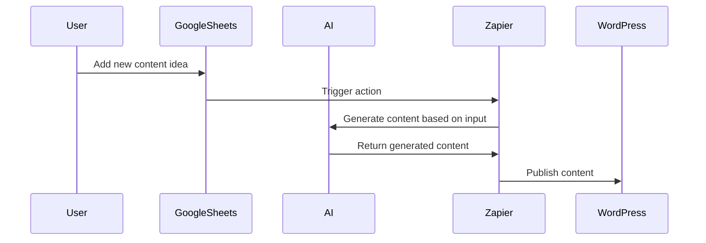

In today’s digital landscape, we rely on a multitude of tools to manage everything from communication to data storage, customer management, and content creation. While each tool excels in its own domain, the real challenge lies in making them work together efficiently. This is where **Zapier** and **AI integrations** come in. With Zapier, you can automate workflows across a wide variety of apps and tools, and when combined with AI, the possibilities for streamlining tasks become even more powerful.

In this blog, we’ll explore how integrating Zapier with AI can supercharge your workflow, saving you time, reducing manual effort, and improving efficiency.

## What is Zapier?

**Zapier** is an automation tool that allows you to connect different apps and automate workflows between them, known as "Zaps." These Zaps consist of a **trigger** (an event that starts the workflow) and an **action** (what happens as a result of the trigger). For example, if you receive a new email, you can set up a Zap to automatically save the attachment to Google Drive or send an alert in Slack.

Zapier supports integrations with over **5,000 apps**, including Google Suite, Slack, Microsoft 365, Salesforce, and many more, making it one of the most versatile automation tools available.

## How AI Integrations Enhance Zapier Workflows

By integrating **AI-powered tools** with Zapier, you can automate not just routine tasks, but also complex processes that require data analysis, decision-making, and natural language understanding. Let’s look at how Zapier’s integration with AI can supercharge your workflow.

### Key Benefits of Zapier + AI Integrations:

- **Time Savings:** Automate complex workflows, reducing manual effort and freeing up time for more strategic work.
- **Increased Productivity:** AI can handle data-driven tasks such as categorizing content, analyzing customer interactions, and generating reports, which traditionally took much longer to do manually.
- **Improved Accuracy:** AI can analyze large datasets, make decisions based on patterns, and reduce the likelihood of human error.
- **Seamless Integration Across Platforms:** Zapier integrates with a wide range of tools, and when combined with AI, it allows you to automate tasks between apps that may otherwise not communicate with each other.

## How to Use Zapier with AI: Examples of Powerful Integrations

Let’s explore a few examples of how **Zapier + AI integrations** can optimize your workflow, with real-world scenarios to demonstrate their effectiveness.

### Example 1: Automating Email Responses Using Zapier and AI

AI-powered tools like **OpenAI's GPT models** can generate human-like text for tasks like drafting emails. With Zapier, you can create a workflow that automatically drafts responses based on email content, providing a personalized touch with minimal input from you.

#### Steps:
1. **Trigger:** A new email is received in Gmail.
2. **Action:** Zapier sends the email’s content to an AI model (like GPT-4) to draft a response.
3. **Action:** The AI-generated response is sent back to Gmail for review and sending.

This workflow streamlines communication, saving time and ensuring consistent, high-quality responses without the need for constant manual intervention.

[**Demo Link**](https://zapier.com/apps/openai/integrations)

### Example 2: Automatically Categorizing Customer Inquiries with AI and Zapier

Another common use case is categorizing customer inquiries automatically. Using AI-driven text classification models, you can set up a Zap to analyze customer emails or support tickets and categorize them by topic, urgency, or sentiment. This helps in routing the inquiries to the appropriate team members and ensuring that no important issues are overlooked.

#### Steps:
1. **Trigger:** A new support ticket is created in Zendesk or an email is received.
2. **Action:** Zapier sends the content to an AI tool (like **Google Cloud Natural Language API** or **OpenAI’s GPT**), which categorizes the inquiry based on its sentiment or topic.
3. **Action:** Based on the classification, Zapier assigns the ticket to the relevant department or team member.

This integration helps you quickly categorize incoming support requests and prioritize urgent or critical tickets, improving the response time and efficiency of your support team.

[**Demo Link**](https://zapier.com/apps/google-cloud-natural-language/integrations)

### Example 3: Streamlining Social Media Management with Zapier and AI

Social media managers often juggle multiple platforms, responding to comments, scheduling posts, and analyzing engagement metrics. By integrating **AI-based tools** for content generation and sentiment analysis, Zapier can help automate these tasks and improve social media strategy.

#### Steps:
1. **Trigger:** A new social media post is made on Instagram or Twitter.
2. **Action:** Zapier sends the post content to an AI tool for sentiment analysis.
3. **Action:** Based on the sentiment score, Zapier can create a report or send a follow-up action like responding to positive comments or flagging negative ones for review.

This workflow allows social media managers to focus on high-priority tasks while AI handles the heavy lifting in sentiment analysis and engagement tracking.

[**Demo Link**](https://zapier.com/apps/twitter/integrations)

### Example 4: Automating Content Creation for Blogs or Newsletters

AI-powered tools like **Copy.ai** or **Jasper** can generate blog posts, articles, or newsletters based on a few keywords or a content brief. Zapier can help automate the process by connecting content management platforms with AI, creating consistent and high-quality content without manual input.

#### Steps:
1. **Trigger:** A new content idea is added to a Google Sheet or Trello.
2. **Action:** Zapier sends the idea to an AI tool (like Jasper or Copy.ai).
3. **Action:** The AI generates content and sends it back to the content platform (e.g., WordPress) for publishing.

This setup speeds up the content creation process, ensuring a steady flow of blog posts and newsletters without additional effort.

[**Demo Link**](https://zapier.com/apps/jasper/integrations)

## The Future of Zapier + AI Integrations

The potential of Zapier combined with AI is limitless. As AI continues to evolve, the integrations between tools like Zapier and AI models will become even more sophisticated, enabling businesses to automate more complex workflows, enhance decision-making, and improve customer experiences.

### Potential Future Applications:
- **AI-driven Customer Support:** Chatbots powered by AI can automatically respond to customer inquiries and escalate issues based on urgency.
- **Smart Reporting:** Automatically generate and send customized reports based on live data, AI analysis, and business objectives.
- **Real-time Analytics:** AI tools integrated with Zapier can provide real-time insights and recommendations based on data analysis.

## Conclusion

By integrating **Zapier** with **AI tools**, businesses can take automation to the next level. Whether it’s email management, support ticket categorization, social media engagement, or content creation, Zapier + AI integrations offer powerful ways to automate and streamline workflows across various platforms. With countless apps to choose from and advanced AI capabilities, you can automate almost any aspect of your business, saving time and improving efficiency.
