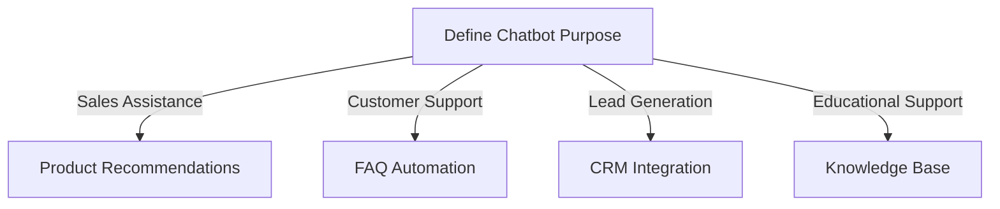
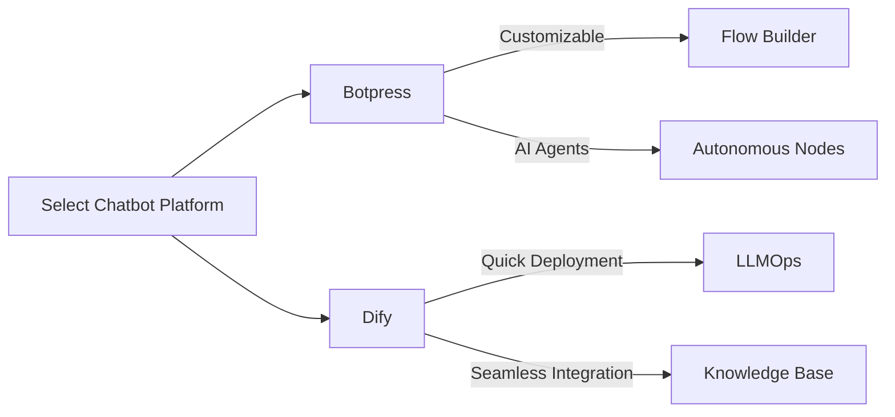
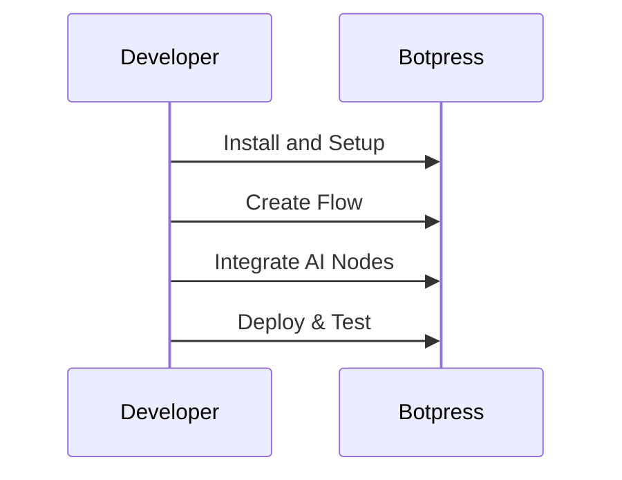
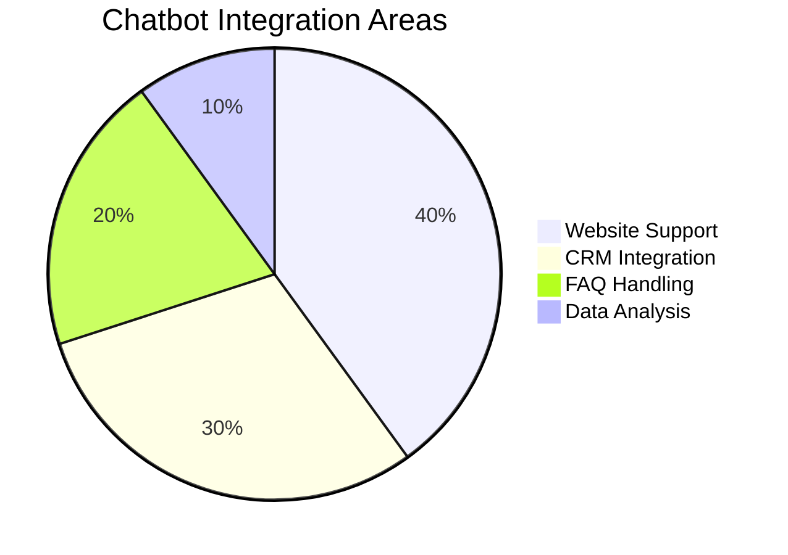
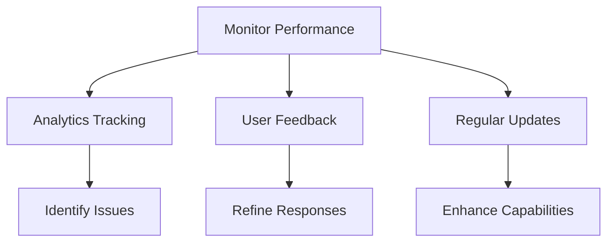

# Building Chatbots with Botpress and Dify

Designing and implementing chatbots using platforms like Botpress and Dify can significantly enhance customer support by automating interactions and providing immediate assistance. Here's a comprehensive guide to building chatbots with these platforms:

## 1. Define the Chatbot's Purpose

Begin by clearly outlining the specific tasks your chatbot will perform. This foundational step influences all subsequent decisions, from platform selection to design and deployment. Common applications include:

- **Sales Assistance**: Guiding customers through product selections and providing pricing information.
- **Customer Support**: Answering frequently asked questions and resolving common issues.
- **Lead Generation**: Collecting user information and integrating with CRM systems.
- **Educational Support**: Offering tutorials or answering subject-specific queries.



## 2. Choose the Right Platform

Selecting an appropriate platform is crucial. Both Botpress and Dify offer robust tools for chatbot development, each with unique features:

- **Botpress**: An open-source platform renowned for its flexibility and extensive educational resources. It provides a visual flow builder, supports integration with various messaging channels, and offers Autonomous Nodes for creating AI agents capable of independent reasoning and action. Botpress is ideal for developers seeking a customizable solution.
- **Dify**: An open-source platform that simplifies the development of AI applications by combining Backend as a Service (BaaS) and Large Language Model Operations (LLMOps). It enables quick creation of AI-powered customer service chatbots and supports integration with existing knowledge bases. Dify is suitable for those looking to deploy AI solutions rapidly without extensive coding.



## 3. Develop the Chatbot

### Botpress

- **Setup**: Install Botpress and access its visual flow builder to design conversation paths. The platform offers a drag-and-drop interface, making it user-friendly for both beginners and experienced developers.
- **Integration**: Utilize Autonomous Nodes to create AI agents that can reason and act independently, enhancing the chatbot's capabilities beyond predefined responses.
- **Testing**: Deploy a test version of your chatbot to gather feedback. Botpress provides a simulator within the studio, allowing you to practice conversations and refine the chatbot's responses iteratively.



### Dify

- **Data Integration**: Upload your business documents or knowledge base to Dify, enabling the chatbot to access and provide relevant information during interactions.
- **Application Creation**: Use Dify's interface to create a conversational AI application. Configure prompts and user interactions to align with your defined purpose, ensuring the chatbot addresses user needs effectively.
- **Deployment**: Embed the chatbot into your website or preferred communication channels. Dify supports seamless integration, allowing the chatbot to function within your existing digital infrastructure.



## 4. Monitor and Improve

Post-deployment, continuous monitoring and improvement are essential:

- **Analytics**: Track user interactions to identify common issues and areas for enhancement. Both platforms offer analytics tools to monitor performance metrics.
- **Updates**: Regularly update the chatbot's knowledge base and functionalities to align with evolving customer needs and business objectives.
- **User Feedback**: Encourage users to provide feedback, which is invaluable for refining the chatbot's responses and capabilities.

### Formula for Chatbot Efficiency Score

```math
CES = \frac{\text{Successful Interactions}}{\text{Total Interactions}} \times 100
```

Where:
- **Successful Interactions**: Conversations resolved without human intervention,
- **Total Interactions**: All chatbot-user interactions.



By following these steps, you can create an effective chatbot using Botpress or Dify, thereby enhancing your customer support and engagement.

For a visual demonstration of building an AI chatbot with Dify, consider the following tutorial:

[Build an AI Chatbot using Dify AI and Streamlit](https://www.youtube.com/watch?v=BMyssB9z_gM)
