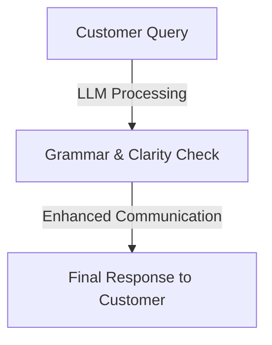
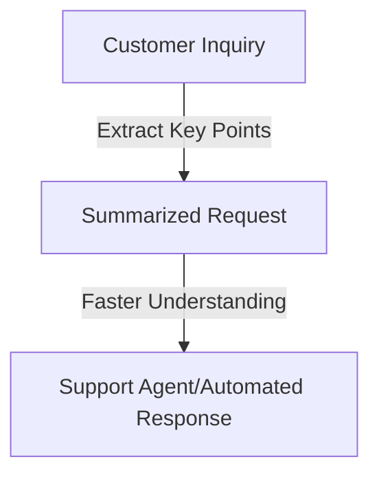
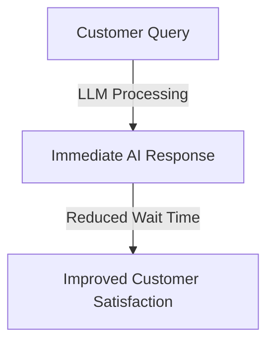
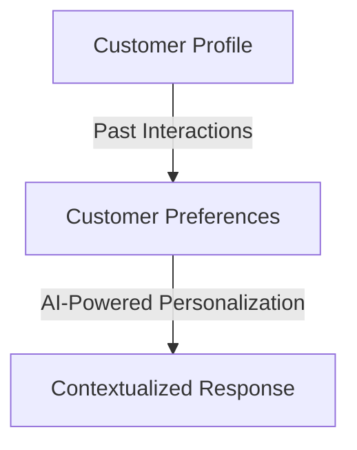
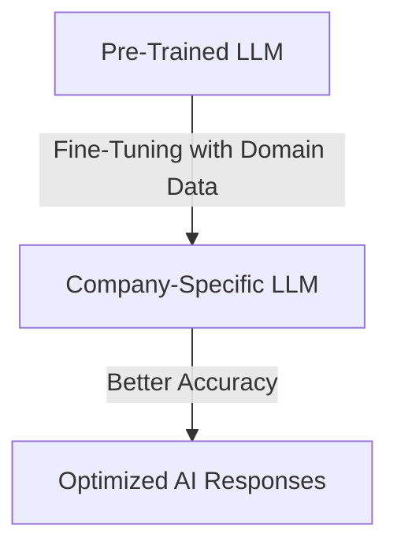
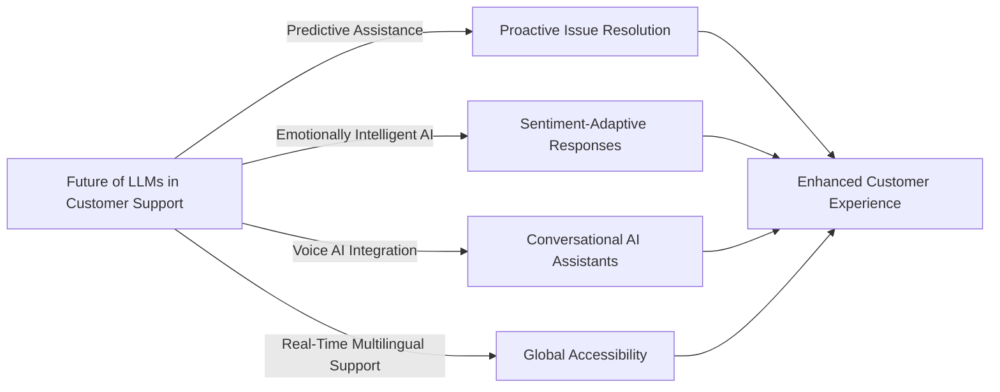

# **Enhancing Customer Support with LLMs**  

Integrating **Large Language Models (LLMs)** into customer support systems significantly improves response efficiency and service quality. LLMs, such as **OpenAI's GPT-4**, can understand and generate human-like text, making them valuable tools for automating customer interactions.  

## **Benefits of Using LLMs in Customer Support**  

### **1. Automated Text Correction**  
LLMs improve grammar, coherence, and readability in real-time, ensuring **professional and polished communication**.  

Mathematically, text clarity can be scored using a readability index, such as Flesch-Kincaid:

$$Readability\ Score = 206.835 - (1.015 \times ASL) - (84.6 \times ASW)$$

Where:
- **ASL** = Average Sentence Length (words per sentence)
- **ASW** = Average Syllables per Word

### **2. Inquiry Summarization**  
LLMs extract key details from long customer queries, helping support agents grasp issues faster and improve resolution time.

The compression ratio of summarization is defined as:

$$CR = \frac{Original\ Length - Summarized\ Length}{Original\ Length} \times 100$$

### **3. Real-Time Assistance**  
LLMs provide instant responses to common customer questions, reducing waiting times and enhancing user satisfaction.

Response Time Efficiency can be measured by:

$$Time\ Saved = \frac{Manual\ Response\ Time - LLM\ Response\ Time}{Manual\ Response\ Time} \times 100$$

### **4. Personalized Interactions**  
LLMs analyze customer history and preferences to provide tailored responses, creating a better customer experience.

$$Personalization\ Score = \frac{Relevant\ Recommendations}{Total\ Responses} \times 100$$

## **Implementing LLMs in Customer Support**  

### **Step 1: Selecting the Right LLM**  
Choose between:
- **Open-Source** (e.g., LLaMA, GPT-J)
- **Proprietary** (e.g., GPT-4, Claude, Gemini)

### **Step 2: Fine-Tuning the Model**  
Customize the model using company-specific terminology and historical data.

### **Step 3: Integration with Support Platforms**  
Connect the LLM to:
- **Chatbots** (Drift, Intercom)
- **CRM Systems** (Salesforce, HubSpot)
- **Email and Ticketing Systems**

### **Step 4: Monitoring and Optimization**  
Regularly evaluate LLM performance to ensure high accuracy and reliability.

$$Accuracy\ Score = \frac{Correct\ AI\ Responses}{Total\ AI\ Responses} \times 100$$

**Ideal range**: 85-95% accuracy for optimal performance.

## **Challenges and Considerations**  

### **1. Data Privacy & Security**  
LLMs handle sensitive customer data, requiring strict compliance with:
- **GDPR** (Europe)
- **CCPA** (California, USA)
- **HIPAA** (for Healthcare Data)

$$Privacy\ Compliance\ Score = \frac{Compliant\ Data\ Processes}{Total\ Data\ Processes} \times 100$$

### **2. Maintaining Context Over Long Interactions**  
LLMs struggle with context retention in lengthy conversations. Solutions:
- **Retrieval-Augmented Generation (RAG)**
- **Memory Mechanisms** (Vector Databases, Token Window Expansion)

$$Context\ Retention\ Score = \frac{Relevant\ Responses}{Total\ Responses} \times 100$$

### **3. Avoiding Miscommunication & Bias**  
To reduce AI-generated errors, businesses should:
- **Implement human-in-the-loop (HITL) reviews**
- **Continuously update training data**

## **Future Trends in LLM-Powered Customer Support**  

## **Conclusion**  
LLMs are transforming customer support by reducing response times, improving personalization, and increasing efficiency. However, businesses must ensure data security, monitor model accuracy, and maintain context awareness for optimal results.

By leveraging AI-powered automation, organizations can streamline customer service operations, enhance user satisfaction, and gain a competitive advantage in the digital landscape. 🚀