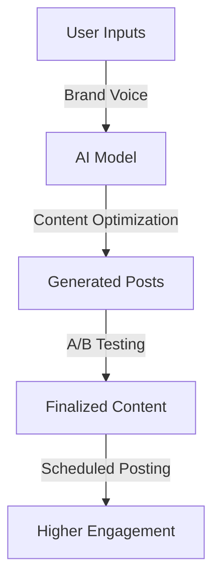
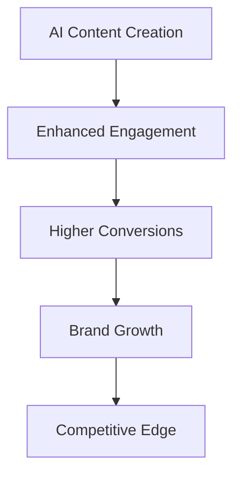

## Introduction

Creating compelling ad copy and engaging social media posts is crucial for brand visibility and audience engagement. AI-powered tools streamline the process, ensuring consistency, personalization, and performance optimization.

## AI for Ad Copy Generation

AI leverages natural language processing (NLP) and machine learning models to generate high-quality ad copy. These tools analyze brand voice, target audience preferences, and trending keywords to craft compelling messages.

### Benefits of AI-Driven Ad Copy
- **Efficiency**: AI generates multiple variations of ad copy in seconds.
- **Personalization**: Tailors messages to different audience segments.
- **Performance Optimization**: Uses data to refine messaging based on past engagement.
- **Consistency**: Maintains brand tone and style across campaigns.
- **Scalability**: Generates ad copy for multiple platforms simultaneously.
- **A/B Testing Support**: Provides real-time variations to test effectiveness.

### AI-Powered Ad Copy Formula

A common AI-driven ad copy framework follows:

```math
\text{Engagement Score} = \alpha R + \beta P + \gamma C + \delta T
```

Where:
- \( R \) = Relevance to the target audience  
- \( P \) = Persuasiveness based on historical performance  
- \( C \) = Creativity and uniqueness of the content  
- \( T \) = Timeliness of the message based on trends  
- \( \alpha, \beta, \gamma, \delta \) are weight factors optimized by AI models  

### Example AI-Generated Ad Copy

**Before AI Optimization:**  
"Our new smartphone has an amazing battery life. Buy now!"

**After AI Optimization:**  
"Say goodbye to low battery anxiety! Our latest smartphone lasts 48 hours on a single charge. Grab yours today!"

### Enhancing AI Ad Copy with Emotional Triggers
- **Urgency**: “Limited-time offer! Get yours before it’s gone.”
- **Curiosity**: “You won’t believe what this new gadget can do!”
- **Social Proof**: “Over 1 million satisfied customers love our product!”
- **Exclusivity**: “Be the first to experience cutting-edge innovation.”

## AI for Social Media Content Creation

AI tools analyze engagement trends, audience demographics, and brand style to create optimized social media content.



### AI-Driven Content Strategies

1. **Personalization & Trend Analysis**
   - AI enhances content personalization by:
     - Using sentiment analysis to match audience preferences.
     - Analyzing trending hashtags and keywords.
     - Suggesting optimal posting times for higher engagement.

2. **Content Variation & Adaptation**
   - AI generates different styles of content for platforms like Twitter, Instagram, LinkedIn, and Facebook.
   - Adjusts tone and format for professional, casual, or humorous messaging.

3. **Real-Time Engagement Insights**
   - AI monitors post performance and recommends adjustments.
   - Identifies underperforming content and suggests improvements.
   - Provides sentiment analysis to gauge audience reaction.

4. **AI-Based Visual Enhancements**
   - AI tools can suggest and generate visuals, including images, infographics, and short videos.
   - Automated caption suggestions that match the tone and intent of the post.
   - Background music and audio enhancements for video posts.

## AI-Powered Tools for Ad Copy & Social Media

| Feature                   | AI Benefit                                  |
|---------------------------|--------------------------------------------|
| Sentiment Analysis        | Tailors messages to audience mood         |
| Trend Detection           | Identifies viral topics for content ideas  |
| A/B Testing Automation   | Optimizes performance through iterations   |
| Smart Scheduling          | Posts at peak engagement times            |
| Auto-Generated Hashtags   | Enhances reach and visibility              |
| AI-Based Image & Video Generation | Creates engaging multimedia content |
| Audience Segmentation    | Customizes messages for specific groups    |
| Predictive Analytics      | Forecasts engagement trends for better planning |
| Chatbot-Generated Responses | Engages with audiences in real-time     |

## Conclusion

AI-driven tools revolutionize digital marketing by creating personalized, engaging, and high-performing ad copy and social media posts. Integrating AI ensures brands maintain a competitive edge in audience engagement and conversion rates.

### Key Takeaways
- AI enhances content relevance and engagement.
- Automates repetitive tasks while ensuring creative flexibility.
- Provides data-driven insights for continuous improvement.
- Helps brands maintain a consistent voice across all platforms.
- Supports visual and multimedia enhancements for better audience interaction.
- Adapts content strategies based on real-time performance data.


