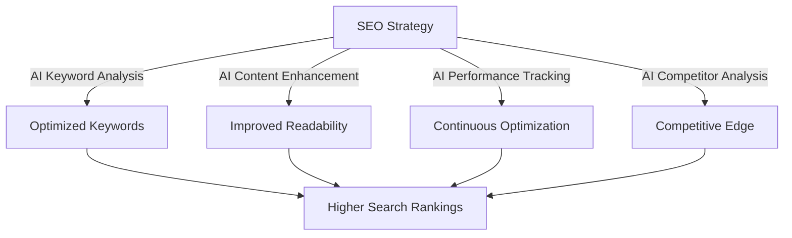
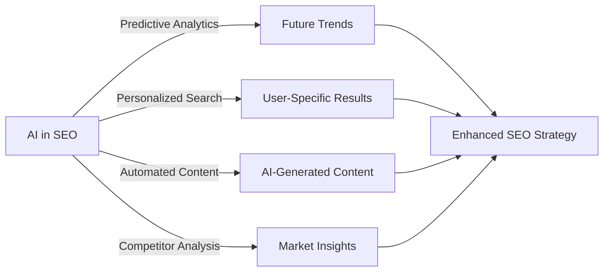

## Introduction

Search Engine Optimization (SEO) is essential for increasing online visibility and driving traffic to websites. As search algorithms become more sophisticated, AI-powered tools play a crucial role in optimizing SEO strategies. AI helps businesses improve search rankings by analyzing search trends, automating content enhancements, and optimizing technical SEO components.

## The Role of AI in SEO

Artificial Intelligence enhances SEO by providing data-driven insights and automating complex processes. Some of the key areas where AI contributes include:

### 1. **Keyword Optimization**
AI-driven tools analyze search trends, user queries, and competitor content to identify high-performing keywords. They suggest keyword variations and long-tail keywords to enhance content relevance.

### 2. **Content Quality Enhancement**
AI improves readability, tone, structure, and engagement by analyzing content against successful SEO benchmarks. AI-driven content generators can also produce well-optimized articles aligned with search intent.

### 3. **Technical SEO Automation**
AI detects and resolves issues such as:
- Broken links and 404 errors
- Mobile-friendliness and page speed optimization
- Schema markup recommendations

### 4. **User Intent Analysis**
AI understands the intent behind user queries and helps businesses create content that satisfies searchers’ needs. AI tools analyze behavioral data, click-through rates, and user engagement to refine content strategies.

### 5. **Automated Performance Monitoring**
AI continuously tracks SEO performance metrics, identifying areas for improvement. It provides actionable insights on keyword rankings, backlink performance, and competitor analysis.

## AI-Powered SEO Tools

| Feature                | AI Benefit                                      |
|------------------------|-----------------------------------------------|
| Keyword Research      | Identifies high-performing keywords           |
| Content Optimization  | Enhances readability and SEO-friendliness    |
| Link Building        | Suggests authoritative backlink opportunities |
| Rank Tracking        | Monitors search engine ranking fluctuations   |
| Voice Search SEO     | Optimizes content for voice-based searches    |
| Technical Audits     | Identifies and fixes website issues           |
| Competitive Analysis | Analyzes competitor strategies for insights   |

## AI and Voice Search Optimization

With the rise of voice search, AI helps optimize content for voice-based queries by:
- Understanding natural language processing (NLP) patterns
- Structuring content in a conversational and question-based format
- Enhancing mobile SEO and featured snippets visibility

## The Future of AI in SEO

The rapid advancements in AI and machine learning will continue to shape the future of SEO. Some emerging trends include:

### 1. **Predictive SEO Analytics**
AI will forecast trends, helping businesses create content proactively before search demand peaks.

### 2. **Personalized Search Optimization**
AI will deliver personalized search experiences by analyzing user behavior, preferences, and interaction history.

### 3. **Automated Content Generation**
Advanced AI models will generate high-quality, SEO-friendly content with minimal human intervention.

### 4. **AI-Driven Competitive Intelligence**
AI will provide deep insights into competitor strategies, allowing businesses to stay ahead in the competitive digital space.

## Conclusion

AI is revolutionizing SEO by automating keyword research, optimizing content quality, improving technical SEO, and tracking performance. Businesses that integrate AI into their SEO strategies gain a competitive edge, ensuring sustained growth in search rankings and online visibility. By leveraging AI-powered tools, organizations can stay ahead in the digital landscape and achieve long-term SEO success.

---

