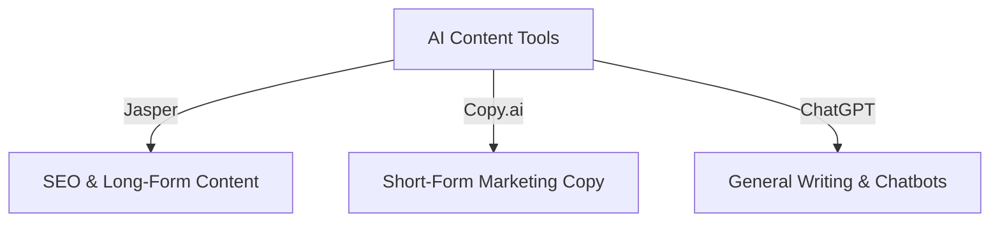

## Introduction

AI-powered content creation tools have revolutionized digital marketing by enabling businesses to generate high-quality ad copy, social media posts, blog articles, and more. Among the top AI tools in this space are **Jasper**, **Copy.ai**, and **ChatGPT**. Each tool offers unique features and capabilities tailored to different content needs.

## Overview of AI Content Creation Tools

### Jasper

Jasper is designed for marketing professionals and businesses looking to automate content creation with an AI-driven assistant. It offers:

- **Templates for various content types** (ads, blog posts, social media, etc.).
- **Long-form content generation** with SEO optimization.
- **Integration with Surfer SEO** for enhanced search rankings.
- **Brand voice customization** to match the tone of your business.

### Copy.ai

Copy.ai is a user-friendly AI writing tool that helps generate creative and engaging copy for marketing and branding purposes. Features include:

- **AI-powered brainstorming** to overcome writer’s block.
- **Instant generation of ad copy, product descriptions, and emails.**
- **Collaboration tools** for team-based content creation.
- **Pre-built templates** for different types of content.

### ChatGPT

ChatGPT, developed by OpenAI, is a versatile AI tool capable of generating human-like text for various applications. It excels in:

- **Conversational AI for customer support and chatbots.**
- **Generating detailed responses and long-form content.**
- **Customizable writing styles for different industries.**
- **Code generation and technical content creation.**

## Comparison Table

| Feature         | Jasper                          | Copy.ai                       | ChatGPT                        |
|---------------|--------------------------------|-------------------------------|--------------------------------|
| Content Types  | Blogs, ads, emails, SEO text  | Ads, product descriptions, emails | Conversational responses, blogs, technical writing |
| SEO Optimization | Yes (Surfer SEO integration) | Basic keyword suggestions     | No built-in SEO features      |
| Customization  | Brand voice, templates       | Templates, tone selection     | Highly flexible, customizable |
| Best For       | Marketing teams, businesses  | Entrepreneurs, content creators | General use, businesses, developers |

## Choosing the Right AI Tool

Each tool serves different purposes depending on your content needs:
- **Use Jasper** if you require long-form content with SEO integration.
- **Use Copy.ai** for short-form marketing copy and quick creative ideas.
- **Use ChatGPT** for versatile text generation, conversation-based AI, and general-purpose writing.

## Conclusion

AI-driven content creation tools provide businesses and marketers with efficient ways to generate high-quality copy while saving time and effort. Understanding the strengths and capabilities of Jasper, Copy.ai, and ChatGPT allows users to select the best tool for their specific content needs.

By leveraging AI-powered tools strategically, businesses can enhance their digital marketing efforts and optimize content creation for better engagement and visibility.
