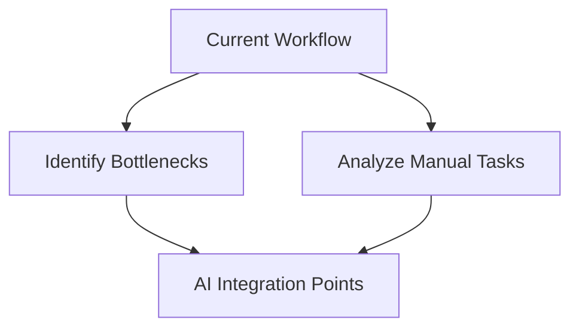
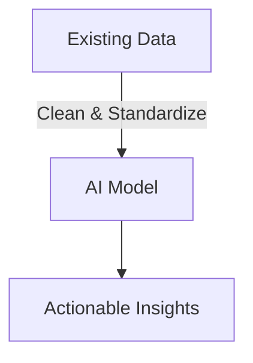
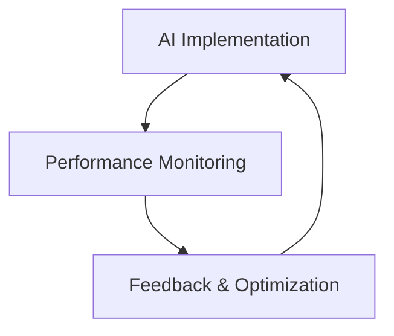

## Introduction

Integrating AI into existing project management workflows enhances efficiency, optimizes resource utilization, and improves decision-making. A structured approach ensures a smooth transition and maximizes AI’s potential. AI tools can automate repetitive tasks, provide data-driven insights, and improve overall team productivity.

## Steps to Integrate AI

### 1. Assess Current Workflow
Before integrating AI, evaluate the existing workflow to identify inefficiencies and areas where AI can provide value. Common pain points include task redundancy, bottlenecks, and lack of real-time insights.



### 2. Select AI-Powered Tools
Choose AI solutions that align with your project management needs, such as task automation, predictive analytics, or intelligent recommendations. Below is a comparison of AI tool functionalities:

| AI Tool Category       | Functionality                                     |
|------------------------|--------------------------------------------------|
| Task Automation       | Automates repetitive tasks                       |
| Predictive Analytics  | Forecasts project timelines and risks            |
| Smart Recommendations | Suggests task assignments and priorities         |
| Workflow Optimization | Identifies inefficiencies and improves processes |

### 3. Data Preparation and Integration
AI models rely on high-quality data for accurate predictions. The key steps involve:
- **Data Cleaning**: Removing duplicates, handling missing values, and normalizing data.
- **Data Integration**: Connecting AI tools with existing project management software such as Jira, Trello, or ClickUp.



### 4. Implement AI-Driven Decision Making
AI models analyze historical data to provide recommendations for project execution. Decision-making can be improved using the following formula:

```math
\text{Decision Score} = \alpha R + \beta C - \gamma T
```

Where:
- \( R \) = Relevance of AI recommendations
- \( C \) = Confidence in AI predictions
- \( T \) = Time taken to implement AI suggestions
- \( \alpha, \beta, \gamma \) are weight factors representing the importance of each component

This approach ensures that AI-driven insights are weighted based on their accuracy and implementation feasibility.

### 5. Monitor and Optimize
AI implementation is an iterative process. Continuous monitoring ensures that AI-driven improvements are effective and beneficial. Performance can be evaluated using key performance indicators (KPIs) such as task completion rate, error reduction, and decision accuracy.



By refining AI models and making necessary adjustments, teams can maximize efficiency and maintain a high level of productivity.

## Conclusion

Seamlessly integrating AI into existing workflows enhances productivity, reduces inefficiencies, and enables better decision-making. By carefully selecting AI tools, preparing data, and optimizing models, organizations can unlock AI’s full potential in project management. A strategic approach to AI adoption ensures that businesses remain competitive and agile in an ever-evolving technological landscape.
