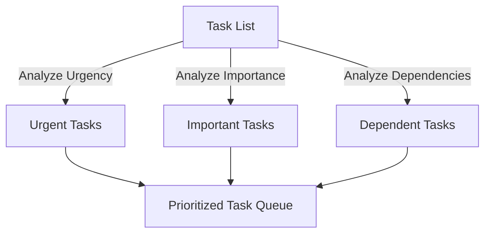
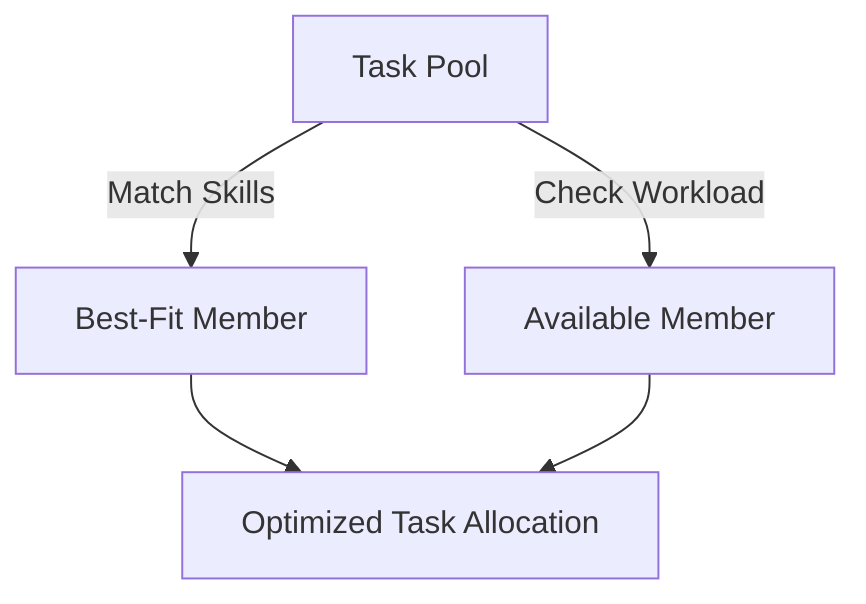
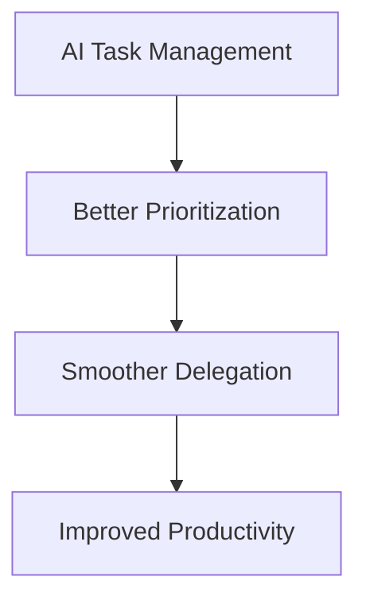

## Introduction

Task prioritization and delegation are essential for successful project management. AI-powered tools can analyze workloads, optimize resource allocation, and improve decision-making, ensuring that tasks are handled efficiently and effectively.

## AI for Task Prioritization

AI enhances task prioritization by analyzing various factors such as urgency, importance, dependencies, and team capacity. It uses predictive analytics to recommend optimal task sequences.

### Mathematical Model for Prioritization

A common approach for prioritization is using a weighted scoring model:

```math
\text{Priority Score} = \alpha U + \beta I + \gamma D - \delta W
```

Where:

- \( U \) = Urgency of the task  
- \( I \) = Importance of the task  
- \( D \) = Task dependencies  
- \( W \) = Workload capacity of the team  
- \( \alpha, \beta, \gamma, \delta \) are weight factors  



## AI for Task Delegation

AI improves delegation by considering team members' skills, workload, and availability. By integrating AI-based decision support systems, organizations can distribute tasks effectively.



### Workload Balance Function

To ensure fair distribution, AI can minimize workload variance:

```math
\min \sum_{i=1}^{n} (W_i - \bar{W})^2
```

Where:
 

```math
\bar{W} = \frac{1}{n} \sum_{i=1}^{n} W_i
```

## AI-Powered Tools for Prioritization and Delegation

| Feature               | AI Benefit                              |
|-----------------------|-----------------------------------------|
| Task Urgency Analysis | Identifies critical tasks               |
| Skill-Based Matching  | Assigns tasks based on expertise        |
| Workload Distribution | Prevents team overload                  |
| Progress Monitoring   | Tracks efficiency and productivity      |

## Conclusion

AI-driven task prioritization and delegation improve project efficiency by optimizing workload distribution, reducing bottlenecks, and ensuring the right tasks are assigned to the right individuals. Leveraging AI in project management leads to better decision-making and overall productivity.


