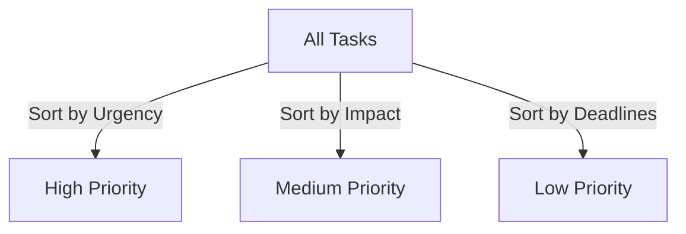
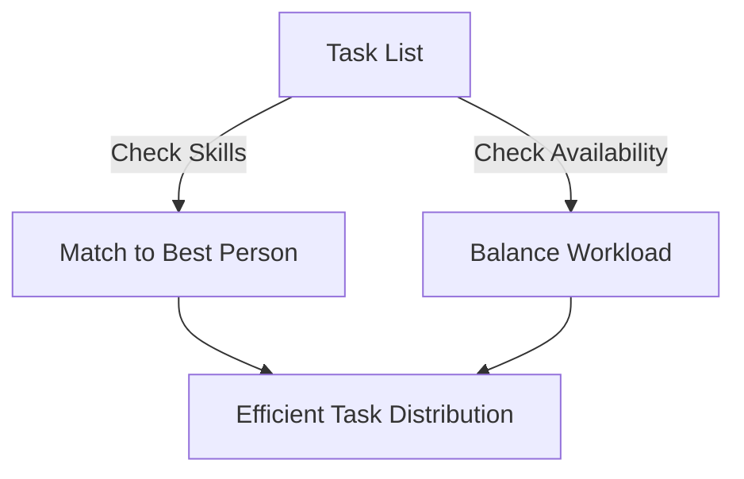

## Introduction
Managing tasks efficiently is crucial for success in any project. Prioritization ensures the most important tasks get done first, while delegation helps distribute work effectively. AI-powered tools such as **Notion AI** and **ClickUp AI** enhance both processes by analyzing task dependencies, workload balance, and project goals.

## Importance of Task Prioritization
Every project involves multiple tasks, but not all tasks hold equal importance. Some require immediate attention, while others can wait. Prioritizing tasks effectively leads to:
- **Meeting deadlines**: Ensuring timely completion of critical tasks.
- **Enhanced productivity**: Focused efforts on high-impact activities.
- **Reduced stress**: Clearer workflows prevent last-minute rushes.
- **Optimized resource use**: Proper distribution of work across the team.

### AI and Task Prioritization
AI tools like Notion AI and ClickUp AI analyze factors such as deadlines, dependencies, and team workload to rank tasks based on importance. Common techniques include:
- **Eisenhower Matrix**: Categorizes tasks into Urgent vs. Important quadrants.
- **Machine Learning Models**: Predicts the impact of tasks on project success.
- **Natural Language Processing (NLP)**: Extracts priority levels from project notes and emails.



### Task Prioritization Formula
AI models can prioritize tasks based on a weighted scoring formula:

$$ P = \alpha U + \beta I + \gamma D - \delta W $$

Where:
- \( U \) = Urgency of the task  
- \( I \) = Importance of the task  
- \( D \) = Task dependencies  
- \( W \) = Workload capacity of the team  
- \( \alpha, \beta, \gamma, \delta \) are weight factors defining priority impact.

## The Power of Delegation
Delegation involves assigning tasks to the right people based on their skills and availability. Effective delegation results in:
- **Time savings**: Managers can focus on higher-level strategic work.
- **Team efficiency**: Each member works on tasks that match their expertise.
- **Skill development**: Team members gain experience in new responsibilities.

### AI and Task Delegation
AI-powered project management tools enhance delegation by considering:
- **Workload Analysis**: Balances task distribution among team members.
- **Skill Matching**: Assigns tasks based on expertise and past performance.
- **Performance Learning**: Uses AI-driven insights to optimize future assignments.



### Workload Balance Function
To ensure fair task distribution, AI minimizes workload variance:

$$ \min \sum_{i=1}^{n} (W_i - \bar{W})^2 $$

Where:  
$W_i$ = Workload assigned to team member $i$  
$\bar{W}$ = Average workload per team member


## Real-World Example
Imagine a **marketing team** launching a campaign:
1. **AI identifies urgent tasks** like ad approvals and content creation.
2. **It assigns tasks based on expertise**—designers handle graphics, writers create content.
3. **It monitors progress** and alerts managers about potential delays.

## Conclusion
AI simplifies task prioritization and delegation, leading to smoother workflows and increased productivity. By leveraging tools like **Notion AI** and **ClickUp AI**, teams can streamline decision-making, avoid bottlenecks, and enhance overall project efficiency.

```mermaid
graph TD;
    M[AI Task Management] --> N[Better Prioritization];
    N --> O[Smoother Delegation];
    O --> P[Improved Productivity];
