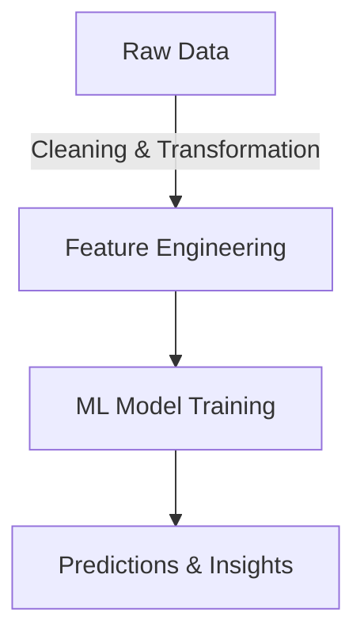
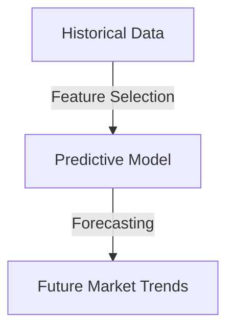
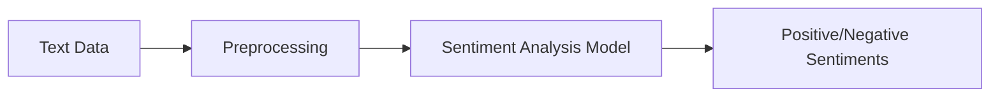
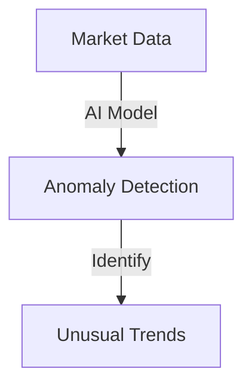
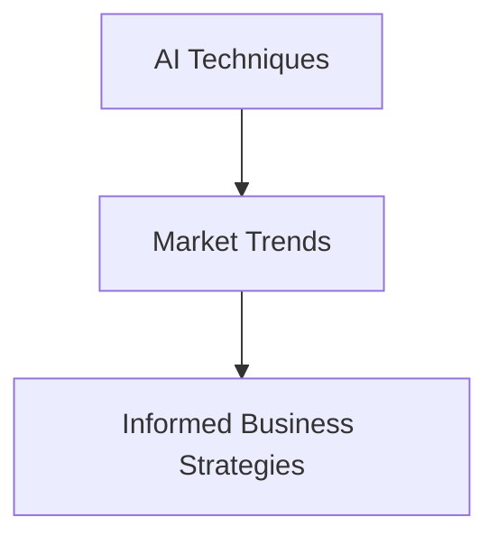

## Introduction
Artificial Intelligence (AI) plays a crucial role in analyzing market trends and data, enabling businesses to make informed decisions. AI-driven analytics help identify patterns, predict trends, and optimize strategies in real time. By leveraging machine learning, deep learning, and natural language processing (NLP), organizations can transform raw data into actionable insights.

## Techniques for AI-Based Market Analysis

### 1. Data Collection and Preprocessing
AI models require clean, structured data for accurate analysis. The process involves:
- **Data Sourcing**: Gathering data from financial reports, social media, web scraping, and databases.
- **Data Cleaning**: Handling missing values, removing duplicates, and normalizing data.
- **Feature Engineering**: Selecting relevant features and transforming raw data into useful insights.



### 2. Predictive Analytics with Machine Learning
Predictive analytics utilizes AI models such as:
- **Regression Models**: Used for predicting numerical values (e.g., stock prices).
  
  $$ y = \beta_0 + \beta_1 x_1 + \beta_2 x_2 + \dots + \beta_n x_n + \epsilon $$
  
- **Time Series Forecasting**: Methods like ARIMA, LSTM, and Prophet help in trend prediction.
- **Clustering Algorithms**: K-Means and DBSCAN identify market segmentation.



### 3. Sentiment Analysis for Market Insights
Natural Language Processing (NLP) enables AI to analyze sentiments from:
- **News Articles**
- **Social Media Posts**
- **Customer Reviews**

Sentiment analysis is often computed using:
  
  $$ Sentiment Score = \frac{\sum Positive - \sum Negative}{Total Words} $$
  


### 4. AI-Powered Data Visualization
AI tools such as Tableau, Power BI, and Python libraries (Matplotlib, Seaborn) generate meaningful visual representations. Visualization helps businesses track market trends effectively.

```python
import matplotlib.pyplot as plt
import numpy as np

t = np.arange(0.01, 10.0, 0.01)
y = np.log(t)

plt.plot(t, y)
plt.xlabel('Time')
plt.ylabel('Market Growth')
plt.title('Market Trend Over Time')
plt.show()
```

### 5. Anomaly Detection in Market Trends
AI models can detect unusual market behaviors through anomaly detection algorithms like Isolation Forest and One-Class SVM. These algorithms help identify:
- Sudden spikes or drops in stock prices
- Irregular consumer demand patterns
- Unusual financial transactions



## Conclusion
AI-driven techniques revolutionize market trend analysis, empowering businesses with predictive insights, sentiment analysis, and data visualization. Leveraging these tools enhances strategic decision-making and fosters data-driven business case studies.



By integrating AI in market analysis, businesses can efficiently navigate dynamic markets and gain a competitive edge.
