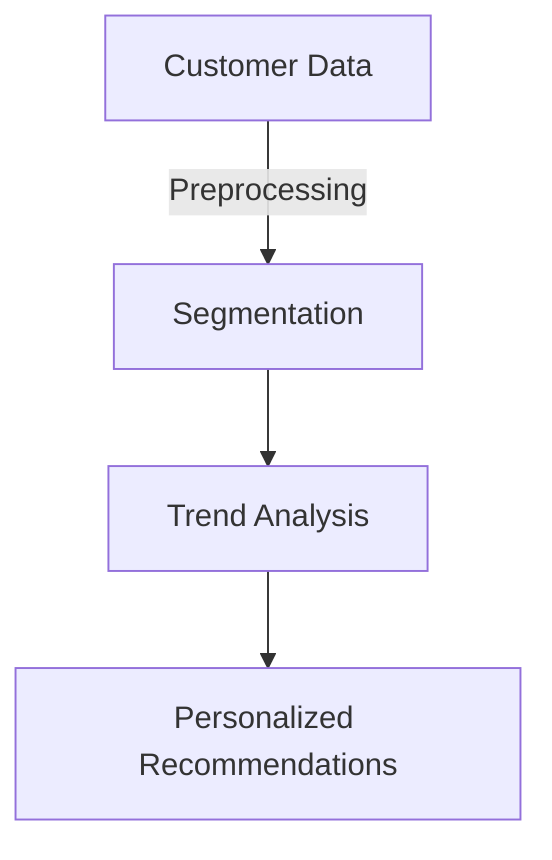
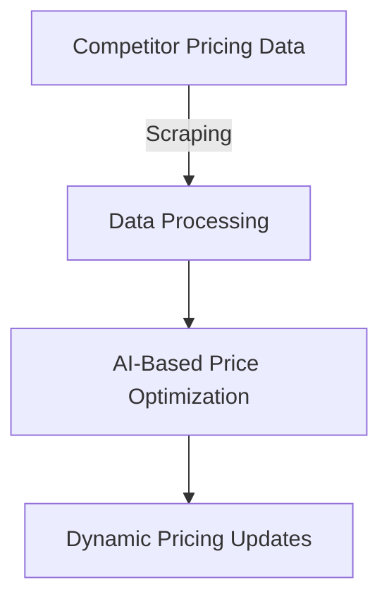
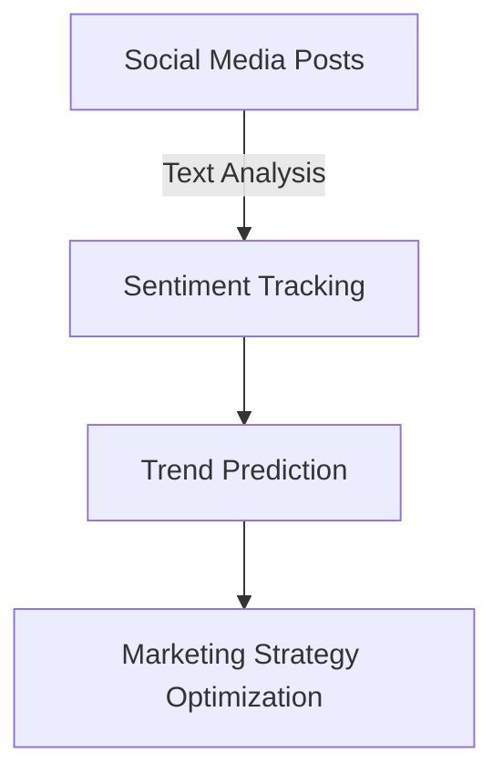

## Introduction
Market research and competitor analysis are crucial for businesses to understand industry trends, customer preferences, and competitive landscapes. AI enhances these analyses by automating data collection, trend detection, and predictive modeling.

## Case Study 1: AI in E-commerce Market Research
### Background
An e-commerce company wanted to identify customer purchasing patterns and optimize product recommendations.

### AI Techniques Used
- **Customer Segmentation**: K-Means clustering categorized customers based on purchasing behavior.
- **Demand Forecasting**: LSTM models predicted future sales trends.
- **Sentiment Analysis**: NLP analyzed customer reviews to assess product satisfaction.



### Results
- 20% increase in customer retention.
- Improved accuracy in inventory management.

## Case Study 2: AI for Competitor Pricing Strategy
### Background
A retail business sought to dynamically adjust pricing based on competitor strategies.

### AI Techniques Used
- **Web Scraping**: Extracted competitor pricing data from multiple sources.
- **Price Optimization Models**: Regression algorithms determined optimal price points.
- **Reinforcement Learning**: Adjusted prices dynamically based on market response.



### Results
- 15% revenue increase.
- Improved competitiveness in the market.

## Case Study 3: AI-Driven Social Media Analysis
### Background
A fashion brand wanted to analyze social media trends and consumer sentiment towards new collections.

### AI Techniques Used
- **Social Media Listening**: NLP models tracked brand mentions and sentiment.
- **Trend Prediction**: AI analyzed past trends to forecast upcoming styles.
- **Influencer Analysis**: Network analysis identified key influencers driving engagement.



### Results
- Enhanced campaign effectiveness.
- Increased brand awareness by 25%.

## Conclusion
AI empowers businesses by automating market research and competitor analysis, enabling data-driven decision-making and strategic advantages.

```mermaid
graph TD;
    X[AI Market Research] --> Y[Business Insights];
    Y --> Z[Competitive Advantage];

