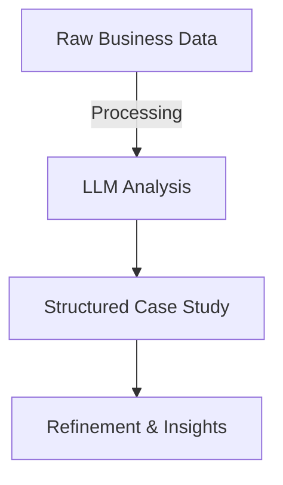
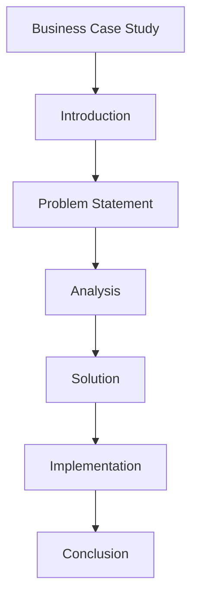

## Introduction
Large Language Models (LLMs) have transformed the way business case studies are written. By leveraging natural language processing (NLP), these models help craft insightful, well-structured, and data-driven case studies efficiently. 

### Why Use LLMs for Case Studies?
- **Automated Research**: LLMs summarize vast amounts of data from multiple sources.
- **Enhanced Writing Efficiency**: Speeds up drafting and editing processes.
- **Data-Driven Insights**: Generates well-supported conclusions with AI-assisted analysis.
- **Consistent Tone & Style**: Maintains professional and structured case study formats.



## Steps to Writing a Case Study with LLMs

### 1. Define the Objective
Clearly outline the purpose, target audience, and key takeaways. This ensures that the case study aligns with the business goals.

### 2. Gather Data
Relevant sources of information include:
- **Company Reports**: Annual reports, financial statements.
- **Market Research**: Trends, competitor analysis.
- **Interviews & Surveys**: First-hand insights.
- **Historical Performance Data**: Revenue growth, customer engagement metrics.

### 3. Generate an Outline with LLMs
Using structured prompts, LLMs can generate an organized case study outline:



### 4. AI-Assisted Drafting & Refinement
- **Use LLMs to Generate Drafts**: AI can generate structured text segments.
- **Refine Output**: Ensure factual accuracy and coherence.
- **Adjust Tone & Readability**: Tailor content to the target audience.

### 5. Validate with Data & Sources
LLMs generate insights based on training data. Fact-checking and validating information with real-world data sources is crucial.

## Quantitative Evaluation of Case Studies
A key metric for evaluating the effectiveness of a case study is the readability score. The **Flesch-Kincaid readability formula** helps assess clarity:

```math
	ext{Readability Score} = 206.835 - 1.015 \times \left(\frac{\text{Total Words}}{\text{Total Sentences}}\right) - 84.6 \times \left(\frac{\text{Total Syllables}}{\text{Total Words}}\right)
```

Higher scores indicate easier readability. AI-generated case studies should aim for scores suitable for their intended audience.

## Example Prompt for LLMs
```plaintext
"Write a business case study on how AI transformed retail sales, including the problem, solution, implementation, and measurable impact."
```

## Conclusion
LLMs streamline research, enhance clarity, and improve content structuring. By integrating AI effectively, businesses can produce compelling, insightful case studies that drive decision-making and improve engagement.

```mermaid
graph TD;
    M[LLM-Powered Case Studies] --> N[Efficient Research];
    N --> O[Data-Driven Writing];
    O --> P[Actionable Insights];
