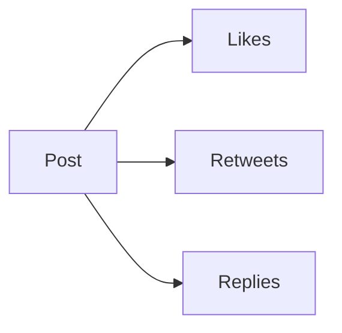

# Analyzing X Posts and User Profiles

In the modern era, social media platforms like X (formerly Twitter) provide a wealth of information that can be analyzed to extract valuable insights. By examining X posts and user profiles, businesses, marketers, researchers, and individuals can understand trends, sentiments, behaviors, and preferences.

This chapter explores the methods of analyzing X posts and user profiles, with practical examples, code snippets, and tools used in this process. We will also cover mathematical models, tables, and visualizations such as Mermaid diagrams to provide a comprehensive understanding.

---

## 1. **Introduction to Social Media Analytics**

Social media analytics is the process of collecting and analyzing data from social media platforms to uncover useful business insights. X posts and user profiles are two primary data sources that can offer insights into:

- **Post Sentiment**: Analyzing the tone of the posts (positive, negative, or neutral).
- **Engagement Metrics**: Likes, retweets, replies, and other interactions.
- **User Demographics**: Understanding who is posting, including their interests, location, etc.
- **Trending Topics**: Identifying topics that are currently popular.
  
### 1.1. **Social Media Data Types**

- **Post Data**: This includes the content of the post, hashtags, mentions, and the date/time of the post.
- **User Data**: Information such as user ID, profile description, followers, following, and activity history.
- **Engagement Data**: Includes likes, retweets, and replies.
- **Metadata**: Information such as post URL, timestamp, and device used.

## 2. **Extracting Data from X**

To begin analyzing X posts and profiles, we need to collect the data. This can be done through X’s API or web scraping methods.

### 2.1. **Using X API**

The X API allows developers to interact with the platform programmatically. To collect data, we can use the `tweepy` Python library to access posts and user profiles.

```python
import tweepy

# Set up API keys
consumer_key = 'your_consumer_key'
consumer_secret = 'your_consumer_secret'
access_token = 'your_access_token'
access_token_secret = 'your_access_token_secret'

# Authenticate to X
auth = tweepy.OAuthHandler(consumer_key, consumer_secret)
auth.set_access_token(access_token, access_token_secret)

# Set up API object
api = tweepy.API(auth)

# Fetch a user's recent posts
user = 'username'
posts = api.user_timeline(screen_name=user, count=10)

# Print the posts
for post in posts:
    print(f"{post.created_at} - {post.text}")

### 2.1. **2.2. Using Web Scraping**

Alternatively, if access to the API is limited, web scraping can be used to extract public data.

```python
import requests
from bs4 import BeautifulSoup

# Define the URL for the user's profile
url = 'https://x.com/username'

# Fetch the page
response = requests.get(url)
soup = BeautifulSoup(response.text, 'html.parser')

# Extract posts
posts = soup.find_all('div', class_='tweet-text')
for post in posts:
    print(post.get_text())
```


## 3. **Data Analysis: Sentiment Analysis**

Once the posts are collected, we can analyze their sentiment using Natural Language Processing (NLP) techniques. The sentiment of a post helps to understand how the public perceives certain topics or brands.

### 3.1. **TextBlob Sentiment Analysis**

We can use the TextBlob library in Python to perform sentiment analysis on X posts. Sentiment analysis typically assigns a polarity score to each post, where:

- Positive scores indicate a positive sentiment.
- Negative scores indicate a negative sentiment.
- Zero scores indicate a neutral sentiment.

```python
from textblob import TextBlob

# Example post
post = "I love the new X update, it's fantastic!"

# Create a TextBlob object
blob = TextBlob(post)

# Get the sentiment
sentiment = blob.sentiment.polarity
print(f"Sentiment polarity: {sentiment}")
```

### 3.2. **Example Sentiment Output**
```text
Post: "I love the new X update, it's fantastic!"
Sentiment polarity: 0.8 (Positive)
```

## 4. **Engagement Metrics Analysis**

Engagement metrics provide insight into how well posts are resonating with the audience. We can analyze the number of likes, retweets, and replies a post receives.
```python
# Fetch engagement metrics for a post
post_id = posts[0].id
likes = api.get_status(post_id).favorite_count
retweets = api.get_status(post_id).retweet_count

print(f"Likes: {likes}, Retweets: {retweets}")
```

### 4.1. **Mermaid Diagram of Engagement Metrics**
The following Mermaid diagram illustrates how engagement metrics are related:

This diagram shows that each post can have associated likes, retweets, and replies, which are key metrics for evaluating engagement.

## 5. **User Profile Analysis**

In addition to posts, analyzing the user profile can provide insights into the person behind the post. Key attributes include:

- Follower Count: The number of followers can indicate the influence of the user.
- Bio Description: The bio may contain information about the user’s interests, profession, or location.
- Activity Level: The number of posts per day/week/month can indicate how active the user is.

```python
# Fetch user profile details
user_profile = api.get_user(screen_name=user)
followers_count = user_profile.followers_count
bio = user_profile.description

print(f"Followers: {followers_count}, Bio: {bio}")

```

### 5.1. **User Profile Table Example**

The following table shows an example of a user profile, displaying key details:

| Attribute        | Value                      |
|------------------|----------------------------|
| Followers        | 5000                       |
| Following        | 200                        |
| Bio              | "Tech enthusiast, writer."  |
| Location         | "New York"                 |
| Recent Posts     | 50                         |

## 5. **Conclusion**

In this chapter, we have explored various methods for analyzing X posts and user profiles. We used sentiment analysis to understand post sentiment, engagement metrics to measure post popularity, and user profile analysis to uncover key information about the users. Additionally, we illustrated the trend analysis of hashtags to identify what topics are currently trending.

By applying these methods, businesses and individuals can gain valuable insights into social media trends and user behavior, which can be leveraged for strategic decision-making.