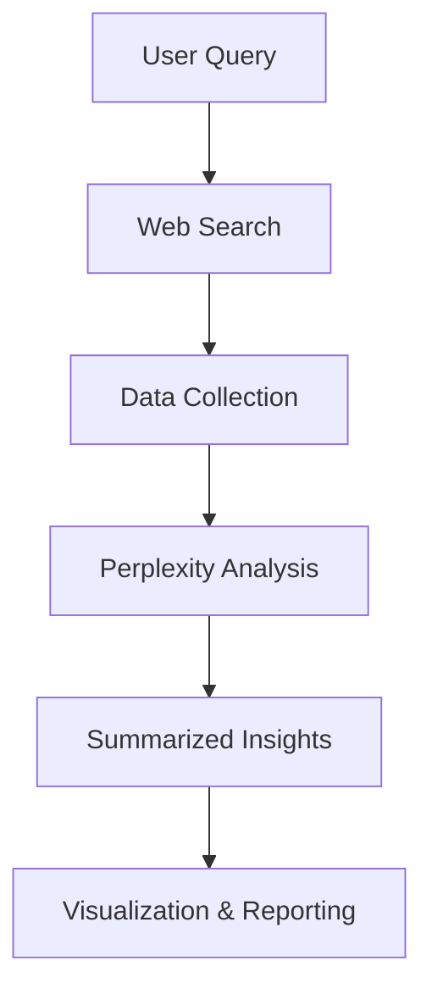
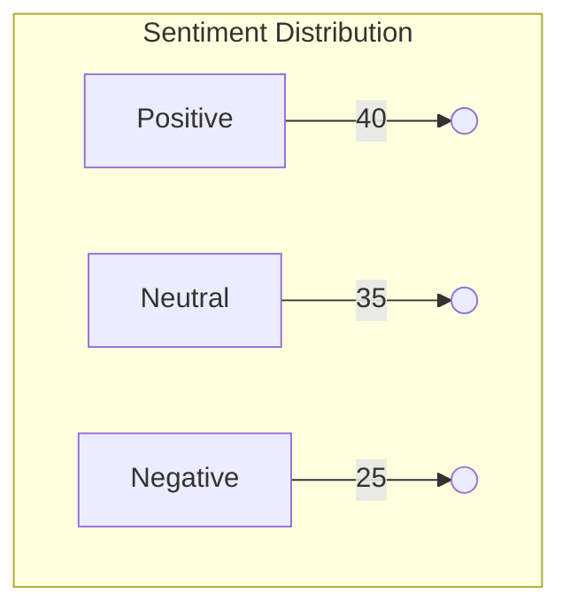

## Introduction

In the modern age of information, researchers and professionals often require comprehensive and accurate data to make informed decisions. Combining AI-powered tools like Perplexity with traditional web searches can significantly enhance research efficiency and provide deeper insights. This guide will explain how to effectively integrate these two methods to optimize research workflows.

## What is Perplexity?

Perplexity is an AI-driven tool that leverages natural language processing (NLP) to generate contextually relevant text, answer questions, and summarize information. It can process vast amounts of data quickly and deliver concise insights, making it ideal for various research applications.

### Key Features of Perplexity
- Contextual text generation
- Summarization of long texts
- Question answering
- Text completion
- Sentiment analysis

## Why Combine Perplexity with Web Searches?

While Perplexity excels at generating concise and contextually accurate text, traditional web searches provide access to vast sources of information. Integrating both methods offers the following benefits:

| Method       | Strengths                    | Limitations             |
|-------------|------------------------------|-----------------------|
| Perplexity  | Fast, accurate summaries     | Limited data sources   |
| Web Search  | Comprehensive information    | Time-consuming        |

By combining these methods, users can quickly gather comprehensive data while maintaining accuracy and context.

## Workflow Integration

The integration workflow consists of the following steps:



## Setting Up the Environment

To set up the environment for integrating Perplexity with web searches, follow these steps:

### Prerequisites
- Node.js installed
- API keys for web search services (e.g., Google Custom Search API)
- Access to Perplexity API

### Installation

Install the required packages:

```bash
npm install perplexity-sdk axios
```

## Example Usage

```js
import { Perplexity } from 'perplexity-sdk';
import axios from 'axios';

const query = 'Latest AI advancements';

async function fetchWebData(query) {
    const response = await axios.get(`https://api.google.com/search?q=${query}`);
    return response.data;
}

async function analyzeData(query) {
    const webData = await fetchWebData(query);
    const perplexity = new Perplexity();
    const summary = await perplexity.summarize(webData);
    console.log('Summary:', summary);
}

analyzeData(query);
```

## Data Transformation

Data collected from web searches is processed using the following normalization formula:

$$
NormalizedData = \frac{RawData \times RelevanceFactor}{NoiseReduction}
$$

## Visualization

Below is an example bar chart displaying sentiment distribution from combined data sources:



## Error Handling

Common errors during the integration process include:
- API request failures
- Rate limiting
- Data parsing errors

Implement error handling as follows:

```js
try {
    await analyzeData(query);
} catch (error) {
    console.error('Error occurred:', error.message);
}
```

## Conclusion

By integrating Perplexity with traditional web searches, users can leverage the strengths of both methods to achieve faster, more accurate, and comprehensive research outcomes. This hybrid approach enhances data aggregation, analysis, and visualization, making it an invaluable tool for modern research workflows.