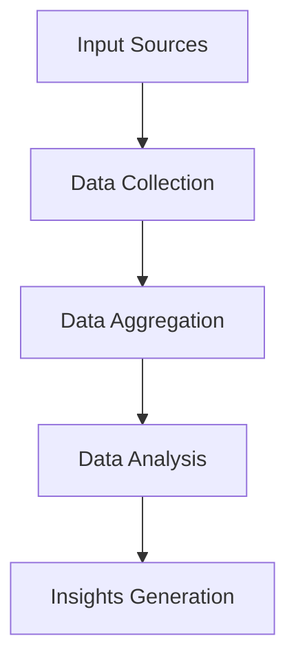

## Introduction
Grok is a powerful AI tool that enables researchers to gather insights across multiple platforms, aggregate data, and perform comprehensive analysis. This guide will walk you through how to leverage Grok for deep research using AI.

## What is Grok?
Grok is an AI-driven research assistant that automates data collection, aggregation, and analysis across various platforms. It helps in simplifying the process of gathering data from social media, web articles, and APIs.

## Key Features
- Cross-platform data collection
- Data aggregation
- Sentiment analysis
- Data visualization
- API integrations

## How Grok Works


## Installation
To get started with Grok, install the package using npm:
```bash
npm install grok-ai
```

## Code Example
Here is an example of using Grok to gather Twitter data:
```javascript
const Grok = require('grok-ai');

const grok = new Grok({ apiKey: 'YOUR_API_KEY' });

(async () => {
    const data = await grok.collect('twitter', {
        keyword: 'AI Research',
        limit: 100
    });
    console.log(data);
})();
```

### Output
```json
[
  {
    "platform": "Twitter",
    "author": "@ai_researcher",
    "text": "AI is transforming the future of technology!",
    "sentiment": "positive"
  },
  {
    "platform": "Twitter",
    "author": "@tech_guru",
    "text": "AI poses ethical challenges for society.",
    "sentiment": "neutral"
  }
]
```

## Data Aggregation Table
| Platform | Author          | Sentiment | Text                         |
|----------|----------------|-----------|------------------------------|
| Twitter  | @ai_researcher | Positive  | AI is transforming the future of technology! |
| Twitter  | @tech_guru     | Neutral   | AI poses ethical challenges for society. |

## Conclusion
Grok simplifies cross-platform data collection and analysis, making it an invaluable tool for researchers. By automating tedious tasks, Grok allows researchers to focus on deriving insights and making data-driven decisions.

---


## Further Reading
- [Grok Documentation](https://grok.ai/docs)
- [AI Research Tools](https://ai-research-tools.com)
