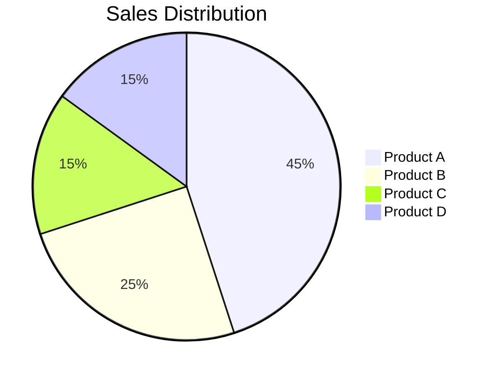
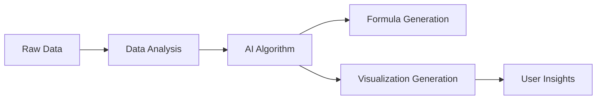

Data analysis and decision-making often require the use of mathematical formulas and visual representations to uncover trends and insights. In the past, creating formulas and generating data visualizations was a tedious and time-consuming task. However, with the advent of AI-powered tools, this process has become automated, significantly increasing productivity and reducing the time it takes to derive insights.

In this blog, we’ll explore how **AI** can automatically generate **formulas** and create **visual data representations**, helping businesses and professionals streamline their analysis and enhance their decision-making capabilities.

## The Challenge of Generating Formulas and Visualizations

In many fields—whether it’s business analytics, scientific research, or engineering—generating accurate formulas and visualizations is essential for understanding and communicating data insights. However, the process of creating these mathematical models and visual representations is often cumbersome and requires specialized knowledge. Some of the challenges involved include:

- **Complexity of Data Relationships:** Data often involves complex relationships that need to be captured with the right formulas.
- **Manual Formula Writing:** Writing formulas from scratch can be time-consuming, especially when dealing with large datasets.
- **Time-Consuming Visualization Creation:** Crafting accurate and insightful visualizations requires understanding the data and the right charting tools.
- **Limited Access to Data Analytics Tools:** Not all users have access to advanced statistical or visualization software, making the process even more challenging.

Fortunately, AI-powered tools are designed to tackle these challenges by automating the creation of both formulas and visualizations, allowing users to quickly generate the insights they need.

## How AI Can Automatically Generate Formulas

AI algorithms, particularly in **machine learning** and **symbolic computation**, can automatically detect patterns and relationships within data and generate formulas to represent these relationships. This is beneficial for various applications, including regression analysis, trend prediction, and financial forecasting.

### 1. **Regression Models and Trend Analysis**

AI tools like **ChatGPT**, **Perplexity**, and other data-driven assistants can help generate regression formulas for linear and non-linear data. By analyzing historical data, AI can identify the best-fit model and automatically derive the formula that best represents the data.

For example, if you have a dataset with sales over time, AI can generate a formula to predict future sales based on past performance. Here’s an example formula that AI might generate for a simple linear regression model:

Sales = a * Time + b

Where:
- **a** is the slope of the line (showing how much sales increase with time).
- **b** is the intercept (showing initial sales).

For a more complex, non-linear regression, AI might generate something like:

Sales = a * exp(b * Time) + c

Where:
- **a**, **b**, and **c** are constants derived from the dataset, and the exponential function models more complex growth trends, like compound interest or sales growth in a saturated market.

### 2. **Symbolic Computation and Formula Generation**

Tools like **Mathematica** and **Wolfram Alpha** use AI to assist in generating complex mathematical formulas. These tools use symbolic computation to automatically simplify and derive formulas for complex equations.

For instance, in **machine learning**, AI can automatically derive the formula for a model based on input features, output variables, and training data.

**Example: AI-Generated Formula for Logistic Regression**

For binary classification, AI can generate the logistic regression formula, which is:

P(Y=1 | X) = 1 / (1 + exp(-(a * X + b)))

Where:
- **P(Y=1 | X)** is the probability that the output variable **Y** is 1 given the input **X**.
- **a** is the weight of the input **X**, and **b** is the bias term.

## How AI Can Automatically Create Visualizations

Once you have a set of data, visualizing it can help in better understanding and communicating insights. AI can assist in automatically generating meaningful visualizations based on the type of data you have.

### 1. **Automatic Chart and Graph Generation**

AI-powered platforms can automatically choose the right type of chart or graph based on the dataset. For example, AI can recognize that a time-series dataset would be best represented by a **line graph**, while categorical data might be best visualized with a **bar chart**.

#### Example Mermaid Graph for Data Visualization:

This pie chart can help a business visualize the sales distribution of different products automatically, based on a dataset. Tools like **Google Sheets**, **Excel**, and **Power BI** have built-in AI features that automatically suggest the best charts for your data.

### 2. **AI-Driven Data Visualization Tools**

AI platforms such as **Tableau**, **Power BI**, and **Qlik Sense** use advanced algorithms to analyze data and generate the most appropriate visualizations. These tools can also recommend visualizations based on trends, patterns, and outliers detected in the data.

For instance:
- **Power BI** uses AI to automatically generate insights like sales trends or anomalies in datasets and create graphs accordingly.
- **Tableau** uses machine learning algorithms to suggest various visualizations, from line graphs to heat maps and scatter plots.

#### Example: Visualizing Sales Data Trends with Power BI

Imagine you have monthly sales data for the past year, and you want to visualize the sales trend. AI can generate a line chart with monthly sales on the **y-axis** and time on the **x-axis**.

### 3. **Data Trend Detection and Highlighting**

AI can also help detect trends and highlight significant patterns in the data, which can then be visualized in an easily digestible format. This is especially useful in areas like **financial analysis**, **sales forecasting**, and **scientific research**.

- **Trend Lines:** AI can automatically add trend lines to scatter plots, showing the overall trend in the data and making it easier to understand.
- **Anomaly Detection:** AI can highlight unusual data points in visualizations to help users identify outliers or important deviations from expected patterns.

For example, AI might create a **scatter plot** for sales and marketing budget data, adding a **best-fit line** to indicate the correlation between the two variables.

### 4. **Geospatial Visualizations**

For data that involves geographic information, AI tools can create geospatial visualizations. These include heat maps, choropleth maps, and bubble maps, which allow users to see how data varies across regions.

- **AI-Powered Geographic Maps:** Tools like **Google Maps API** and **ArcGIS** use AI to help map data based on geographical locations, enabling better insights for fields like real estate, urban planning, and marketing.

#### Example: Visualizing Sales by Region

AI can automatically create a **heat map** showing which regions have the highest sales, making it easier for a company to target those areas for more marketing or product development.

## Tools for Generating Formulas and Visualizations with AI

### **ChatGPT for Formula Generation and Explanation**

While **ChatGPT** may not directly generate complex formulas in the traditional sense, it can assist in simplifying complex data analysis and suggesting formulas in **natural language**. Users can ask **ChatGPT** to explain the relationship between variables or ask for formula generation for specific mathematical models.

For example, you can ask **ChatGPT**:
- "How do I generate a formula for predicting sales based on time and promotions?"
- "What formula should I use for calculating the moving average?"

### **Perplexity for Automated Formula Derivation**

**Perplexity** uses machine learning algorithms to suggest formulas based on the input dataset and the user's needs. Perplexity can analyze historical data and generate predictive formulas that help businesses forecast future performance.

### **Other AI Tools for Formula and Visualization Generation**

- **Tableau:** AI-powered recommendations for data visualizations.
- **Power BI:** Automatically suggests trends and visualizations using machine learning.
- **Google Sheets:** Built-in AI features for chart recommendations and formula creation.
- **Excel:** Automated trendlines, analysis, and charting through AI and machine learning.

## Benefits of AI-Generated Formulas and Visualizations

1. **Saves Time:** Automates the process of generating formulas and visualizations, reducing the manual effort involved.
2. **Improves Accuracy:** AI-driven tools can help reduce human error in both formula generation and data visualization.
3. **Accessibility:** Allows non-technical users to generate complex formulas and insightful visualizations without needing to understand advanced statistics or coding.
4. **Enhanced Decision-Making:** By automatically generating insights, formulas, and visualizations, AI helps businesses make faster and more informed decisions.

## Conclusion

**AI-powered tools** like **ChatGPT**, **Perplexity**, and others are revolutionizing the process of generating formulas and visualizations, making data analysis more accessible and efficient. Whether you're dealing with complex data relationships or looking for meaningful visualizations to communicate your insights, AI is simplifying and accelerating the process.

By integrating these AI tools into your data workflows, you can save time, improve the accuracy of your analysis, and gain deeper insights that drive better business decisions. With AI, generating formulas and visualizations is no longer a daunting task—it's an automatic process that empowers professionals to unlock the full potential of their data.
