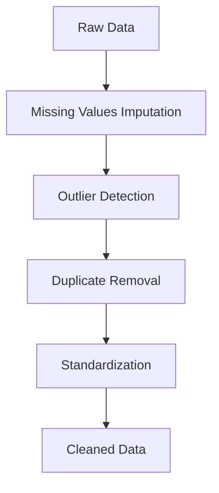

Data is the backbone of decision-making in businesses today. However, raw data often arrives in an unstructured, incomplete, or inconsistent form, making it difficult to extract actionable insights. Whether it’s missing values, duplicates, or outliers, the process of cleaning and preparing data for analysis is both time-consuming and critical to ensure accuracy. Fortunately, **AI-powered tools** like **ChatGPT**, **Perplexity**, and other **AI assistants** are transforming how we approach data cleaning and analysis, enabling more accurate and efficient data insights.

In this blog, we’ll explore how AI can help with the **data cleaning process** and how tools like **ChatGPT** and **Perplexity** specifically assist in **data analysis**, providing faster and more reliable insights.

## The Challenges of Data Cleaning

Data cleaning is a necessary step in the data analysis pipeline. It involves identifying and correcting errors or inconsistencies in the data before it can be analyzed. Common data issues include:

- **Missing Values:** Data may be incomplete, and rows or columns could be missing critical information.
- **Inconsistent Formatting:** Dates, currencies, and other values may be formatted differently across datasets.
- **Duplicates:** Multiple entries of the same data can distort analysis.
- **Outliers:** Extreme values may skew results if not properly handled.

Without proper data cleaning, any analysis performed on the dataset could lead to inaccurate or misleading results. Traditional data cleaning techniques often require manual intervention, but AI can automate much of this process, making it faster and more accurate.

## How AI Tools Can Help Clean Data

### 1. **Automating Data Preprocessing**

AI tools like **Perplexity** and **ChatGPT** can assist in automating many of the steps involved in data preprocessing. These tools can scan datasets for missing or incorrect data, suggest imputation methods, and even remove outliers.

- **Missing Data Imputation:** AI algorithms can predict missing values based on patterns in the available data. For example, missing values in a customer database could be inferred based on customer profiles or historical purchasing behaviors.
  
- **Outlier Detection and Removal:** AI can quickly identify data points that deviate significantly from the rest of the dataset and suggest how to handle them (whether by removal or adjustment).
  
- **Duplicate Detection:** AI can automatically flag and remove duplicate entries, reducing the manual work involved in data cleaning.

### 2. **Data Normalization and Standardization**

When working with datasets from different sources, inconsistencies in formats can cause problems. For instance, one source may use "MM/DD/YYYY" for dates, while another uses "YYYY-MM-DD". AI tools can standardize the data by converting all entries to a uniform format.

- **AI-driven normalization:** AI can automate the transformation of numeric data into a consistent scale, ensuring that all data points are comparable.

- **Text Data Cleaning:** If you have textual data, AI can help in tasks like removing stop words, stemming, and lemmatization to ensure consistent terminology across the dataset.

### 3. **Categorization and Clustering**

AI models like **ChatGPT** can also be used to categorize unstructured data (such as text) into meaningful groups, helping to clean and prepare data for analysis. For instance, **ChatGPT** can classify customer feedback into categories like "product issues," "service complaints," or "general inquiries." This classification can be invaluable for businesses looking to perform sentiment analysis or trend analysis on customer data.

- **Text Clustering:** AI can group similar text data, making it easier to identify patterns and correlations that may not be immediately apparent.
- **Entity Recognition:** AI can recognize specific entities (names, locations, dates, etc.) in unstructured data and convert them into structured data for further analysis.

## How ChatGPT, Perplexity, and Other AI Assistants Help with Data Analysis

Once the data is cleaned and well-structured, AI tools like **ChatGPT**, **Perplexity**, and other AI assistants can then be leveraged for advanced analysis, helping to uncover insights that would be time-consuming or difficult to find manually.

### **ChatGPT for Data Analysis**

ChatGPT excels in helping users analyze textual data by processing, summarizing, and providing insights directly from the content.

- **Natural Language Queries:** **ChatGPT** can assist users by answering specific questions about data. For example, if you have a dataset containing customer reviews, **ChatGPT** can analyze the reviews and provide insights about customer sentiment, common complaints, or product feedback.
  
- **Text Summarization:** **ChatGPT** can condense large volumes of text into clear summaries, highlighting key trends, findings, and action points. This can be particularly useful when analyzing long-form documents or multiple reports.
  
- **Sentiment Analysis:** By examining textual data, **ChatGPT** can automatically detect sentiment (positive, negative, or neutral), making it easier to gauge public opinion or customer feedback without manually reading each entry.

### **Perplexity for Data Analysis**

**Perplexity** is an AI-powered tool focused on extracting key insights from both structured and unstructured datasets. It uses advanced natural language processing (NLP) techniques to identify hidden trends and relationships within the data.

- **Data Exploration:** **Perplexity** allows users to quickly explore large datasets by identifying patterns and generating visualizations. It uses AI to recommend the most relevant insights based on the data you input, reducing the need for trial-and-error analysis.
  
- **Predictive Analysis:** With **Perplexity**, users can perform predictive analytics, leveraging historical data to make informed predictions about future trends. Whether it's forecasting sales, customer churn, or market trends, **Perplexity** can provide robust predictive models based on historical patterns.
  
- **Correlation Analysis:** **Perplexity** can also identify correlations between different variables, helping users understand the relationships between various factors in the dataset. This can be crucial for businesses looking to identify causes of changes in their key metrics.

### 4. **Text Analysis with AI Assistants**

For businesses dealing with textual data (e.g., reviews, customer feedback, social media comments), **ChatGPT** can be used to conduct sentiment analysis or summarize long documents, making it easier to draw conclusions.

- **Sentiment Analysis:** **AI assistants** like **ChatGPT** can analyze customer reviews, social media posts, or surveys to gauge overall sentiment (positive, negative, or neutral) toward a product or service.
  
- **Text Summarization:** **AI assistants** can summarize large volumes of text, allowing businesses to quickly understand key points without reading every detail.

### 5. **Data Visualization**

Once data is cleaned and analyzed, visualizing it effectively is crucial for communicating insights. AI tools can automate the creation of charts, graphs, and dashboards to make complex datasets more digestible and actionable.

- **Automated Reporting:** **AI assistants** can generate real-time reports with visualizations, providing decision-makers with up-to-date insights on key metrics.

## Key Benefits of Using AI for Data Cleaning and Analysis

- **Speed and Efficiency:** AI can automate time-consuming tasks like data cleaning and analysis, reducing the time required to get actionable insights.
- **Improved Accuracy:** AI models can detect patterns and inconsistencies in data more accurately than humans, reducing errors in analysis.
- **Scalability:** AI tools can handle large datasets with ease, making them ideal for businesses with vast amounts of data.
- **Cost-Effectiveness:** By automating repetitive tasks, AI reduces the need for manual labor, allowing businesses to allocate resources more effectively.

## Conclusion

The process of cleaning and analyzing data is essential for making informed business decisions, but it can often be a daunting and time-consuming task. **AI-powered tools** like **ChatGPT**, **Perplexity**, and other **AI assistants** are changing the game by automating data cleaning, normalization, and analysis, allowing businesses to gain insights faster and more accurately.

By leveraging AI in your data workflows, you can streamline your operations, reduce errors, and gain valuable insights that drive decision-making. Whether you’re dealing with structured or unstructured data, **ChatGPT**, **Perplexity**, and other **AI assistants** can be your ultimate tools for ensuring that your data is clean, analyzed, and ready for action.

