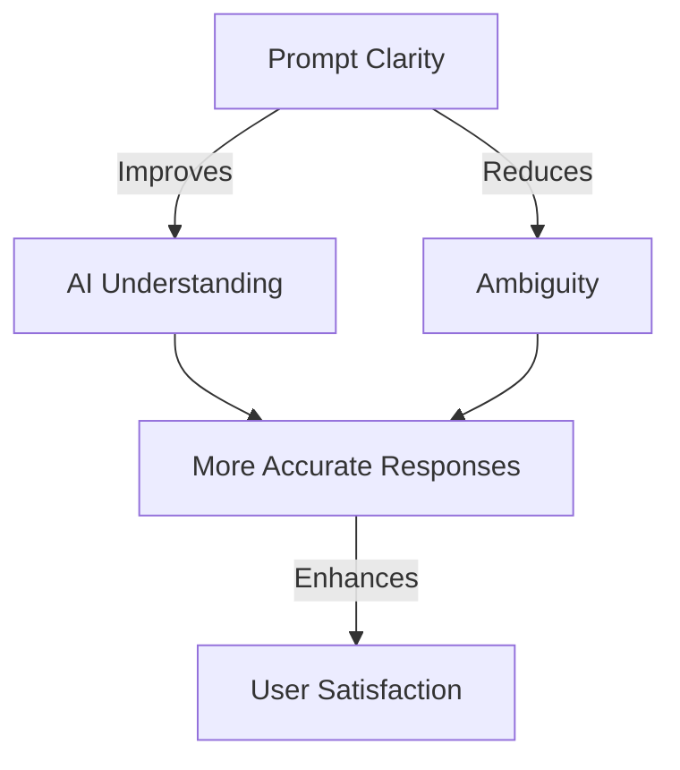

## Introduction
Prompt engineering is the art of designing effective inputs for AI models to generate desired outputs. This guide covers three fundamental principles: **Clarity, Specificity, and Context**, which significantly impact the quality of AI-generated responses.


---
## 1. Clarity
Clarity ensures the AI understands exactly what is being asked. Vague or ambiguous instructions often lead to irrelevant or generic outputs. 

### 📝 **Key Considerations:**
- Use **simple and direct language**.
- Avoid **vague terms** or unnecessary jargon.
- Ensure **concise phrasing** to eliminate multiple interpretations.

### 📌 **Example:**
```prompt
"Tell me about history."
```
🔽 **Improved Prompt:**
```prompt
"Summarize the key events of the Renaissance period in Europe, highlighting key figures and innovations in art and science."
```


---
## 2. Specificity
Being specific helps guide the AI towards precise responses. The more details you provide, the more refined the output.

### 📝 **Key Considerations:**
- Specify the **format** (e.g., list, paragraph, summary, Q&A).
- Define **length constraints** (e.g., 100-word summary vs. 1000-word essay).
- Mention **important aspects** to include.

### 📌 **Example:**
```prompt
"Write a story."
```
🔽 **Improved Prompt:**
```prompt
"Write a 300-word science fiction story about a world where AI governs human society. Include a protagonist who challenges the AI’s authority and explore the ethical dilemmas they face."
```

### 🖼 **Visual Representation:**


---
## 3. Context
Context helps the AI generate relevant responses. Without it, results may be too general or off-topic.

### 📝 **Key Considerations:**
- Provide **background information**.
- Define the **target audience** (e.g., beginner, expert, child).
- Mention any **specific perspectives** or frameworks.

### 📌 **Example:**
```prompt
"Explain photosynthesis."
```
🔽 **Improved Prompt:**
```prompt
"Explain photosynthesis to a 10-year-old using simple language and examples. Use an analogy related to cooking to make it more relatable."
```


### 🎥 **Demonstration Video:**
<iframe 
  width="560" 
  height="315" 
  src="https://www.youtube.com/embed/pmzZF2EnKaA" 
  frameBorder="0" 
  allow="accelerometer; autoplay; clipboard-write; encrypted-media; gyroscope; picture-in-picture" 
  allowFullScreen
></iframe>

---
## 📊 **Interactive Graph: Prompt Effectiveness**


---
## 📋 **Comparative Table: Poor vs. Effective Prompts**

| Poor Prompt | Effective Prompt |
|-------------|------------------|
| "Write an essay." | "Write a 500-word essay on the impact of AI in healthcare, including ethical considerations and real-world examples." |
| "Describe a painting." | "Describe the artistic style and historical significance of Van Gogh's 'Starry Night', focusing on its use of color and brushwork." |
| "Summarize a book." | "Summarize the book '1984' by George Orwell, highlighting key themes, character development, and its relevance to modern society." |

---
## 🏆 **Practical Exercise: Improve These Prompts**
Try refining these prompts using **Clarity, Specificity, and Context**.

1. "Explain gravity."
2. "Write a review."
3. "Give me a summary."

### 🔍 **Example Refinements:**
1. "Explain gravity in simple terms, using real-world examples like why objects fall to the ground and how it keeps planets in orbit."
2. "Write a 200-word review of the movie 'Inception,' analyzing its plot complexity, cinematography, and audience reception."
3. "Summarize the main arguments in the research paper 'Deep Learning for Natural Language Processing' in 300 words, focusing on key methodologies and findings."

### 📚 **Further Reading:**
Best Prompt Techniques for LLM Responses
<a href="https://medium.com/the-modern-scientist/best-prompt-techniques-for-best-llm-responses-24d2ff4f6bca" target="_blank">
  
</a>

Prompt Engineering Principles
<a href="https://www.geeksforgeeks.org/chatgpt-prompt-engineering-principles/" target="_blank">
  
</a>

---
## ✅ **Summary**
- **Clarity**: Use precise language to remove ambiguity.
- **Specificity**: Provide detailed instructions to guide AI responses.
- **Context**: Include necessary background information for better results.

By implementing these principles, AI-generated responses become more **accurate, meaningful, and useful** for various applications.

📌 **Practice makes perfect! Keep refining prompts for better AI interactions.** 🚀
