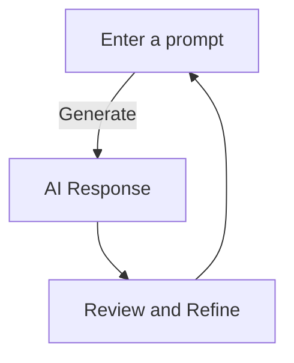

## 🚀 Introduction

A **prompt** is the input given to an AI model to generate a response. Think of it as a question or instruction that directs AI’s output. The way a prompt is structured significantly influences the **accuracy, relevance, and usefulness** of the response.

### 🎯 Why Prompts Matter
Prompts play a crucial role in:
✅ **Controlling Output** – Well-structured prompts yield more accurate responses.
✅ **Reducing Ambiguity** – Specific prompts help avoid vague answers.
✅ **Optimizing Performance** – Fine-tuned prompts improve efficiency.

### 📌 Watch this quick introduction to Prompt Engineering:
<iframe 
  width="560" 
  height="315" 
  src="https://www.youtube.com/embed/p09yRj47kNM" 
  frameBorder="0" 
  allow="accelerometer; autoplay; clipboard-write; encrypted-media; gyroscope; picture-in-picture" 
  allowFullScreen
></iframe>
---

## 🛠️ Types of Prompts & How to Use Them

### 1️⃣ Instruction-Based Prompts
These clearly direct AI to perform a specific task.

📌 **Example:**  
👉 *"Summarize this article in two sentences."*

**Explanation:** Instruction-based prompts work well when you need precise and concise answers. They guide AI to deliver targeted responses, making them ideal for summarization, step-by-step guides, or task automation.

### 2️⃣ Open-Ended Prompts
These encourage creative or exploratory responses.
📌 **Example:**  
👉 *"What are the implications of AI in education?"*

🔹 **Explanation:** Open-ended prompts allow AI to generate diverse responses based on the provided context. They are useful for brainstorming, discussions, or expanding on complex topics.

### 3️⃣ Contextual Prompts
They provide background information for more informed responses.
📌 **Example:**  
👉 *"Given AI's role in automation, how will it impact employment?"*

🔹 **Explanation:** Contextual prompts enhance AI’s ability to generate accurate answers by including relevant background details. This ensures more nuanced and insightful responses.

### 🔍 Visualizing Prompt Effectiveness

---

## ✨ Good vs. Bad Prompts: A Side-by-Side Comparison

| Type             | Poor Prompt                         | Well-Crafted Prompt                         |
|-----------------|---------------------------------|-------------------------------------|
| Instruction-Based | "Tell me about space"           | "Summarize the history of space exploration in 100 words." |
| Open-Ended      | "What is AI?"                    | "How has AI evolved over the past decade in the healthcare industry?" |
| Contextual      | "Explain Python"                 | "Given Python’s versatility in data science, explain its most widely used libraries." |

---
A well-structured prompt provides clear guidance, context, and constraints, ensuring AI generates precise and relevant responses. Avoid vague or overly broad prompts that can result in generic answers.

## 📈 The Impact of Well-Crafted Prompts

This graph illustrates how refining prompts can **significantly enhance AI response accuracy**. 

---
Experimenting with prompt phrasing, specificity, and context can dramatically improve AI's ability to provide useful responses. Refining prompts ensures better engagement and practical utility.

## 🔥 Best Practices for Crafting Effective Prompts

✅ **Be Specific** – Provide clear, detailed instructions.  
✅ **Use Examples** – Guide the model with structured inputs.  
✅ **Keep it Concise** – Avoid overly complex prompts.  
✅ **Iterate & Test** – Experiment with different prompts for best results.  

🔹 **Try it Yourself:** Test different prompts and see how they influence AI’s response!  

---
📝 **Quiz: Test Your Prompting Knowledge!**

**Question 1:** Which of the following is a well-crafted prompt?
1. "Tell me about history."
2. "Summarize the causes of World War II in under 200 words."
3. "AI is cool."

*(Answer: Option 2)*

**Question 2:** What is the benefit of using contextual prompts?
- A) They provide background information for better responses.
- B) They are vague and broad.
- C) They reduce AI performance.

*(Answer: Option A)*

## 📚 Further Learning & Resources
📺 **Video Guide:**  
<iframe 
  width="560" 
  height="315" 
  src="https://www.youtube.com/embed/_ZvnD73m40o" 
  frameBorder="0" 
  allow="accelerometer; autoplay; clipboard-write; encrypted-media; gyroscope; picture-in-picture" 
  allowFullScreen
></iframe>

📖 **Read More:**  

## 🏁 Conclusion
Mastering **prompt crafting** ensures more accurate, relevant, and meaningful AI responses. By refining your prompts, you unlock AI’s full potential for better and more effective interactions.

🌟 **Your next step:** Experiment with different prompts and optimize your results! 🚀

📌 **Final Visual Example:**  
  

