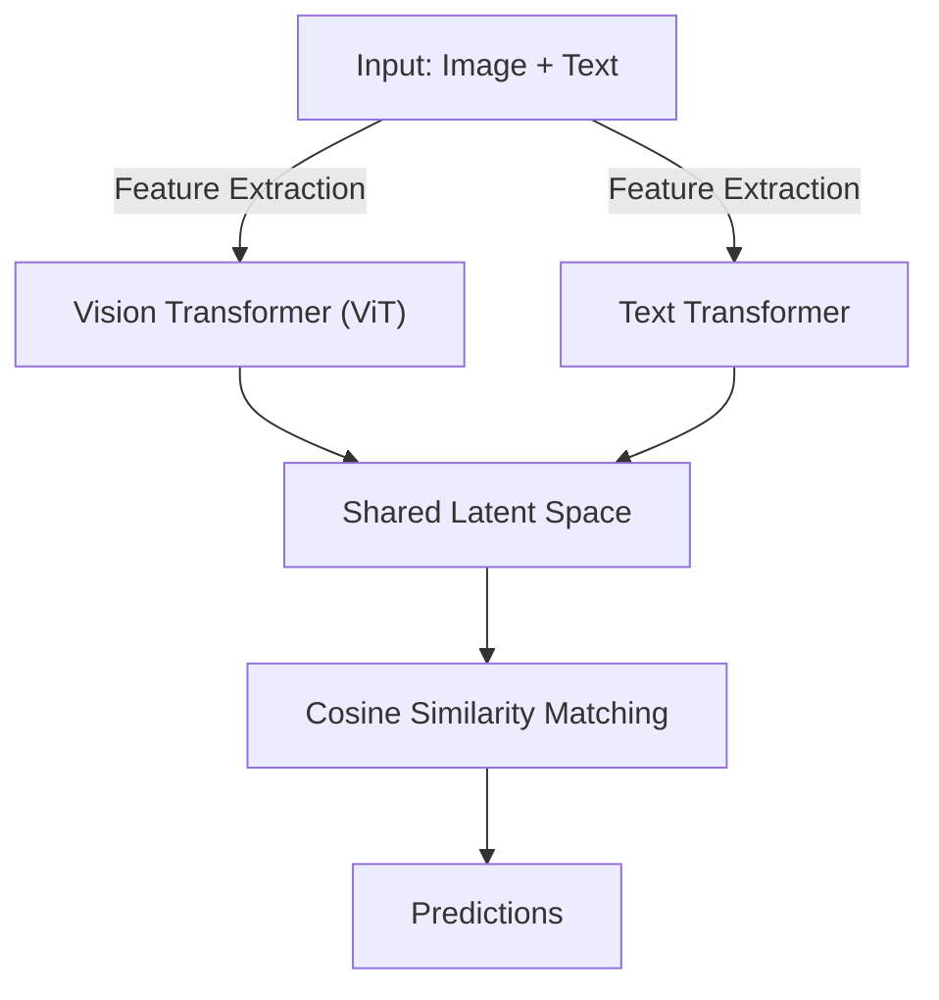
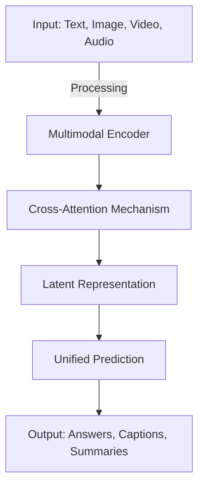

Multimodal AI tools leverage both text and image data to create more sophisticated AI models. Two key tools in this space are **CLIP (Contrastive Language-Image Pretraining)** by OpenAI (available via Hugging Face) and **Google Gemini**, an advanced multimodal AI model developed by Google DeepMind.

## CLIP (Hugging Face)

CLIP is a neural network trained on a variety of image and text pairs. It can understand and associate images with textual descriptions, making it useful for tasks such as image retrieval, zero-shot classification, and captioning.

### Key Features
- Zero-shot image classification
- Natural language-based image search
- Transfer learning for multiple downstream tasks

### Architecture


### Example: Using CLIP via Hugging Face
```python
import torch
from transformers import CLIPProcessor, CLIPModel

model = CLIPModel.from_pretrained("openai/clip-vit-base-patch32")
processor = CLIPProcessor.from_pretrained("openai/clip-vit-base-patch32")

text = ["a photo of a cat"]
image = torch.randn((1, 3, 224, 224))
inputs = processor(text=text, images=image, return_tensors="pt", padding=True)
outputs = model(**inputs)
print(outputs.logits_per_image)
```

#### Expected Output
```plaintext
tensor([[12.1342]], grad_fn=<MulBackward0>)
```

## Google Gemini

Google Gemini is an advanced multimodal AI system designed to process and reason across text, images, video, and audio. It is built upon deep learning advancements and is optimized for high-performance AI applications.

### Key Features
- Unified multimodal model for various data types
- Strong reasoning capabilities across modalities
- Scalable for real-world applications

### Architecture Overview


### Example: Using Google Gemini API (Hypothetical)
```pyhton
import requests

API_URL = "https://api.google.com/gemini"
data = {"text": "Describe this image", "image_url": "https://example.com/sample.jpg"}
response = requests.post(API_URL, json=data)
print(response.json())
```

#### Expected Output
```json
{
  "description": "A beautiful sunset over the ocean with a boat in the distance."
}
```

## Comparison of CLIP and Google Gemini

| Feature         | CLIP (Hugging Face)  | Google Gemini |
|---------------|-------------------|--------------|
| Input Modalities | Image, Text       | Text, Image, Video, Audio |
| Use Cases      | Image retrieval, captioning, zero-shot classification | Multimodal reasoning, content generation, AI assistance |
| Architecture   | Vision Transformer + Text Transformer | Advanced deep learning fusion model |
| API Availability | Hugging Face Transformers | Google Cloud AI Services |

---

Multimodal AI tools like CLIP and Google Gemini continue to push the boundaries of artificial intelligence, offering robust capabilities across diverse data types.


