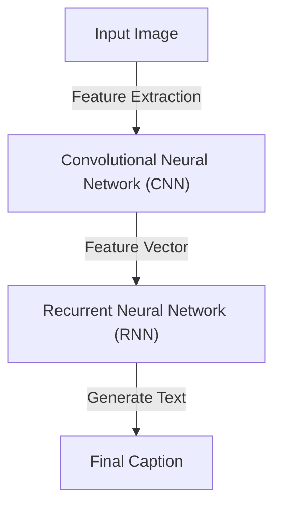
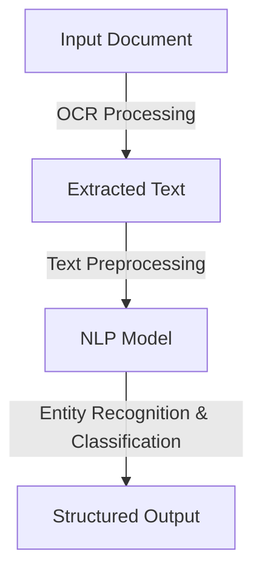

## 1. Introduction
Multimodal Large Language Models (LLMs) extend traditional language models by incorporating multiple input types such as text, images, and structured data. Two significant applications of these models are:

- **Image Captioning**: Automatically generating descriptive text for images.
- **Document Analysis**: Extracting insights from structured and unstructured documents.

## 2. Image Captioning
Image captioning is the process of analyzing an image and generating a human-readable textual description. This is achieved through models combining **Computer Vision (CV)** and **Natural Language Processing (NLP)**.

### 2.1 Workflow



### 2.2 Python Code Example

```python
import torch
import torchvision.transforms as transforms
from PIL import Image
from transformers import BlipProcessor, BlipForConditionalGeneration

# Load pre-trained model
processor = BlipProcessor.from_pretrained("Salesforce/blip-image-captioning-base")
model = BlipForConditionalGeneration.from_pretrained("Salesforce/blip-image-captioning-base")

# Load and preprocess image
image = Image.open("example.jpg").convert("RGB")
inputs = processor(images=image, return_tensors="pt")

# Generate caption
output = model.generate(**inputs)
caption = processor.decode(output[0], skip_special_tokens=True)
print("Generated Caption:", caption)

```

### 2.3 Example Output
```
Generated Caption: "A cat sitting on a wooden floor."
```

## 3. Document Analysis
Document analysis involves extracting structured information from text-heavy sources such as PDFs, invoices, and legal documents.

### 3.1 Key Techniques
| Technique           | Description                                          |
|--------------------|--------------------------------------------------|
| Optical Character Recognition (OCR) | Converts scanned documents into text. |
| Named Entity Recognition (NER) | Identifies key entities (dates, names, locations). |
| Sentiment Analysis | Determines the emotional tone of a document. |

### 3.2 Workflow


### 3.3 Python Code Example

```pyhton
import pytesseract
from PIL import Image

# Load image of a document
image = Image.open("document.jpg")
text = pytesseract.image_to_string(image)
print("Extracted Text:", text)

```

### 3.4 Example Output
```
Extracted Text: "Invoice #12345, Date: 2025-02-15, Total: $500.00"
```

## 4. Conclusion
Multimodal LLMs bridge the gap between text and vision, making them valuable for **automating image captioning** and **analyzing complex documents**. These technologies are improving accessibility, enhancing productivity, and reducing manual effort in multiple industries.


