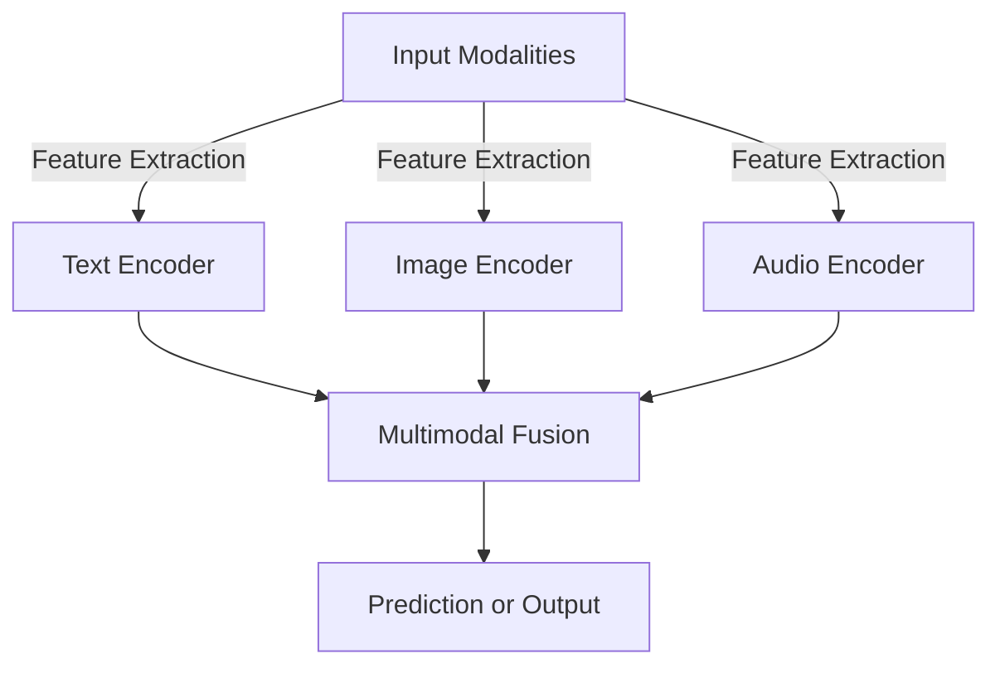

## Understanding Multimodal Models

Multimodal models are deep learning systems designed to process and integrate multiple types of data, such as text, images, audio, and sensor readings, to make more informed predictions. 

## Types of Modalities in Multimodal Models

| Modality  | Description |
|-----------|-------------|
| Text      | Natural Language Processing (NLP) tasks |
| Image     | Computer vision applications |
| Audio     | Speech recognition and sound processing |
| Video     | Motion analysis and video captioning |
| Sensors   | IoT data, temperature, GPS, and other signals |

## Deep Learning in Multimodal Models

A multimodal model typically employs deep learning techniques to learn from diverse data. The fundamental steps include:

1. **Feature Extraction**: Using CNNs for images, RNNs/Transformers for text, and spectrogram-based models for audio.
2. **Fusion Techniques**: Combining modalities at feature, decision, or intermediate levels.
3. **Alignment**: Synchronizing different modalities (e.g., matching audio with corresponding text in speech recognition).

## Architectures and Algorithms in Multimodal Models



### Common Architectures
- **Early Fusion**: Combining raw data before model processing.
- **Late Fusion**: Merging decisions from separate models.
- **Joint Representation Learning**: Learning a shared latent space for multiple modalities.

## Applications of Multimodal Models

| Application | Example |
|------------|---------|
| Healthcare | Diagnosing diseases using text (patient history) and images (X-rays) |
| Autonomous Vehicles | Processing camera images, LIDAR, and GPS for navigation |
| Chatbots | Using speech and text for interactive AI assistants |
| Content Recommendation | Analyzing video, text, and audio for personalized suggestions |

## Advances and Challenges in Multimodal Models

### Advances
- Transformer-based multimodal models (e.g., CLIP, Flamingo, GPT-4V)
- Efficient cross-modal attention mechanisms
- Larger datasets with labeled multimodal data

### Challenges
- Data alignment complexity
- Computational cost
- Handling missing modalities in real-time scenarios

## Examples of Multimodal Models

### Example: Image-Text Classification

#### Code Implementation
```python

import torch
from transformers import CLIPProcessor, CLIPModel

model = CLIPModel.from_pretrained("openai/clip-vit-base-patch32")
processor = CLIPProcessor.from_pretrained("openai/clip-vit-base-patch32")

text = ["a photo of a dog"]
image = torch.randn((1, 3, 224, 224))
inputs = processor(text=text, images=image, return_tensors="pt", padding=True)
outputs = model(**inputs)
print(outputs.logits_per_image)
```

#### Expected Output
```plaintext
tensor([[10.3245]], grad_fn=<MulBackward0>)
```

This example uses OpenAI's CLIP model to process images and text together.

---

Multimodal models continue to advance AI applications, improving understanding and interaction across diverse data sources.


