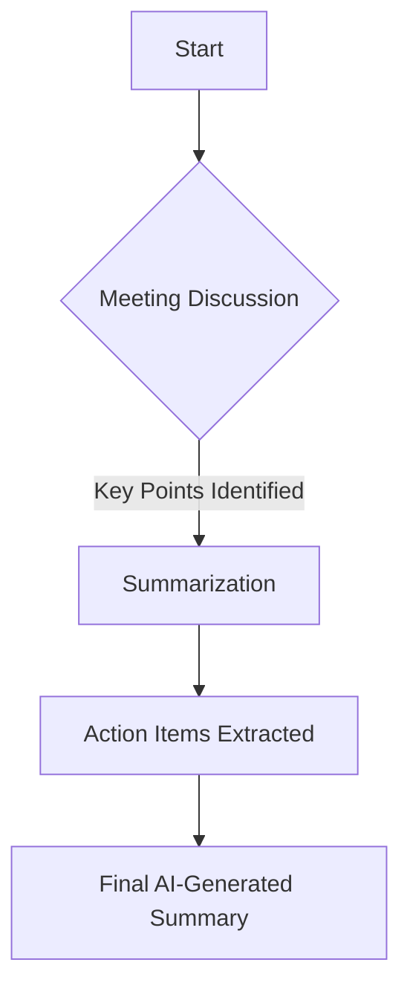
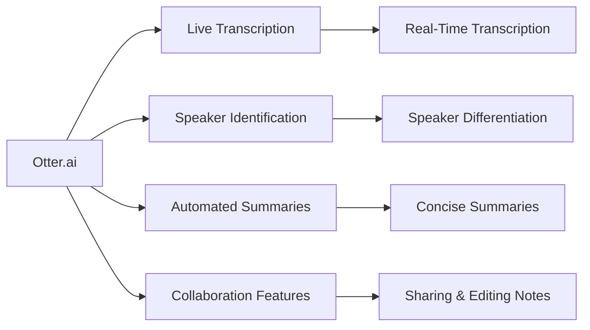
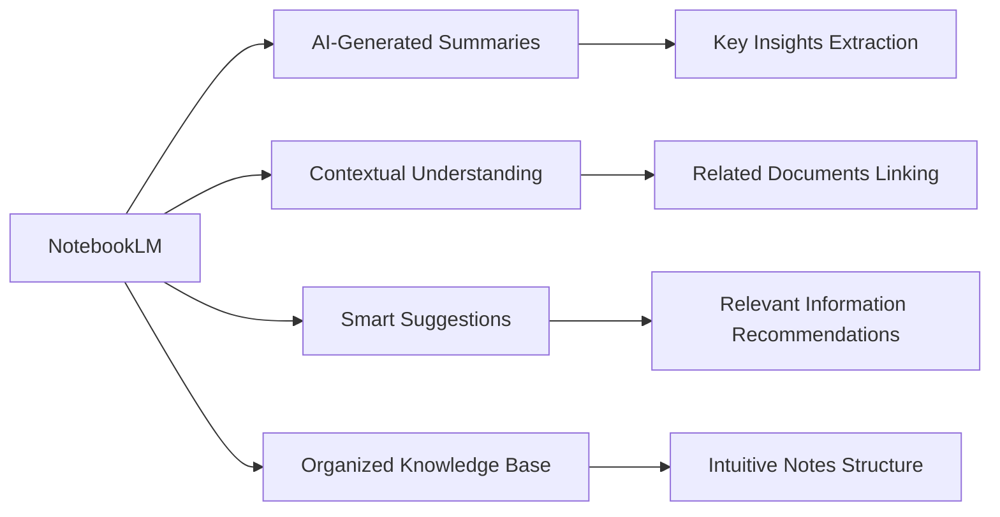
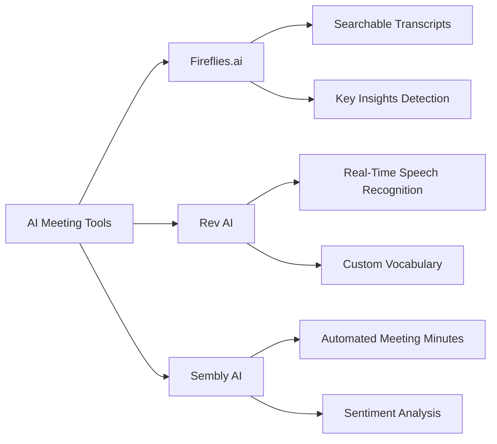

In today's fast-paced work environment, meetings are a crucial aspect of collaboration. However, they can often be time-consuming and overwhelming, making it difficult to capture key takeaways and action items efficiently. AI-powered note-taking and meeting management tools like **Otter.ai** and **NotebookLM** are revolutionizing the way professionals handle meetings, ensuring higher productivity and better information retention.

## The Need for AI-Powered Meeting Summarization

Meetings can be lengthy, and manually taking notes can be distracting and inefficient. Traditional note-taking methods often result in incomplete or inaccurate records, leading to miscommunication and loss of valuable insights. AI-driven summarization tools help address these issues by:

- **Automatically transcribing conversations** in real-time.
- **Identifying key discussion points**, decisions, and action items.
- **Allowing users to search** and retrieve specific information from past meetings.
- **Reducing the need for extensive manual note-taking**, enabling participants to focus on discussions.

> "AI-powered note-taking is revolutionizing the way businesses capture and retain knowledge." — *TechCrunch*

## How Otter.ai Enhances Meeting Productivity

[Watch this video on how Otter.ai works](https://www.youtube.com/watch?v=yUxlIDKIHhA)

**Otter.ai** is an AI-powered transcription and meeting summarization tool that offers real-time voice-to-text capabilities. It is widely used for business meetings, lectures, and brainstorming sessions. 

### Key Features:

- **Live Transcription:** Converts speech into text in real-time, ensuring accessibility and accurate record-keeping.
- **Speaker Identification:** Differentiates between multiple speakers to provide structured and organized transcripts.
- **Automated Summaries:** Generates concise summaries highlighting critical discussion points.
- **Collaboration Features:** Allows users to share notes, edit transcripts, and add comments for better team communication.
- **Integration with Meeting Platforms:** Works seamlessly with Zoom, Microsoft Teams, and Google Meet.
- **Keyword Highlighting & Search:** Users can quickly search for specific terms and key points within transcripts.

## NotebookLM: AI-Driven Contextual Note-Taking

[Watch this video on how Notebook LM works](https://www.youtube.com/watch?v=UG0DP6nVnrc)

**NotebookLM**, developed by Google, is another powerful AI tool designed to enhance note-taking and meeting management. Unlike traditional transcription tools, NotebookLM focuses on **context-aware summarization** and **knowledge organization**.

### Key Features:

- **AI-Generated Summaries:** Extracts key insights from meeting transcripts, eliminating the need for manual summarization.
- **Contextual Understanding:** Links discussions to related documents and references, providing deeper insights.
- **Smart Suggestions:** Recommends relevant information based on the meeting’s context, improving decision-making.
- **Organized Knowledge Base:** Structures notes in an intuitive format, making it easier to review past discussions.
- **Interactive Summarization:** Users can interact with AI-generated notes, asking follow-up questions to refine the information extracted.

## Other AI Meeting Summarization Tools

While Otter.ai and NotebookLM are popular choices, several other AI-driven meeting management tools can further improve productivity:

### Fireflies.ai

**Fireflies.ai** is an AI-powered assistant that records, transcribes, and analyzes meetings.

- **Automatic Meeting Notes:** Generates searchable transcripts and summaries.
- **AI-Powered Insights:** Detects key themes and action items from discussions.
- **CRM Integration:** Syncs notes with platforms like Salesforce and HubSpot.

### Rev AI

**Rev AI** specializes in highly accurate transcription services with AI-enhanced models:

- **Real-Time Speech Recognition:** Converts voice to text with minimal lag.
- **Custom Vocabulary:** Allows users to add industry-specific terms for improved accuracy.
- **Speaker Diarization:** Differentiates between multiple speakers efficiently.

### Sembly AI

**Sembly AI** focuses on advanced analytics and AI-driven decision support:

- **Automated Meeting Minutes:** Extracts action items and decisions.
- **Team Collaboration:** Provides shared workspaces for meeting summaries.
- **Sentiment Analysis:** Identifies emotional tones in discussions to gauge engagement and response.

## Benefits of Using AI for Meeting Summarization

The adoption of AI tools for note-taking and meeting management provides several advantages:

- **Time Savings:** Reduces the effort required to manually summarize meetings, freeing up time for other tasks.
- **Improved Accuracy:** AI eliminates human errors in note-taking, ensuring precise and comprehensive records.
- **Enhanced Collaboration:** Teams can share and review meeting notes effortlessly, leading to better coordination.
- **Searchable Archives:** AI-generated transcripts and summaries allow for quick retrieval of past meeting details.
- **Increased Engagement:** Participants can focus on discussions instead of worrying about taking notes.
- **Better Decision-Making:** AI insights help teams identify trends and action points more effectively.

## Conclusion

AI-powered meeting summarization tools like **Otter.ai, NotebookLM, Fireflies.ai, Rev AI,** and **Sembly AI** are transforming workplace productivity by automating transcription, improving note-taking accuracy, and enhancing collaboration. As businesses and professionals continue to seek efficiency in their workflows, leveraging AI for meeting management is becoming a necessity rather than a luxury. By integrating these tools into daily operations, organizations can optimize their meetings and ensure that no crucial information is lost.
