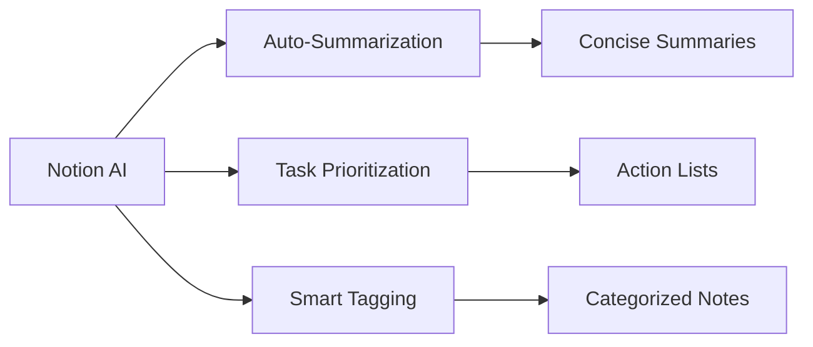
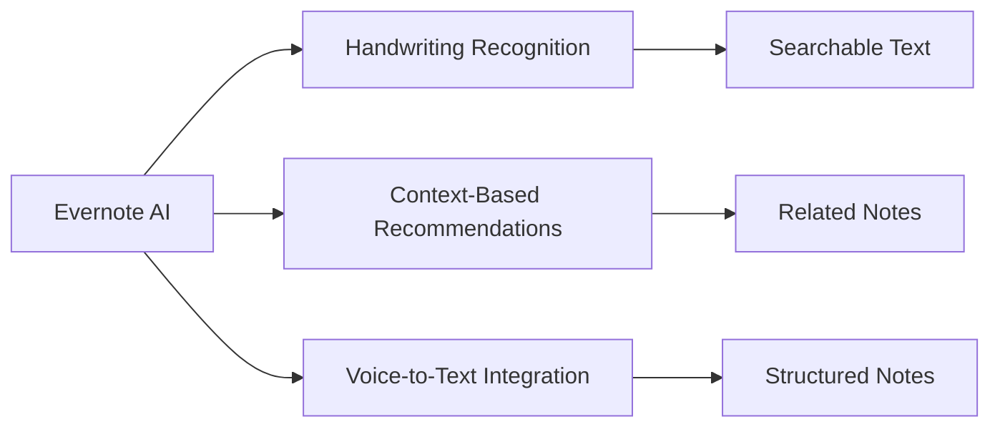
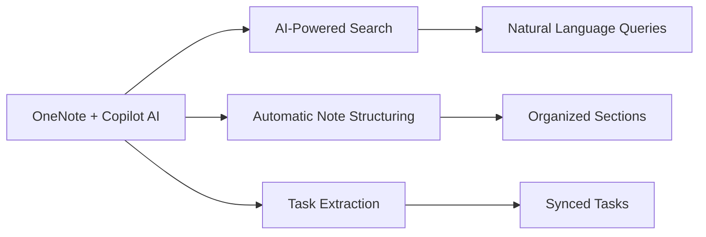
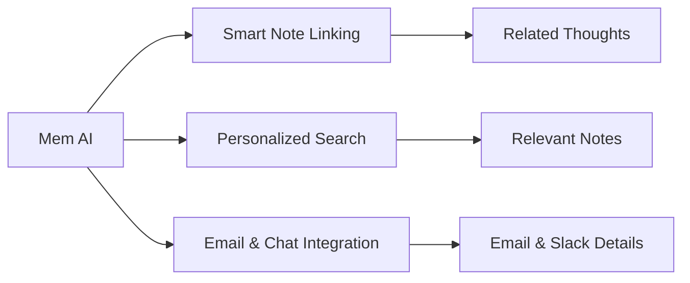
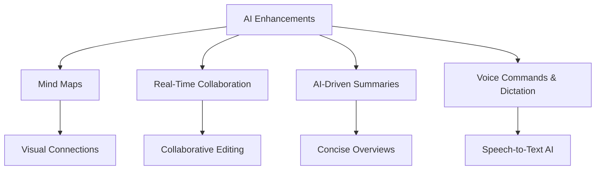

Taking notes is just the first step—efficient organization ensures accessibility, easy retrieval, and enhanced productivity. AI-powered tools help automate and structure notes, categorize information, and create intelligent summaries. Whether it’s sorting meeting notes, academic material, or personal thoughts, AI enhances organization by tagging, summarizing, and linking related content.

## Key Benefits of AI-Powered Note Organization

- **Smart Categorization**: AI automatically sorts notes into relevant topics and categories.
- **Searchable Archives**: Advanced search functions make it easy to find notes by keywords, themes, or dates.
- **Context-Aware Linking**: AI suggests connections between different notes, documents, and references.
- **Task & Action Item Extraction**: Identifies and highlights key action items from meeting or project notes.
- **Cloud Sync & Integration**: AI-driven note-taking tools integrate with productivity apps like Notion, Evernote, Google Drive, and Slack.

## Popular AI-Powered Note Organization Tools

### Notion AI

Notion is a flexible workspace that combines notes, tasks, and databases. Its AI-powered assistant enhances organization by:

- **Auto-Summarization**: Generates concise summaries for long notes.
- **Task Prioritization**: Extracts to-do items from notes and organizes them into action lists.
- **Smart Tagging**: Categorizes notes using keywords and themes.

#### Demo Link:
[Notion AI Demo](https://www.notion.so)

### Evernote AI

Evernote, a well-known note-taking tool, includes AI-powered search and organization features:

- **Handwriting Recognition**: Converts handwritten notes into searchable text.
- **Context-Based Recommendations**: Links related notes and suggests useful documents.
- **Voice-to-Text Integration**: Captures spoken ideas and organizes them into structured notes.

#### Demo Link:
[Evernote AI Demo](https://www.evernote.com)

### Microsoft OneNote + Copilot AI

OneNote integrates with Copilot AI to improve organization:

- **AI-Powered Search**: Retrieves notes using natural language queries.
- **Automatic Note Structuring**: Converts unstructured text into organized sections.
- **Task Extraction**: Identifies tasks within notes and syncs them with Microsoft To-Do.

#### Demo Link:
[OneNote Copilot Demo](https://www.microsoft.com/en-us/microsoft-365/onenote)

### Mem AI

Mem AI is designed for automatic knowledge organization:

- **Smart Note Linking**: AI connects related thoughts and ideas without manual tagging.
- **Personalized Search**: Learns user preferences and surfaces the most relevant notes.
- **Email & Chat Integration**: Pulls important details from emails and Slack into notes.

#### Demo Link:
[Mem AI Demo](https://www.mem.ai)

## How AI Enhances Note Organization

- **AI-Generated Mind Maps**: Converts notes into visual mind maps, helping users see connections between ideas.
- **Real-Time Collaboration**: Allows teams to collaboratively edit and organize notes efficiently.
- **AI-Driven Summaries**: Condenses large note collections into concise overviews.
- **Voice Commands & Dictation**: Enables hands-free organization through speech-to-text AI.

## Conclusion

AI-powered meeting summarization and note organization tools like Otter.ai, NotebookLM, Notion, Evernote, and Mem AI are transforming workplace productivity by automating transcription, improving note-taking accuracy, and enhancing collaboration. As businesses and professionals continue to seek efficiency in their workflows, leveraging AI for meeting management is becoming a necessity. By integrating these tools into daily operations, organizations can optimize their meetings and ensure that no crucial information is lost.

