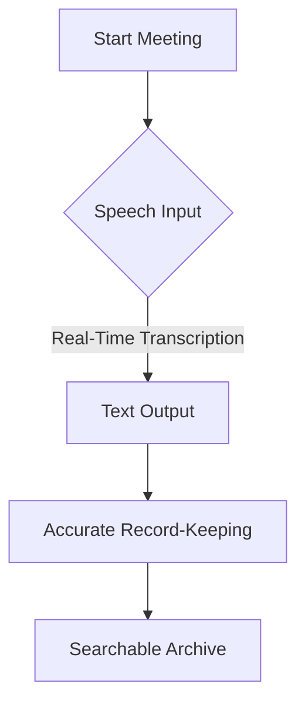
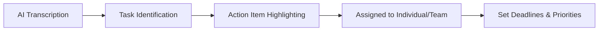
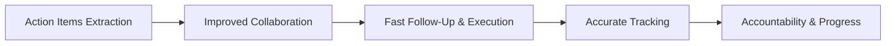

In today’s fast-paced business world, meetings are essential to collaboration, decision-making, and keeping teams aligned. However, capturing key points and action items in real-time can often feel like an overwhelming task. Traditional note-taking methods can be slow, prone to errors, and distract participants from focusing on the discussion. To tackle this challenge, **real-time transcription** and **automated action item extraction** powered by AI are becoming essential tools to ensure no crucial information is lost and that follow-up actions are clear and actionable.

## The Power of Real-Time Transcription

Real-time transcription refers to the ability to automatically convert spoken words into text during a meeting or discussion. With AI-powered transcription tools like **Otter.ai**, **Fireflies.ai**, and **Rev AI**, businesses are significantly improving their meeting productivity. Here’s why real-time transcription is such a game-changer:

- **Increased Accessibility:** Real-time transcription provides accurate, instant text versions of spoken words. This ensures that everyone, regardless of their hearing ability or language proficiency, can follow along with the meeting.
- **Accurate Record-Keeping:** AI-driven transcription tools minimize human error, providing accurate, comprehensive meeting records without the need for manual note-taking.
- **Time Efficiency:** Real-time transcription eliminates the need for attendees to take detailed notes, allowing them to focus on the conversation rather than worrying about capturing every point.

## Action Item Extraction: Automating the Follow-Up Process

One of the most crucial aspects of meetings is ensuring that the discussed tasks are tracked and acted upon. Automated action item extraction is a feature available in many AI-powered transcription tools, which automatically identifies and highlights key tasks and follow-up actions during a meeting. This is a game-changer for businesses looking to boost productivity and keep their teams aligned.

### How AI Extracts Action Items:

- **Task Identification:** AI tools can automatically recognize phrases like “I’ll take care of that,” “We need to follow up,” or “This needs to be done by…”. These statements are flagged as potential action items.
- **Task Assignment:** Some tools can even associate the identified task with specific individuals or teams based on context or pre-configured preferences, making follow-up more structured.
- **Deadlines & Priorities:** Many AI tools are equipped with natural language processing (NLP) algorithms that can detect deadlines, urgency, and priority levels based on the conversation flow, ensuring that no critical task is overlooked.

By automating the action item extraction, teams no longer need to manually sift through meeting notes to determine who’s responsible for what. This automated system allows for:

- **Efficient Follow-Up:** With action items clearly identified and assigned, team members can immediately begin working on tasks after the meeting.
- **Reduced Human Error:** Manual task tracking often leads to mistakes or missed assignments. AI-driven action item extraction ensures all tasks are captured accurately.
- **Increased Accountability:** Automatic tagging of team members for specific tasks holds everyone accountable for their responsibilities.

## Key Benefits of Real-Time Transcription and Action Item Extraction

### 1. **Improved Meeting Productivity**
By eliminating the need for manual note-taking and task tracking, participants can engage more fully in the conversation. The AI transcription provides a clear, accurate record, while the automated extraction of action items ensures that everyone knows what to do next.

### 2. **Enhanced Team Collaboration**
Clear documentation of tasks and assignments, along with shared, accessible transcripts, ensures that everyone is on the same page after the meeting. No one has to ask, “What was decided?” or “Who’s handling that task?”—it’s all in the transcript.

### 3. **Faster Follow-Up and Execution**
Since action items are already identified and assigned, there’s no need for follow-up emails or meetings just to clarify next steps. Teams can dive straight into executing their tasks, leading to faster decision-making and project execution.

### 4. **Accurate Tracking and Accountability**
AI tools can create easily searchable archives of meeting transcripts, which means that tasks and discussions can be tracked over time. Team members can review the status of their action items and check whether they met their deadlines, driving accountability and progress.

### 5. **Real-Time Collaboration**
Some AI tools offer collaborative features, allowing multiple users to edit and comment on the transcribed notes in real time. This improves communication and ensures that everyone is aligned as the meeting progresses.

## Links for Real-Time Transcription Tools

To experience the benefits of real-time transcription and action item extraction firsthand, explore the following AI tools:

- **[Otter.ai](https://otter.ai)**: Offers real-time transcription, speaker identification, and automatic action item extraction. It integrates seamlessly with platforms like Zoom and Google Meet.
- **[Fireflies.ai](https://fireflies.ai)**: An AI-powered assistant that transcribes meetings, analyzes conversations, and extracts action items. It integrates with CRM platforms like Salesforce.
- **[Rev AI](https://www.rev.ai/)**: Provides highly accurate transcription services with real-time speech recognition and speaker diarization.

## Conclusion

Incorporating **real-time transcription** and **automated action item extraction** into your meeting workflow can transform the way your team collaborates and follows up. By leveraging AI-powered tools, businesses can ensure that no critical information is lost, tasks are clearly assigned, and follow-up is faster and more efficient. These technologies are not only improving productivity but also fostering better team collaboration, accountability, and decision-making. As more organizations embrace AI in their meetings, the traditional methods of note-taking and task management will soon be a thing of the past.

By adopting these tools, you can ensure that your team spends less time worrying about documentation and more time focusing on executing tasks and driving results.

