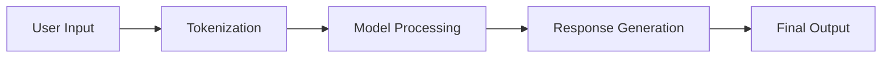

## Key Features of ChatGPT

1. **Versatile Applications**: 
   - Customer support
   - Creative writing
   - Education and tutoring
   - Coding assistance
   - Data analysis

2. **Interactive Conversations**:
   - Context-aware replies
   - Memory (short-term or session-based)
   - Dynamic adaptability to user needs

3. **Powered by GPT Architecture**:
   - Built on OpenAI's Generative Pre-trained Transformer models.
   - Fine-tuned with reinforcement learning from human feedback (RLHF).

---

## How ChatGPT Works

The ChatGPT system processes input text through the following pipeline:



### Breakdown of Each Stage

| Stage               | Description                                                                 |
|---------------------|-----------------------------------------------------------------------------|
| **Tokenization**    | Converts user input into smaller units (tokens) for easier processing.     |
| **Model Processing**| Processes tokens using GPT architecture to understand intent and context. |
| **Response Generation** | Generates a response based on patterns and probabilities learned during training. |
| **Final Output**    | Converts the generated response tokens back into text for the user.       |

---

## Example Code and Output

ChatGPT can assist developers by generating and explaining code. Below is an example:

### Python Code Example
```python
def factorial(n):
    if n == 0 or n == 1:
        return 1
    else:
        return n * factorial(n - 1)

# Example usage
print(f"Factorial of 5: {factorial(5)}")
```

### Output
```
Factorial of 5: 120
```

ChatGPT can also explain how the recursion works in this function, breaking it down step-by-step for beginners.

---

## Applications in Creative Writing

ChatGPT is a valuable tool for generating creative content, such as:

- **Stories and Poems**:
  Example:
  ```
  Once upon a time in a land so bright,
  A chatbot emerged, shedding AI light.
  From coding to poems, it worked day and night,
  Helping users with answers, ever so right.
  ```

- **Brainstorming Ideas**:
  For instance, suggesting titles for blog posts or books.


## Advantages of ChatGPT

1. **User-Friendly**: Intuitive interface for diverse users.
2. **Customizable**: Can be fine-tuned for specific tasks.
3. **Scalable**: Suitable for small businesses to enterprise solutions.
4. **Continuous Learning**: Improves with updates and user feedback.

---

## Limitations and Challenges

| Limitation         | Description                                                                 |
|--------------------|-----------------------------------------------------------------------------|
| Lack of Real-Time Updates | May not have knowledge of the latest events or trends.                |
| Contextual Errors  | Can occasionally misinterpret user intent or context.                      |
| Dependence on Input Quality | Outputs rely heavily on how the query is framed.                  |

---

## Future of ChatGPT

With continuous advancements, ChatGPT is set to:

1. Improve real-time learning capabilities.
2. Expand multilingual support.
3. Enhance ethical and safe AI practices.
4. Offer deeper integrations with third-party apps and platforms.

---

## Conclusion

ChatGPT is a revolutionary conversational AI tool with applications spanning industries and use cases. Whether aiding developers, writers, educators, or businesses, its versatility and adaptability make it a powerful companion in the digital age.

---

