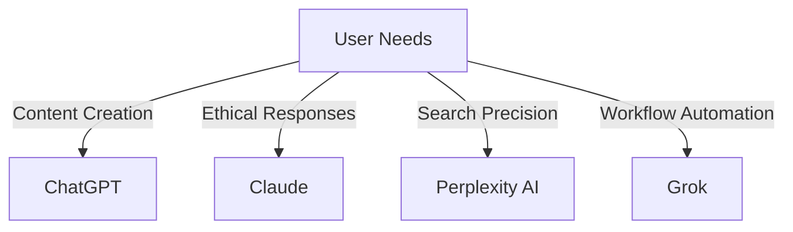
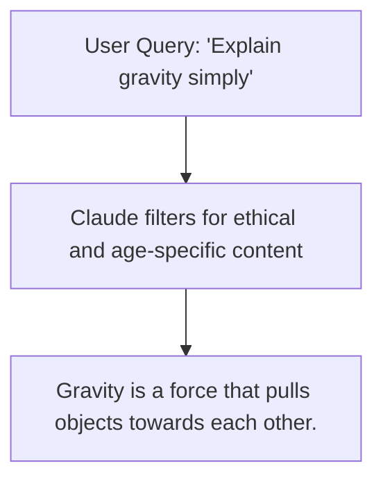
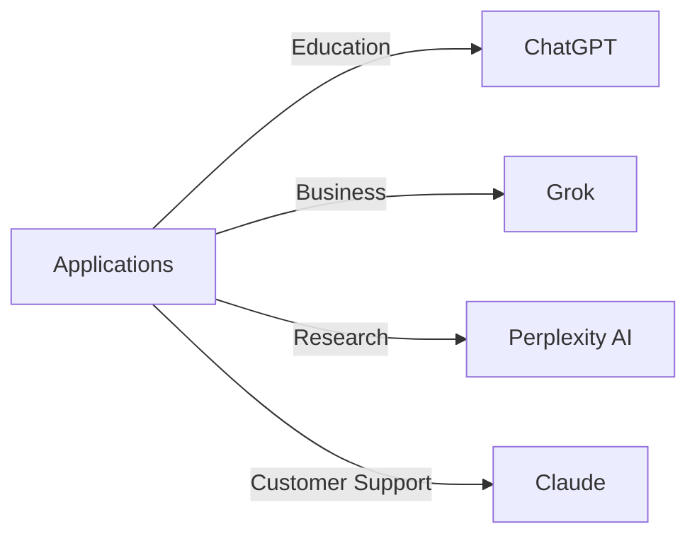

## Key Features Comparison

| Feature                  | ChatGPT (OpenAI)           | Claude (Anthropic)          | Perplexity AI            | Grok (xAI)                |
|--------------------------|----------------------------|-----------------------------|--------------------------|---------------------------|
| **Primary Focus**        | Versatile conversational AI| Ethical, human-aligned AI   | Contextual search engine | Deep insights and workflow automation |
| **Integration**          | API support for developers | Focus on ethical alignment  | Search-enhanced responses| Seamless cross-platform integration |
| **Strength**             | Creative and technical tasks| Safety and clarity         | Concise, information-rich answers | Scalability and automation |
| **Use Cases**            | Writing, education, and coding assistance | Customer service, tutoring | Research and decision-making | Data analytics and business workflows |
| **Ethics**               | Moderate ethical safeguards| Strong ethical focus        | Citation-backed results  | Moderate ethical safeguards |

---

## Use Case Scenarios



### Use Case Examples

1. **ChatGPT (OpenAI)**:
   - **Ideal For**: Creative writing, coding help, brainstorming ideas.
   - **Example**: Generating a blog post on emerging technologies or assisting with Python script debugging.

   ```python
   # Example of ChatGPT writing a Python function
   def factorial(n):
       if n == 0:
           return 1
       return n * factorial(n-1)

   print(factorial(5))  # Output: 120
   ```

2. **Claude (Anthropic)**:
   - **Ideal For**: Situations demanding ethical and empathetic interactions.
   - **Example**: Providing safe, age-appropriate responses to tutoring queries.




3. **Perplexity AI**:
   - **Ideal For**: Rapid research and decision-making.
   - **Example**: Answering "What are the top benefits of solar energy?"

   **Output**:
   - Reduces carbon emissions.
   - Provides renewable energy.
   - Lowers electricity bills.

   #### Use Case Example: Solar Energy Research
   ```python
   # Using Perplexity AI for a quick research query
   query = "Top benefits of solar energy"
   response = perplexity_ai.search(query)

   # Output from Perplexity AI
   print("Response:", response)

   # Expected Output:
   # Response: "1. Reduces carbon emissions. 2. Provides renewable energy. 3. Lowers electricity bills."
   ```

4. **Grok (xAI)**:
   - **Ideal For**: Streamlining business workflows and deep analytics.
   - **Example**: Automating sales trend analysis across multiple datasets.

   #### Use Case Example: Automating Sales Trend Analysis
   ```python
   # Example of Grok's Python SDK integration for business analytics
   import grok_sdk

   # Initialize the Grok client
   client = grok_sdk.Client(api_key="your_api_key")

   # Analyze sales data
   response = client.analyze_data(dataset="sales_data.csv", analysis_type="trend_analysis")

   # Display the analysis result
   print("Sales Trends:", response)
   ```

   **Expected Output**:
   ```
   Sales Trends: {
       "2022-Q1": "10% growth",
       "2022-Q2": "15% growth",
       "2022-Q3": "5% decline",
       "2022-Q4": "20% growth"
   }
   ```

---

## Strengths and Limitations

| Tool                     | Strengths                                      | Limitations                                     |
|--------------------------|-----------------------------------------------|-----------------------------------------------|
| **ChatGPT**              | Creative, versatile, developer-friendly       | Limited focus on safety for sensitive contexts|
| **Claude**               | Ethical alignment, clear and empathetic       | Limited in-depth technical capabilities       |
| **Perplexity AI**        | Precision, citation-backed, concise responses | May oversimplify complex topics              |
| **Grok**                 | Robust integrations, deep analytics, scalable | Requires technical expertise for setup        |

---

## Visualization: Application Alignment



---

## Conclusion

Each tool excels in its domain, making them suitable for distinct tasks:

- **ChatGPT**: Best for creative, technical, and conversational tasks.
- **Claude**: Ideal for ethical and empathetic interactions.
- **Perplexity AI**: Excels in research and decision-making through concise answers.
- **Grok**: Streamlines complex workflows and integrates deeply with platforms.

Selecting the right AI tool depends on your specific needs, whether it’s creativity, ethics, precision, or automation.


