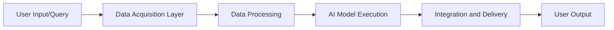

## Key Features of Grok

1. **Deep Insights**:
   - Processes and analyzes vast datasets to uncover actionable insights.
   - Utilizes advanced machine learning models for predictive analytics.

2. **Cross-Platform Integration**:
   - Seamlessly integrates with various platforms and tools.
   - Offers APIs and SDKs for easy customization and scalability.

3. **Streamlined Workflows**:
   - Automates repetitive tasks, enhancing productivity.
   - Provides intuitive interfaces for managing complex operations.

4. **Applications**:
   - Business intelligence
   - Automation of workflows
   - Data visualization
   - Research and development

---

## How Grok Works

Grok’s architecture is designed for flexibility and efficiency. Here’s a step-by-step visualization of its workflow:



### Workflow Details

| Stage                     | Description                                                                 |
|---------------------------|-----------------------------------------------------------------------------|
| **Data Acquisition Layer**| Connects to various data sources, gathering information for processing.    |
| **Data Processing**       | Cleanses and organizes data for analysis by AI models.                      |
| **AI Model Execution**    | Applies advanced algorithms to derive insights or automate tasks.           |
| **Integration and Delivery** | Ensures seamless output delivery through connected platforms or APIs.     |
| **User Output**           | Presents results in an intuitive format, such as dashboards or reports.     |

---

## Example Code and Output

### Python Integration Example
```python
import grok_sdk

# Initialize Grok client
client = grok_sdk.Client(api_key="your_api_key")

# Example query: Analyze sales data
response = client.analyze_data(
    dataset="sales_data.csv",
    analysis_type="trend_analysis"
)

# Display results
print("Sales Trends:", response["trends"])
```

### Output
```
Sales Trends: {
    "2022-Q1": "10% growth",
    "2022-Q2": "15% growth",
    "2022-Q3": "5% decline",
    "2022-Q4": "20% growth"
}
```

This example demonstrates how Grok’s SDK can be used to quickly analyze datasets and extract meaningful insights.

---


## Advantages of Grok

| Advantage                | Description                                                                 |
|--------------------------|-----------------------------------------------------------------------------|
| Deep Analytical Insights | Unveils hidden patterns and trends from data.                              |
| Seamless Integrations    | Connects easily with existing platforms and tools.                         |
| Scalability              | Suitable for businesses of all sizes, from startups to enterprises.        |
| Automation               | Reduces manual effort by automating complex workflows.                     |

---

## Limitations and Challenges

| Limitation               | Description                                                                 |
|--------------------------|-----------------------------------------------------------------------------|
| Learning Curve           | May require initial training for effective use of advanced features.       |
| Data Quality Dependency  | Performance depends on the quality and consistency of input data.           |
| Integration Complexity   | Cross-platform setup may require technical expertise.                      |

---

## Future Developments

Grok is continuously evolving with planned enhancements, including:

1. Expanding support for more platforms and tools.
2. Introducing advanced AI models for niche applications.
3. Enhancing user interfaces for greater intuitiveness.
4. Strengthening real-time analytics capabilities.

---

## Conclusion

Grok by xAI is a robust tool designed for deep insights and seamless integrations. It simplifies complex workflows and empowers users to make data-driven decisions efficiently. As it continues to evolve, Grok promises to redefine how AI integrates with business and research processes.

---


