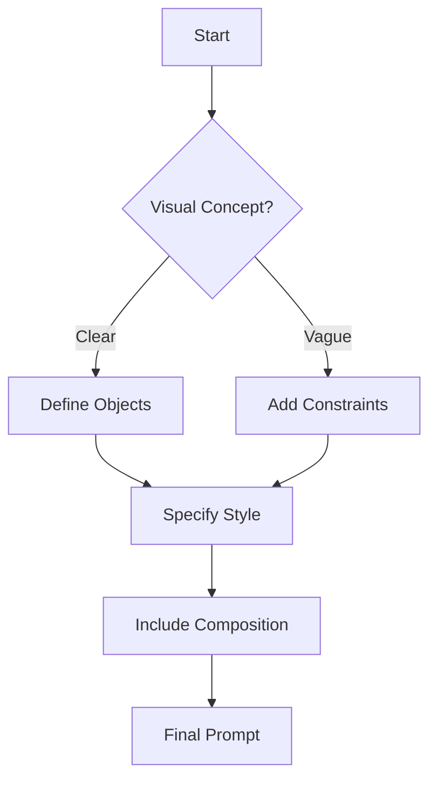
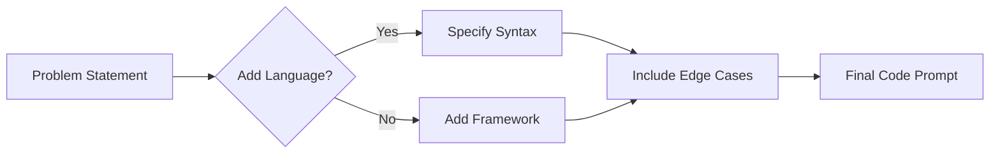

## Tool-Specific Prompting

### DALL-E: Visualizing Ideas Through Text
**Overview**: DALL-E generates images from textual descriptions. Precision in describing objects, styles, and composition is key.

**Key Strategies**:
1. **Specify visual details**: Include colors, shapes, and spatial relationships.
2. **Reference artistic styles**: Use terms like "oil painting" or "cyberpunk."
3. **Use compositional terms**: E.g., "centered," "background/foreground."

**Example Prompt**:
```plaintext
"A futuristic cityscape at sunset, with neon-lit hovercars flying between glass skyscrapers, rendered in a retro 1980s anime style."
```

### Prompt Effectiveness Comparison:
| Effective Prompt | Ineffective Prompt |
|-------------|------------------|
| "A red fox sitting on a moss-covered rock in a misty forest, digital art" | "An animal in nature." |
| "Write React component for a login form with email validation" | "Make a form." |



### GitHub Copilot: Coding Assistance

#### Overview: This AI pair programmer requires clear task descriptions and context.

Key Strategies:

- Specify language/framework: "Write a Python function using PyTorch..."
- Break complex tasks: "First, load dataset. Then normalize values..."
- Include context: "This is for a weather prediction model"




### Common Pitfalls and How to Avoid Them

#### 1. Vagueness

**Problem**: "Write something creative" lacks direction.

**Solution**: Add constraints - "Write a Halloween poem in iambic pentameter."

#### 2. Overloading Prompts

**Problem**: Multiple conflicting requests confuse models.

**Solution**: Use step-by-step breakdowns.

#### 3. Ignoring Model Architecture

**Problem**: Asking GPT-3 for real-time web search.

**Solution**:  Research model capabilities first.