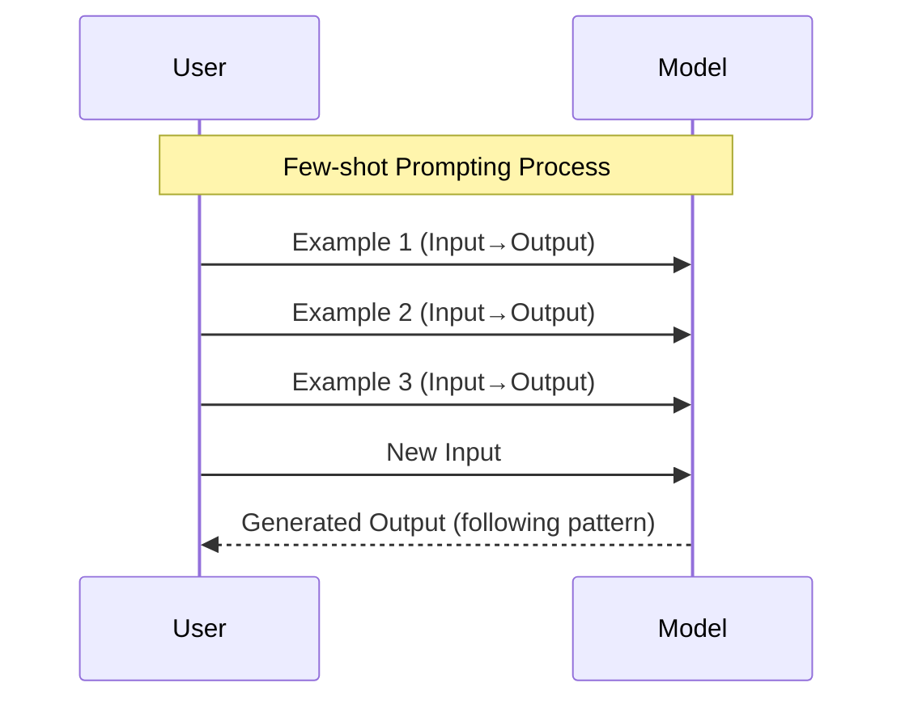
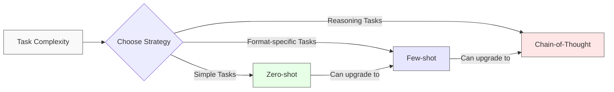
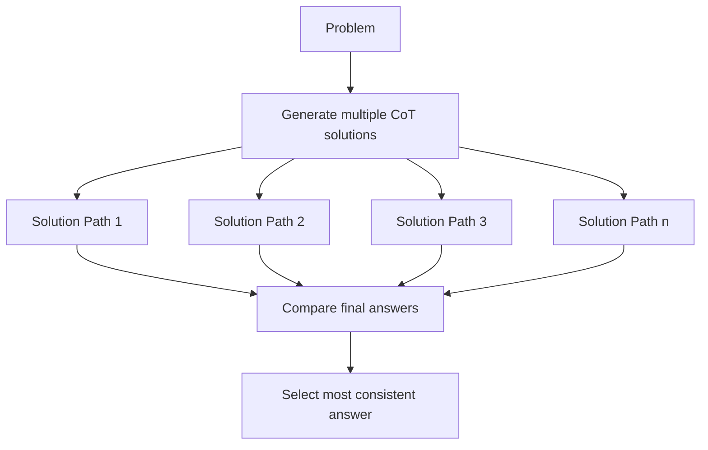

## Introduction to Prompting Strategies

Prompting strategies are techniques for structuring inputs to generative AI models to obtain desired outputs. The way we communicate with AI systems significantly influences their performance on tasks. As language models have evolved, so have the strategies for effectively prompting them.

<div className="grid grid-cols-1 md:grid-cols-3 gap-4 my-8">
  <div className="border rounded p-4">
    <h3 className="font-bold text-lg">Zero-shot</h3>
    <p>Direct instruction without examples</p>
  </div>
  <div className="border rounded p-4">
    <h3 className="font-bold text-lg">Few-shot</h3>
    <p>Instruction with example pairs</p>
  </div>
  <div className="border rounded p-4">
    <h3 className="font-bold text-lg">Chain-of-Thought</h3>
    <p>Reasoning through multi-step problems</p>
  </div>
</div>

Let's explore each of these strategies in detail.

## Zero-shot Prompting

<div className="flex flex-col md:flex-row gap-8 my-8">
  <div className="flex-1">
    **Zero-shot prompting** refers to asking a model to perform a task without any demonstrations or examples. The model must rely entirely on its pre-training to understand and execute the request.

    Zero-shot prompting is the simplest approach but can be surprisingly effective with modern foundation models that have been trained on diverse datasets.
  </div>
  <div className="flex-1">

  </div>
</div>

### When to Use Zero-shot Prompting

- For straightforward tasks within the model's capabilities
- When you don't have examples readily available
- For initial exploration of a model's capabilities
- When you want to test the model's "out-of-the-box" performance

### Example of Zero-shot Prompting

```plaintext
Explain quantum computing in simple terms.
```

<div className="bg-gray-100 p-4 rounded-lg my-4 text-gray-900">
The model would respond directly to this request without additional context or examples, drawing on its training to provide an explanation of quantum computing in accessible language.
</div>

## Few-shot Prompting

Few-shot prompting involves providing the model with a small number of examples (typically 1-5) demonstrating the expected input-output pattern before asking it to perform a similar task. This helps the model understand the specific format, style, or reasoning pattern you want it to follow.



### Why Few-shot Works

Few-shot prompting leverages a phenomenon known as "in-context learning," where models can rapidly adapt to new tasks based on a handful of examples. This occurs without updating the model's weights—the adaptation happens entirely within the context window.

### Example of Few-shot Prompting

```plaintext
Convert these sentences to French:

English: The weather is beautiful today.
French: Le temps est magnifique aujourd'hui.

English: I would like to order a coffee.
French: Je voudrais commander un café.

English: Where is the nearest train station?
French:
```

The model would likely complete this with: "Où est la gare la plus proche?"

### Variants of Few-shot Prompting

<div className="my-6">
  <div className="font-bold mb-2">Standard Few-shot</div>
  <div className="bg-gray-50 p-4 rounded mb-4 text-gray-900">
    Provides complete input-output pairs as examples.
    ```
    Input: X
    Output: Y
    
    Input: A
    Output: B
    
    Input: C
    Output: ?
    ```
  </div>

  <div className="font-bold mb-2">Label-conditioned Few-shot</div>
  <div className="bg-gray-50 p-4 rounded mb-4 text-gray-900">
    Explicitly labels the parts of each example.
    ```
    Example 1:
    Input: X
    Classification: Positive
    
    Example 2:
    Input: A
    Classification: Negative
    
    Input: C
    Classification:
    ```
  </div>

  <div className="font-bold mb-2">Format-conditioned Few-shot</div>
  <div className="bg-gray-50 p-4 rounded text-gray-900">
    Focuses on teaching a particular output format.
    ```
    Input: Analyze sentiment
    Output: {"text": "I love this product", "sentiment": "positive", "confidence": 0.95}
    
    Input: Analyze sentiment
    Output: {"text": "This doesn't work", "sentiment": "negative", "confidence": 0.87}
    
    Input: Analyze sentiment
    Output:
    ```
  </div>
</div>

## Chain-of-Thought (CoT) Prompting

Chain-of-Thought prompting is a technique that encourages models to break down complex reasoning tasks into intermediate steps. By showing the model how to "think step by step," we can improve performance on tasks requiring multi-step reasoning.

### How Chain-of-Thought Works

<div className="grid grid-cols-1 md:grid-cols-2 gap-8 my-8">
  <div>
    Chain-of-Thought prompting works by:
    
    1. Decomposing complex problems into simpler sub-problems
    2. Solving each sub-problem in sequence
    3. Using intermediate results to inform later steps
    4. Arriving at a final answer through this structured reasoning process
  </div>
  <div>
    ```mermaid
    graph TD
        A[Problem Statement] --> B[Step 1: Understand the problem]
        B --> C[Step 2: Identify relevant information]
        C --> D[Step 3: Apply appropriate technique]
        D --> E[Step 4: Calculate intermediate results]
        E --> F[Step 5: Synthesize final answer]
        style A fill:#f9f9f9,stroke:#666
        style F fill:#e6f7e6,stroke:#666
    ```
  </div>
</div>

### Zero-shot Chain-of-Thought

A simplified variant where you simply instruct the model to "think step by step" without providing examples.

```plaintext
Q: Roger has 5 tennis balls. He buys 2 more cans of tennis balls. Each can has 3 tennis balls. How many tennis balls does he have now?

A: Let me think through this step by step.
```

### Few-shot Chain-of-Thought

<div className="bg-blue-50 p-4 rounded-lg my-4 border border-blue-200 text-blue-900">
  <p className="font-bold">Research Insight:</p>
  <p>Research by Wei et al. (2022) demonstrated that adding "Let's think step by step" to prompts improved performance on reasoning tasks by 10-40% across multiple models.</p>
</div>

Here's a classic example of few-shot chain-of-thought prompting:

```plaintext
Q: If I have 3 apples and buy 5 more, then give 2 to my friend, how many apples do I have?
A: I start with 3 apples. I buy 5 more apples, so now I have 3 + 5 = 8 apples. I give 2 apples to my friend, so I have 8 - 2 = 6 apples.

Q: A store has 25 shirts. If they sell 17 shirts and then get a shipment of 12 more, how many shirts do they have?
A: The store starts with 25 shirts. They sell 17 shirts, so they have 25 - 17 = 8 shirts left. Then they get 12 more shirts, so now they have 8 + 12 = 20 shirts.

Q: Roger has 5 tennis balls. He buys 2 more cans of tennis balls. Each can has 3 tennis balls. How many tennis balls does he have now?
A:
```

## Comparing Prompting Strategies



### Performance Comparison

<div className="overflow-x-auto my-6">
  <table className="min-w-full bg-white border border-gray-300">
    <thead>
      <tr className="bg-gray-100 text-gray-900">
        <th className="py-2 px-4 border-b">Strategy</th>
        <th className="py-2 px-4 border-b">Strengths</th>
        <th className="py-2 px-4 border-b">Weaknesses</th>
        <th className="py-2 px-4 border-b">Best For</th>
      </tr>
    </thead>
    <tbody className="text-gray-900">
      <tr>
        <td className="py-2 px-4 border-b">Zero-shot</td>
        <td className="py-2 px-4 border-b">Simple, uses less context window, straightforward</td>
        <td className="py-2 px-4 border-b">Less control over output format, may struggle with complex tasks</td>
        <td className="py-2 px-4 border-b">Simple classification, generation, Q&A</td>
      </tr>
      <tr>
        <td className="py-2 px-4 border-b">Few-shot</td>
        <td className="py-2 px-4 border-b">Controls output format, teaches specific patterns</td>
        <td className="py-2 px-4 border-b">Uses more context window, requires creating examples</td>
        <td className="py-2 px-4 border-b">Translation, classification, format conversion</td>
      </tr>
      <tr>
        <td className="py-2 px-4 border-b">Chain-of-Thought</td>
        <td className="py-2 px-4 border-b">Best for complex reasoning, shows work, traceable logic</td>
        <td className="py-2 px-4 border-b">Uses most context window, may be verbose</td>
        <td className="py-2 px-4 border-b">Math problems, logical reasoning, complex analysis</td>
      </tr>
    </tbody>
  </table>
</div>

## Interactive Examples

<div className="bg-gray-50 p-6 rounded-lg my-8 border text-gray-900">
  <h3 className="font-bold text-xl mb-4 text-gray-900">Try It Yourself: Prompting Strategy Selector</h3>
  
  <p className="mb-4 text-gray-900">Consider these tasks and select the most appropriate prompting strategy:</p>
  
  <div className="mb-4 text-gray-900">
    <p><strong>Task 1:</strong> Translating a technical document from English to Spanish</p>
    <details>
      <summary className="cursor-pointer text-blue-700">Reveal recommendation</summary>
      <div className="mt-2 p-3 bg-white rounded text-gray-900">
        <p><strong>Best strategy: Few-shot prompting</strong></p>
        <p>Providing a few examples of correctly translated technical terms will help maintain consistency and accuracy in domain-specific vocabulary.</p>
      </div>
    </details>
  </div>
  
  <div className="mb-4">
    <p><strong>Task 2:</strong> Solving a complex word problem involving multiple calculation steps</p>
    <details>
      <summary className="cursor-pointer text-blue-700">Reveal recommendation</summary>
      <div className="mt-2 p-3 bg-white rounded text-gray-900">
        <p><strong>Best strategy: Chain-of-thought prompting</strong></p>
        <p>This approach will guide the model to break down the problem into manageable steps, reducing calculation errors.</p>
      </div>
    </details>
  </div>
  
  <div className="mb-4">
    <p><strong>Task 3:</strong> Generating a creative product description</p>
    <details>
      <summary className="cursor-pointer text-blue-700">Reveal recommendation</summary>
      <div className="mt-2 p-3 bg-white rounded text-gray-900">
        <p><strong>Best strategy: Zero-shot with detailed instruction</strong></p>
        <p>For creative tasks, clear parameters about tone, length and style may be sufficient without examples.</p>
      </div>
    </details>
  </div>
</div>

## Advanced Techniques and Combinations

### Self-Consistency

Self-consistency is an advanced technique that involves:
1. Generating multiple reasoning paths using chain-of-thought
2. Taking the most common answer as the final result

This helps mitigate reasoning errors and has been shown to improve performance on complex tasks.



### Tree-of-Thoughts

Tree-of-Thoughts extends Chain-of-Thought by exploring multiple reasoning branches in parallel, allowing the model to evaluate different problem-solving approaches.

### ReAct (Reasoning + Acting)

ReAct combines Chain-of-Thought reasoning with the ability to take actions (like searching for information) to solve complex tasks.

## Case Studies and Empirical Results

### Case Study: Math Word Problems

Research by Wei et al. (2022) found that using Chain-of-Thought prompting improved GPT-3's performance on GSM8K (a dataset of math word problems) from 17.9% to 40.7% accuracy.


### Case Study: Commonsense Reasoning

Kojima et al. (2022) showed that simply adding "Let's think step by step" before answering improved zero-shot performance on commonsense reasoning benchmarks by an average of 17%.

## Best Practices

### When to Use Each Strategy

<div className="overflow-x-auto my-6">
  <table className="min-w-full bg-white border border-gray-300">
    <thead>
      <tr className="bg-gray-100 text-gray-900">
        <th className="py-2 px-4 border-b">Strategy</th>
        <th className="py-2 px-4 border-b">Context Window Usage</th>
        <th className="py-2 px-4 border-b">Task Complexity</th>
        <th className="py-2 px-4 border-b">Setup Effort</th>
      </tr>
    </thead>
    <tbody className="text-gray-900">
      <tr>
        <td className="py-2 px-4 border-b">Zero-shot</td>
        <td className="py-2 px-4 border-b">Low</td>
        <td className="py-2 px-4 border-b">Low to Medium</td>
        <td className="py-2 px-4 border-b">Low</td>
      </tr>
      <tr>
        <td className="py-2 px-4 border-b">Few-shot</td>
        <td className="py-2 px-4 border-b">Medium</td>
        <td className="py-2 px-4 border-b">Medium</td>
        <td className="py-2 px-4 border-b">Medium</td>
      </tr>
      <tr>
        <td className="py-2 px-4 border-b">Chain-of-Thought</td>
        <td className="py-2 px-4 border-b">High</td>
        <td className="py-2 px-4 border-b">High</td>
        <td className="py-2 px-4 border-b">High</td>
      </tr>
    </tbody>
  </table>
</div>

### Tips for Effective Prompting

1. **Be specific** about the task, format, and any constraints
2. **Start simple** and gradually increase complexity
3. **Iterate on your prompts** based on model responses
4. **Combine strategies** for best results (e.g., few-shot + chain-of-thought)
5. **Consider context window limitations** when choosing strategies

## Video Tutorial

For a visual walkthrough of these prompting techniques, watch our tutorial:


## Further Reading

- Wei, J., Wang, X., Schuurmans, D., et al. (2022). "Chain-of-Thought Prompting Elicits Reasoning in Large Language Models"
- Brown, T., Mann, B., Ryder, N., et al. (2020). "Language Models are Few-shot Learners"
- Kojima, T., Gu, S.S., Reid, M., et al. (2022). "Large Language Models are Zero-shot Reasoners"
- Yao, S., et al. (2023). "Tree of Thoughts: Deliberate Problem Solving with Large Language Models"

## Interactive Quiz

Test your understanding of prompting strategies with these questions:

<div className="p-4 border rounded-lg bg-gray-50 text-gray-900">
  <p className="font-bold mb-2">1. Which prompting strategy is most appropriate for solving complex math problems?</p>
  <ul className="list-disc pl-5">
    <li>a) Zero-shot</li>
    <li>b) Few-shot</li>
    <li>c) Chain-of-Thought</li>
    <li>d) Format-conditioning</li>
  </ul>

  <p className="font-bold mb-2 mt-4">2. What is the key advantage of few-shot prompting over zero-shot?</p>
  <ul className="list-disc pl-5">
    <li>a) It uses less of the context window</li>
    <li>b) It provides examples that guide the model's output format</li>
    <li>c) It always produces more accurate results</li>
    <li>d) It requires less computational resources</li>
  </ul>

  <p className="font-bold mb-2 mt-4">3. When using Chain-of-Thought prompting, what phrase often helps improve reasoning?</p>
  <ul className="list-disc pl-5">
    <li>a) "The answer is"</li>
    <li>b) "In conclusion"</li>
    <li>c) "Let's think step by step"</li>
    <li>d) "According to my knowledge"</li>
  </ul>
</div>

<details>
  <summary className="cursor-pointer text-blue-700 mt-4">Check Your Answers</summary>
  <div className="mt-2 p-3 bg-white rounded border text-gray-900">
    1. c) Chain-of-Thought
    2. b) It provides examples that guide the model's output format
    3. c) "Let's think step by step"
  </div>
</details>