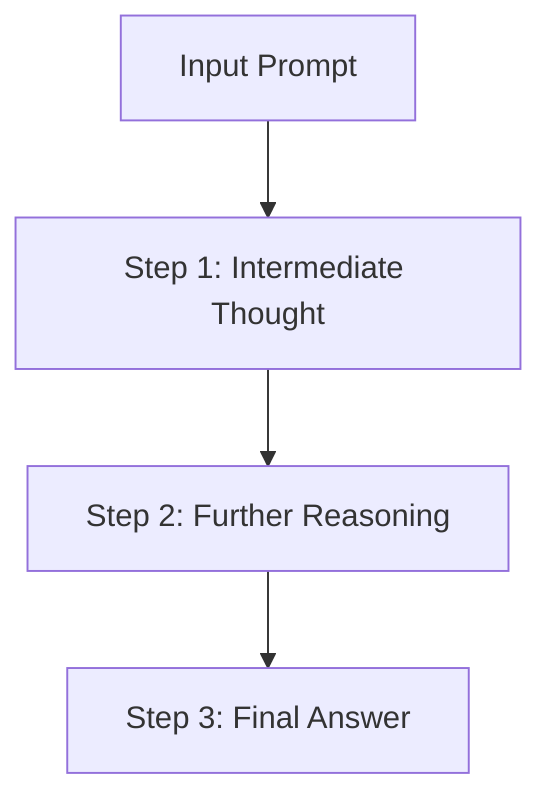

## What is Chain-of-Thought Prompting?

Chain-of-Thought (CoT) Prompting is a technique that enhances the reasoning capabilities of large language models (LLMs) by incorporating logical steps—or a “chain of thought”—within the prompt. Unlike direct-answer prompting, CoT guides the model to work through intermediate reasoning steps, making it more adept at solving complex tasks like math problems, commonsense reasoning, and symbolic manipulation.


## How Chain-of-Thought Prompting Differs from Existing Techniques

Traditional prompts typically consist of simple input-output examples and lack explicit reasoning steps, making it challenging for models to infer the necessary logic for tasks requiring multi-step reasoning. CoT prompting addresses this by:
Traditional LLMs generate responses in a single step, which can lead to logical inconsistencies. CoT reasoning improves this by introducing step-wise reasoning:
- Encouraging Multi-Step Reasoning: Rather than relying solely on model size for complex tasks, CoT embeds reasoning steps within the prompt, unlocking sophisticated reasoning in models that might otherwise struggle with complexity.
- Achieving Efficiency without Finetuning: CoT works across tasks without the need for finetuning, using a standard prompt format that embeds reasoning, thus simplifying adaptation to various complex tasks.


## How Chain-of-Thought Prompting Works
Decompose the Problem: CoT prompts guide the model to break down a complex question into manageable steps, akin to how a human might solve the problem.
Guide with Exemplars: CoT uses examples that demonstrate reasoning steps, helping the model grasp the method needed to reach the correct answer.
With CoT, the model essentially “talks through” its thought process, leading to more reliable answers.


## Example: Arithmetic Problem Solving

### Without CoT

```python
from transformers import pipeline
model = pipeline("text-generation", model="gpt-3.5")
print(model("What is 23 × 47?"))
```

**Output:**
```plaintext
The answer is 1081.
```

### With CoT

```python
print(model("23 × 47 can be broken down as (23 × 40) + (23 × 7)."
"23 × 40 = 920 and 23 × 7 = 161."
"Adding them together, the final answer is 1081."))
```

**Output:**
```plaintext
23 × 40 = 920 and 23 × 7 = 161.
Adding them together, the final answer is 1081.
```

## Comparison Table

| Method | Accuracy | Interpretability | Suitable for Complex Tasks? |
|--------|----------|------------------|-----------------------------|
| Direct Answer | Moderate | Low | No |
| Chain-of-Thought | High | High | Yes |

## Implementation in Prompt Engineering

To enable CoT reasoning, we modify the prompt format:

**Standard Prompt:**
```
Q: What is 72 ÷ 8?
A: 9
```

**CoT Prompt:**
```
Q: What is 72 ÷ 8?
A: Let's break it down step by step. 72 can be divided by 8 directly.
Since 72 ÷ 8 equals 9, the final answer is 9.
```

## Applications and Benefits:
CoT prompting is especially valuable for tasks where structured reasoning is crucial:

- Mathematics and Arithmetic: CoT helps solve multi-step word problems by guiding calculations through each necessary step.
- Commonsense and Symbolic Reasoning: Useful for tasks requiring general knowledge or symbolic reasoning, where CoT can bridge the gap between facts and logical connections.
- Complex Decision-Making: In fields like robotics, CoT enables models to follow logical steps for decision-making tasks.

## Limitations of Chain-of-Thought
Importantly, according to CoT authors, CoT only yields performance gains when used with models of ∼100B parameters. Smaller models wrote illogical chains of thought, which led to worse accuracy than standard prompting. Models usually get performance boosts from CoT prompting in a manner proportional to the size of the model.

## Conclusion
Chain-of-Thought Prompting is a powerful method for unlocking reasoning capabilities in large language models. By encouraging step-by-step thinking, CoT prompting allows models to perform complex reasoning tasks effectively without needing additional training data. The benefits are particularly pronounced in large models (e.g., models with over 100 billion parameters), which exhibit improved reasoning capacities as they follow these structured reasoning prompts.

## FAQ
### Why is Chain-of-Thought prompting effective?
Chain-of-Thought prompting works by providing the model with examples of logical reasoning. When shown how to approach problems in a step-by-step way, the LLM is more likely to emulate this approach, resulting in responses that are both accurate and reliable.

### What is a limitation of Chain-of-Thought prompting?
CoT prompting is less effective with smaller models. To achieve meaningful gains, it’s best to apply CoT in proportion to the model’s size, as smaller models may produce less coherent reasoning with CoT prompting.


