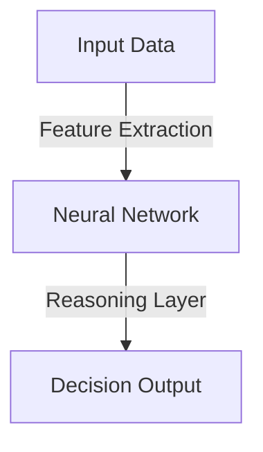
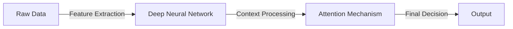

# Introduction to Reasoning Models: DeepSeek R1, V3

Artificial Intelligence (AI) has evolved significantly, with reasoning models playing a crucial role in problem-solving and decision-making. This article explores DeepSeek R1 and V3, highlighting their functionalities, advantages, and real-world applications.

## What are Reasoning Models?
Reasoning models are AI frameworks designed to simulate human-like logical processing. These models improve AI's ability to analyze, infer, and make decisions based on given data.

### Mathematical Representation
A reasoning model can be represented mathematically as:

```text 
M(x) = f(W, x)
```

where:
- M(x) is the model output,
- W represents the learned parameters,
- x is the input data,
- f is the function defining the model's logic.

## DeepSeek R1
DeepSeek R1 is a state-of-the-art reasoning model optimized for complex decision-making tasks.DeepSeek R1 is a cutting-edge reasoning model engineered to tackle complex decision-making tasks. It integrates reinforcement learning with chain-of-thought reasoning, enabling it to decompose intricate problems into manageable steps and derive accurate solutions. This approach mirrors human cognitive processes, enhancing the model's problem-solving proficiency.
### Architecture

- Feature Extraction: Processes raw input data to identify relevant attributes.
- Neural Network: Analyzes extracted features to discern patterns and relationships.
- Reasoning Layer: Applies logical inference to generate decisions or solutions.

### Features
- **Enhanced Logical Inference**: Utilizes deep learning to perform structured reasoning, enabling the model to handle tasks that require advanced cognitive functions.
- **Self-Optimization**: Adapts dynamically to new data through reinforcement learning, continually refining its performance without explicit human intervention.
- **High Interpretability*8: Generates human-readable explanations for its decisions, fostering transparency and trust in AI-driven solutions.

### Implementation Example (Python)
```python
import torch
import torch.nn as nn

class DeepSeekR1(nn.Module):
    def __init__(self, input_size, hidden_size):
        super(DeepSeekR1, self).__init__()
        self.layer1 = nn.Linear(input_size, hidden_size)
        self.relu = nn.ReLU()
        self.layer2 = nn.Linear(hidden_size, 1)
    
    def forward(self, x):
        x = self.relu(self.layer1(x))
        return self.layer2(x)

model = DeepSeekR1(10, 20)
print(model)
```

### Sample Output
```
DeepSeekR1(
  (layer1): Linear(in_features=10, out_features=20, bias=True)
  (relu): ReLU()
  (layer2): Linear(in_features=20, out_features=1, bias=True)
)
```

## DeepSeek V3
Building upon the foundation of R1, DeepSeek V3 introduces advanced contextual reasoning capabilities. It employs a Mixture-of-Experts (MoE) architecture, which dynamically activates a subset of its parameters for each input, optimizing computational efficiency and enhancing performance across diverse tasks.


### Architecture

- Feature Extraction: Transforms raw data into a structured format suitable for analysis.
- Deep Neural Network: Processes features to capture complex patterns.
- Context Processing: Incorporates contextual information to enhance understanding.
- Attention Mechanism: Focuses on relevant parts of the input for decision-making.

### xFeatures
- **Advanced Contextual Reasoning**: Excels in understanding and processing context-rich information, making it adept at tasks requiring nuanced comprehension.
- **Scalability**: The MoE architecture allows the model to scale efficiently, handling large-scale tasks without a proportional increase in computational resources.
- **Versatility**: Capable of performing a wide range of tasks, from natural language processing to complex problem-solving.

### Comparison Table
| Feature           | DeepSeek R1  | DeepSeek V3  |
|------------------|-------------|-------------|
| Logical Inference | Yes         | Yes         |
| Self-Learning    | Moderate    | Advanced    |
| Context Awareness | Limited     | High        |
| Speed           | Fast        | Faster      |

## Conclusion
DeepSeek R1 and V3 represent major advancements in AI reasoning. These models enhance problem-solving capabilities and improve decision-making efficiency across various applications.

Stay updated with the latest AI reasoning innovations to leverage their potential effectively!
