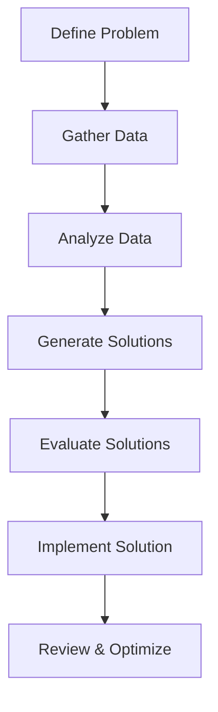

## Introduction
Problem-solving is a fundamental skill in various fields, from mathematics to software development. AI enhances this process by providing structured, step-by-step guidance, ensuring systematic and efficient problem resolution.

## The Problem-Solving Process
The AI-driven approach follows a structured methodology:


### 1. Define the Problem Clearly
AI responds best to well-defined, structured information. When approaching a problem with AI, make sure to:

- Be specific: Avoid vague language. Instead of saying, “My app has issues,” specify, “The app crashes when I try to load images in the gallery view.”
- State the desired outcome: Explain the ideal result so the AI has a clear end goal. For example, “I want the app to handle 10MB image files without crashing” is better than “Fix the crashing issue.”

**Example:** Instead of “AI, help with my website loading speed,” try: “AI, identify ways to reduce load time for my homepage, which currently has a 3-second delay due to large images and unoptimized code.

### 2. Break the Problem Down into Smaller Parts
Most problems are complex and multi-faceted. Breaking them down can help the AI focus on manageable pieces:

- Identify individual issues: If you have a web app that’s slow, separate the problem into elements like image optimization, JavaScript loading, and API response times.
- Address each component: By analyzing each element separately, you can ask the AI to solve one aspect at a time. This focused approach allows the AI to give targeted recommendations.

**Example:** For a slow-loading website, you could start by asking, “How can I optimize my JavaScript loading to reduce initial load time?” and then, “What are the best practices for image compression in web applications?


### 3. Use Problem-Solving Frameworks with AI
When describing a problem, try using established problem-solving frameworks to structure your question. Here are two common frameworks:

- Root Cause Analysis (e.g., the “5 Whys” technique): Identify the root cause of a problem by asking “why” iteratively. Once the root cause is clear, request a solution from the AI.
- SWOT Analysis (Strengths, Weaknesses, Opportunities, Threats): If you're trying to make a strategic decision, this analysis helps the AI understand both internal and external factors that could affect the outcome.

**Example:** Using Root Cause Analysis, instead of asking, “Why isn’t my marketing campaign effective?” try, “Why isn’t my campaign getting conversions? Is it due to ad targeting, messaging, or platform choice?


### 4. Use Precise Language and Context
When working with AI, precise language helps reduce ambiguity:

- Describe the context: Include relevant background information, such as technical constraints, your industry, or user demographics.
- Ask follow-up questions: If the initial answer isn’t precise, refine the question based on the AI’s response. This helps the AI better understand the nuance of your problem.

**Example:** If you're asking how to improve user retention, specify “Our app's primary users are college students, and we're losing 20% of them in the first month. What retention strategies work best for young adult users?


### 5. Use Multiple AI Tools for Varied Insights
Different AI tools are optimized for different types of tasks. Combining them can produce a well-rounded solution:

- General-purpose AI (like ChatGPT): Great for brainstorming, explanations, and general advice.
- Coding-specific AI (like Claude.ai): For programming and technical problem-solving, coding-specific AI tools like Claude.ai excel in providing targeted coding assistance. Claude.ai can help generate sample code, debug existing code, and offer language-specific insights.


### 6. Evaluate AI’s Output and Refine the Question
When you receive a solution from an AI, it’s essential to assess its accuracy and relevance. Here’s how to do this effectively:

- Verify suggestions: Ensure that the AI’s solution aligns with industry standards and your own knowledge.
- Ask clarifying questions: If a solution is incomplete or vague, ask the AI to elaborate or suggest alternatives.
- Experiment and gather feedback: Implement suggestions on a small scale first, then gather feedback or observe results before scaling up.

**Example:** If the AI suggests using a new framework to speed up development, you could test it in a small, isolated feature of your application first before adopting it across the project.


### 7. Iterate Until You Get the Desired Outcome
AI thrives on iterative improvement. You may not receive a perfect solution the first time, but by repeatedly refining your question based on previous answers, you can approach an optimal solution.

- Provide feedback: If the AI’s output is only partially correct, let it know. For example, “That solution partially helps, but it doesn’t solve X issue.”
Rephrase or Add Detail: When necessary, rephrase your question or add more detail to address areas that may have been misunderstood. For example, if AI misses a specific technical requirement, you could say, “I think the core issue is how the code handles asynchronous requests. Could you focus on optimizing that?”
- You can use multiple rounds: Please continue asking questions until you reach a satisfactory solution.

**Example:** If the AI offers a general marketing strategy, but it doesn’t fully apply to your target audience, ask, “Can you tailor this to a younger demographic interested in tech products?

## Mathematical Problem-Solving
AI can assist in solving complex mathematical equations step by step. Consider solving a quadratic equation:

$$ ax^2 + bx + c = 0 $$

Using the quadratic formula:

$$ x = \frac{-b \pm \sqrt{b^2 - 4ac}}{2a} $$

### Example: Solving \(2x^2 + 3x - 2 = 0\)
```python
import sympy as sp
x = sp.Symbol('x')
equation = 2*x**2 + 3*x - 2
solution = sp.solve(equation, x)
solution
```
#### Output:
```plaintext
[-2, 0.5]
```

## AI-Guided Decision-Making
AI can analyze decision-making scenarios and provide structured recommendations. Consider a decision matrix for selecting the best machine-learning model:

| Model  | Accuracy | Speed | Interpretability | Score |
|--------|----------|------|----------------|--------|
| SVM    | 85%      | Medium | Low            | 7.5    |
| Random Forest | 88% | High  | Medium        | 8.2    |
| Neural Network | 92% | Low  | Low           | 7.0    |

Based on weighted scoring, the Random Forest model is the optimal choice.

## Algorithmic Problem-Solving
Let's consider sorting an array using AI-assisted approaches.

### Python Implementation: QuickSort
```python
def quicksort(arr):
    if len(arr) <= 1:
        return arr
    pivot = arr[len(arr) // 2]
    left = [x for x in arr if x < pivot]
    middle = [x for x in arr if x == pivot]
    right = [x for x in arr if x > pivot]
    return quicksort(left) + middle + quicksort(right)

arr = [3, 6, 8, 10, 1, 2, 1]
print(quicksort(arr))
```
#### Output:
```plaintext
[1, 1, 2, 3, 6, 8, 10]
```

## Conclusion
AI-powered problem-solving follows a structured, systematic approach that enhances efficiency and accuracy across different domains. From mathematics to decision-making and algorithmic problem-solving, leveraging AI ensures an optimized and reliable process.
