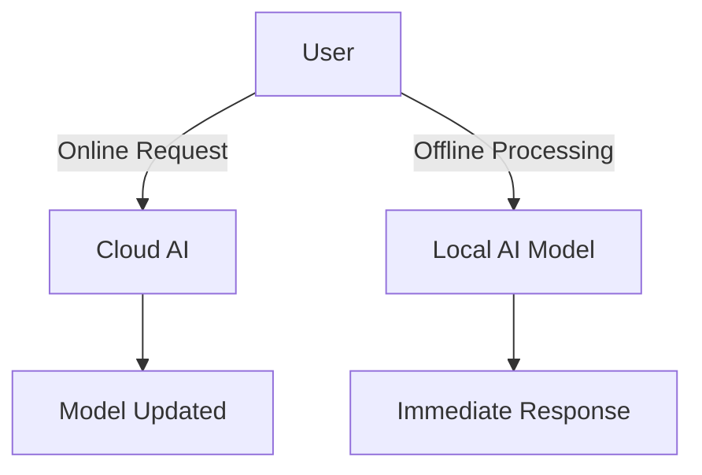

## **1. Hardware Prerequisites**

### **Minimum System Requirements**

| Component  | Minimum  | Recommended |
|------------|----------|-------------|
| CPU        | Intel i5 or AMD Ryzen 5  | Intel i7+ or Ryzen 7+ |
| RAM        | 8GB       | 16GB+       |
| Storage    | 20GB SSD  | 50GB+ NVMe SSD |
| GPU (for AI models) | None / Integrated | NVIDIA RTX 3060+ (6GB VRAM) |

---

## **2. Common Troubleshooting Steps**

### **Issue 1: High CPU/GPU Usage**
#### **Solution:**
- Close unnecessary applications.
- Reduce model size (use `ollama run llama2` instead of `llama3`).
- Upgrade hardware if needed.

### **Issue 2: Installation Errors**
#### **Solution:**
- Ensure correct package dependencies (`pip install -r requirements.txt`).
- Check system architecture (ARM vs. x86).
- Run installation as Administrator or with `sudo`.

### **Issue 3: Slow Processing**
#### **Solution:**
- Increase RAM allocation.
- Use a dedicated GPU (NVIDIA CUDA-supported GPUs improve AI performance).
- Optimize queries (shorter prompts, less computation-heavy requests).

---

## **3. Internet Requirements**

While some AI tools like Ollama run offline, others require stable internet connectivity.

| Task | Offline Support | Online Requirement |
|------|---------------|--------------------|
| Running LLM Models Locally | ✅ | ❌ |
| Fetching Latest Models | ❌ | ✅ |
| Cloud-based AI Processing | ❌ | ✅ |
| NotebookLM Research & Summarization | ✅ | 🔄 (Limited Features Offline) |

### **Mermaid Diagram: Internet Dependency**

---

## **Final Thoughts**
- **Ensuring proper hardware setup** and **following troubleshooting steps** can significantly improve AI tool performance.
- **Offline and online AI capabilities** should be considered based on the use case.
---

