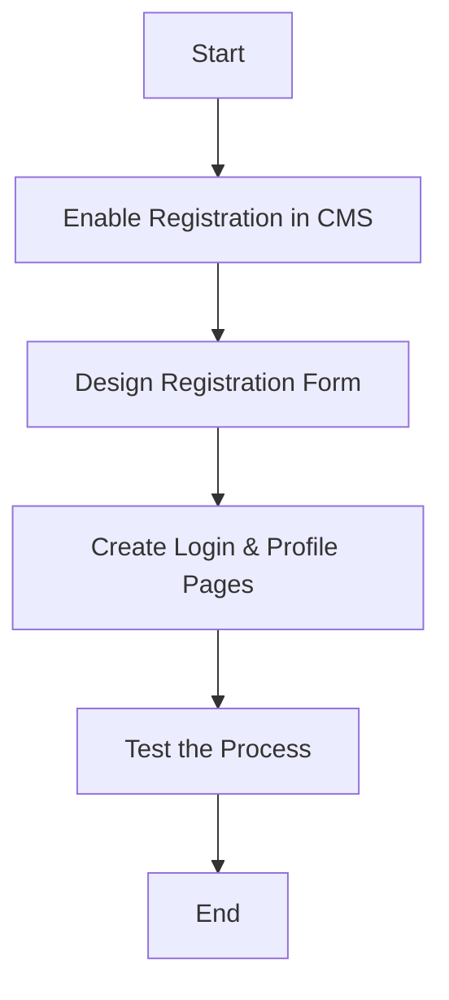
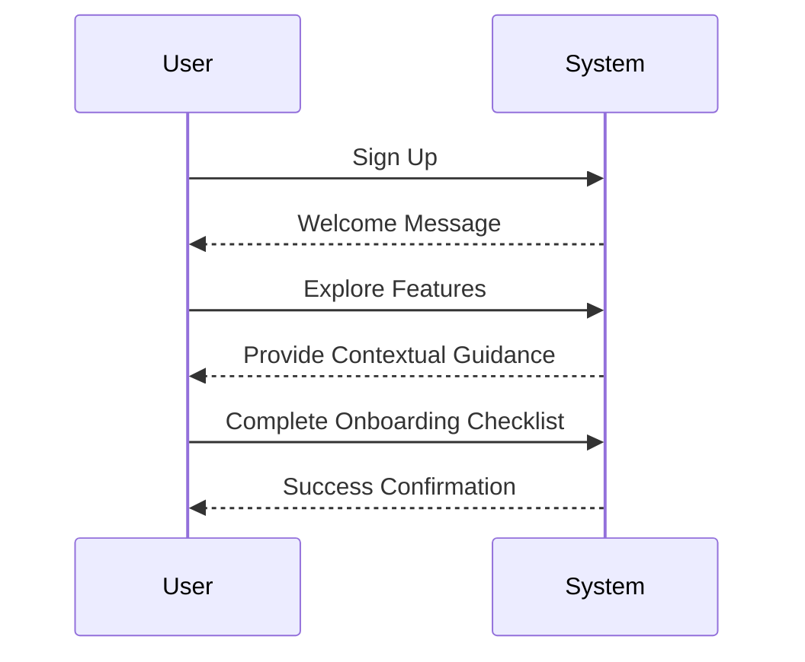
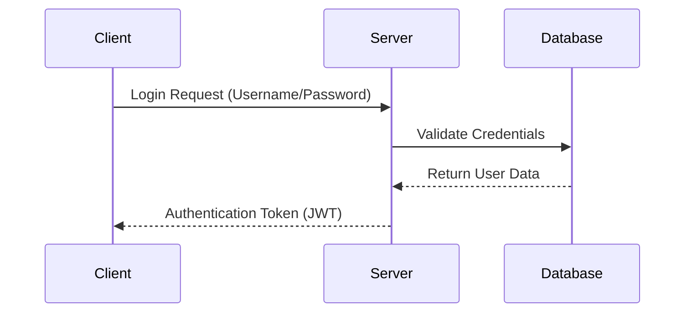

## **1. Creating User Accounts**

Creating user accounts is a fundamental step for enabling access to web-based tools. Below are the key steps involved in creating accounts:

### **Steps to Create User Accounts**
1. **Enable User Registration**: 
   - Log in to your website builder or CMS (e.g., WordPress, Wix).
   - Navigate to the settings and enable user registration.
   - Use plugins like "Nextend Social Login" for social media-based sign-ins[1].

2. **Design a Registration Form**:
   - Include fields for essential details such as name, email, password, and role.
   - Example CSV format for bulk user creation:
     ```
     Name,Email,Password,Role
     John Doe,john@example.com,password123,user
     Jane Smith,jane@example.com,password456,admin
     ```

3. **Create Login and Profile Pages**:
   - Develop pages where users can log in and manage their profiles.

4. **Test the Process**:
   - Verify the registration flow by signing up as a new user.

### **Mermaid Diagram: User Registration Workflow**


---

## **2. Accessing AI Tools**

AI tools can be accessed via various platforms offering services like chatbots, image generation, coding assistance, and more. Below are examples of popular tools and their features:

### **AI Tools Overview**

| Tool               | Description                                                                 | Availability          | Data Classification Level |
|--------------------|-----------------------------------------------------------------------------|-----------------------|---------------------------|
| Clarity Platform   | AI chatbot for emails, reports, code generation, image analysis            | Web-based             | High                      |
| GitHub Copilot     | AI-powered coding assistant integrated with IDEs                           | Visual Studio Code    | Moderate                  |
| Adobe Firefly      | AI-driven image editing and creation                                       | Adobe Suite           | Low                       |
| Azure AI           | Advanced AI models from Microsoft/OpenAI hosted on Azure                  | Requires SPA per app  | High                      |

### **Example: Accessing GitHub Copilot**
1. Install Visual Studio Code.
2. Add the GitHub Copilot extension.
3. Sign in with your GitHub account.
4. Start coding with AI assistance.

---

## **3. Onboarding Best Practices**

A smooth onboarding process ensures users quickly understand and utilize tools effectively.

### **Key Elements of Onboarding**
- **Interactive Guides**: Use tooltips or walkthroughs to guide users.
- **Progress Indicators**: Display progress bars to motivate users.
- **Personalization**: Tailor onboarding flows based on user roles or preferences.

### **Mermaid Diagram: Onboarding Flow**

---
### **Onboarding Checklist Example**
| Step                  | Description                                |
|-----------------------|--------------------------------------------|
| Welcome Message       | Show a friendly welcome message           |
| Product Tour          | Provide an interactive walkthrough        |
| Account Setup         | Guide users in setting up their profiles  |
| First Task Completion | Help users complete their first task      |

---

## **4. Example Code for Onboarding**
### JavaScript Code Example: Onboarding Steps

Here’s an example of JavaScript code to manage and track onboarding steps:

```js
const onboardingSteps = [
  { step: "Welcome Message", completed: false },
  { step: "Product Tour", completed: false },
  { step: "Account Setup", completed: false },
  { step: "First Task Completion", completed: false },
];

function completeStep(stepName) {
  const step = onboardingSteps.find((s) => s.step === stepName);
  if (step) step.completed = true;
}

function displayProgress() {
  const completedSteps = onboardingSteps.filter((s) => s.completed).length;
  console.log(`Progress: ${completedSteps}/${onboardingSteps.length} steps completed.`);
}

// Simulate completing steps
completeStep("Welcome Message");
displayProgress();


**Output**:
Progress: 1/4 steps completed.
```

---

## **5. Advanced Diagrams with Mermaid.js**

Mermaid.js can be used to visualize complex workflows like authentication or server interactions.


---

### **Authentication Flow Example**

---

## **6. Templates for Onboarding**

Use templates to streamline onboarding processes:
- Customer Onboarding Templates (e.g., welcome emails, training resources).
- Employee Onboarding Templates (e.g., task checklists).
- Project Onboarding Templates (e.g., timelines).

Templates can be customized using tools like Jotform or Zendesk for specific needs[6][10].

---

## Conclusion

By following these guidelines for creating accounts and accessing tools, you can provide a seamless experience for users while leveraging effective onboarding strategies. Utilize diagrams, templates, and personalized flows to enhance engagement and retention.

