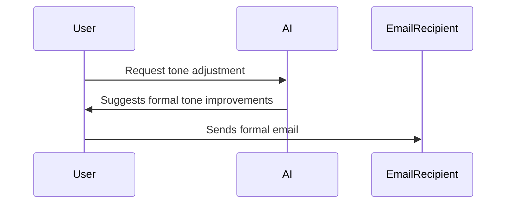

In today’s professional world, effective communication is crucial, and **email** has become the primary mode of interaction in business settings. Whether you’re writing to a colleague, a manager, or a client, the tone of your email plays a significant role in conveying your message clearly and professionally. But finding the right balance between being formal, casual, or persuasive can be tricky.

Fortunately, **AI** techniques and tools are now available to help tailor the tone of your emails, ensuring your message is received the way you intend it. In this blog, we’ll explore how AI can help you write professional emails with tone adjustments, allowing you to customize your emails based on the recipient, context, and purpose.

## The Importance of Tone in Professional Emails

Tone is the underlying emotion or attitude conveyed in the text, and in emails, this can significantly impact the recipient's response. A well-adjusted tone helps:

- **Build rapport:** Whether you're being friendly or formal, the right tone ensures effective communication.
- **Convey professionalism:** A formal tone in business emails exudes respect and authority.
- **Prompt action:** Persuasive emails encourage recipients to take action, whether it's responding, confirming, or making decisions.
- **Foster a positive work environment:** Casual, yet respectful, emails build rapport and create an approachable environment.

However, writing emails with the right tone can be difficult, especially when your emotions or context might be influencing your choice of words. That's where **AI** comes in.

## How AI Can Adjust Tone in Emails

AI-based tools, such as **ChatGPT**, **Grammarly**, and others, use advanced language models and natural language processing (NLP) techniques to analyze text and adjust its tone. These tools can help you write emails with the appropriate tone by suggesting modifications to vocabulary, sentence structure, and style.

### Key Features of AI in Tone Adjustment:

- **Tone Detection:** AI can analyze your email and detect the current tone, offering suggestions to make it more formal, casual, or persuasive.
- **Contextual Suggestions:** AI tools consider the context of your message—such as who you're addressing and the purpose of the email—while making tone adjustments.
- **Style Guide Adherence:** AI tools can ensure that your emails align with a particular style guide, whether it's for professional communication, marketing, or customer service.
- **Persuasiveness:** AI can craft persuasive language to help you encourage action, such as prompting someone to reply to your email or take a specific action.

## Crafting Emails with AI: Examples of Tone Adjustments

Let’s explore how AI can help you craft emails with different tones—whether **formal**, **casual**, or **persuasive**.

### Example 1: Formal Tone

In professional communication, a **formal tone** is often necessary. Whether you're emailing a potential client, making a business proposal, or addressing a senior executive, your language should be respectful, clear, and devoid of slang or overly casual expressions.

**Original Email (Casual Tone):**
> Hi John,  
> Just checking in to see if you've had a chance to look at the proposal I sent you. Would love to hear your thoughts.  

**AI-Adjusted Email (Formal Tone):**
> Dear Mr. Smith,  
> I hope this email finds you well. I wanted to follow up on the proposal I submitted last week and inquire if you’ve had the opportunity to review it. I would greatly appreciate your feedback at your earliest convenience.  

In this example, AI suggested switching from a casual greeting ("Hi John") to a formal one ("Dear Mr. Smith") and refined the wording to make it more polite and respectful.

[**Demo Link**](https://app.grammarly.com/) – Check out how Grammarly can help with tone adjustments.

### Example 2: Casual Tone

When communicating with colleagues or teammates, a **casual tone** is more appropriate. AI tools can help you write more approachable and friendly emails, making the message feel personal and warm.

**Original Email (Formal Tone):**
> Dear Ms. Johnson,  
> I would like to inform you that your request has been processed and will be completed by the end of the day. If you have any questions, feel free to reach out.

**AI-Adjusted Email (Casual Tone):**
> Hey Sarah,  
> Just wanted to let you know that your request is all set and will be wrapped up by the end of the day. Let me know if you need anything else!

Here, the AI adjusted the tone to make the email more friendly and informal, changing the salutation and tone of the message.

[**Demo Link**](https://www.copy.ai/) – Try Copy.ai for crafting casual and friendly emails.

### Example 3: Persuasive Tone

When you need to encourage someone to take immediate action or make a decision, a **persuasive tone** is crucial. AI can help you craft emails that motivate the recipient to respond quickly or agree to your proposal.

**Original Email (Neutral Tone):**
> Hello Rachel,  
> I hope you’re doing well. I wanted to reach out to discuss the upcoming product launch and see if you’re available for a meeting next week.

**AI-Adjusted Email (Persuasive Tone):**
> Hi Rachel,  
> I hope you’re doing well! With the product launch coming up next week, I’d love to schedule a quick meeting to discuss how we can maximize our success. Could you let me know your availability for a 15-minute chat on Monday or Tuesday? Your insights would be invaluable!

The AI’s suggestions aim to create a sense of urgency and highlight the importance of the meeting to make the recipient more likely to agree.

[**Demo Link**](https://www.jasper.ai/) – Experience how Jasper can help you with persuasive email writing.

## Benefits of Using AI for Tone Adjustment in Emails

- **Consistency:** AI helps maintain consistent tone across all communications, ensuring your messaging aligns with your company’s values.
- **Time Efficiency:** AI quickly analyzes your email and suggests tone adjustments, saving you time and effort in manual editing.
- **Improved Communication:** The right tone can help prevent misunderstandings and ensure that your email conveys the intended message.
- **Professional Image:** AI tools ensure that your emails are polished, professional, and suitable for various situations and audiences.

## Conclusion

Mastering the art of email communication is vital for professional success, and AI tools like **ChatGPT**, **Grammarly**, **Copy.ai**, and **Jasper** can make the process much easier. Whether you need a formal, casual, or persuasive tone, these AI tools can help you craft emails that reflect your message’s purpose and your audience’s needs.

By leveraging AI for tone adjustment, you can ensure your emails are both effective and appropriate for any situation, freeing up time for you to focus on the more critical aspects of your work.
