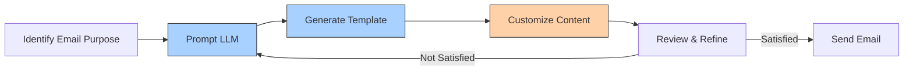
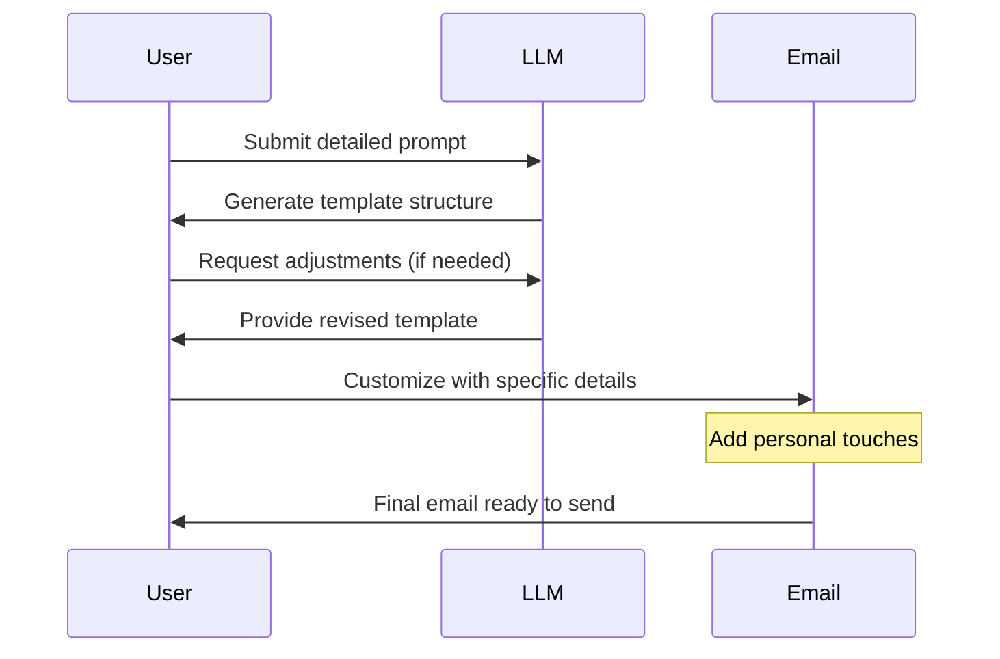

In today's fast-paced business environment, effective email communication is essential, but it can also be time-consuming. Large Language Models (LLMs) like Claude and ChatGPT offer an innovative solution by providing customizable templates and examples that can dramatically streamline your email composition process.

## How LLMs Transform Email Writing

LLMs have revolutionized how professionals approach email writing by offering intelligent assistance that adapts to specific contexts, audiences, and purposes.



## Key Benefits of Using LLM-Generated Email Templates

### Time Efficiency
- Reduce email drafting time by up to 70%
- Eliminate "blank page syndrome" when starting emails
- Quickly generate variations for different recipients

### Consistency and Quality
- Maintain professional tone across all communications
- Ensure proper structure and formatting
- Reduce grammar and spelling errors

### Versatility
- Access templates for virtually any business scenario
- Easily modify templates for specific industries
- Scale from brief messages to comprehensive communications

## Essential Email Templates Generated by LLMs

Let's explore some of the most valuable email templates you can generate using LLMs, complete with examples and customization tips.


# Professional Email Templates Collection

## 1. Introduction/Cold Outreach Template

### Template Structure
```
Subject: [Specific Value Proposition] for [Recipient's Company]

Dear [Recipient Name],

[Personalized opening referencing something specific about their company/work]

I'm [Your Name] from [Your Company], and we specialize in [brief value proposition]. 

Our [product/service] has helped companies like [reference example] achieve [specific result]. I believe we could help [Recipient's Company] with [specific challenge they might face].

Would you be open to a brief conversation next week to explore how we might support your [relevant department/initiative]?

[Specific day/time suggestion] would work well, but I'm happy to accommodate your schedule.

Thank you for considering this request.

Best regards,
[Your Name]
[Your Title]
[Contact Information]
```

### Example Implementation
```
Subject: Improving Sales Team Efficiency for Horizon Technologies

Dear Ms. Johnson,

I was impressed by Horizon's recent expansion into the European market, as mentioned in your LinkedIn post last week.

I'm Alex Chen from ProductivityPro, and we specialize in sales workflow optimization for tech companies.

Our sales enablement platform has helped companies like TechForward reduce their sales cycle by 28% while increasing conversion rates by 15%. I believe we could help Horizon Technologies streamline your international sales processes as you scale your European operations.

Would you be open to a brief conversation next week to explore how we might support your sales team's efficiency?

Tuesday at 2:00 PM ET would work well, but I'm happy to accommodate your schedule.

Thank you for considering this request.

Best regards,
Alex Chen
Head of Business Development
ProductivityPro
alex.chen@productivitypro.com | (555) 123-4567
```

## 2. Follow-Up After Meeting Template

### Template Structure
```
Subject: Thank you for the meeting + Next Steps

Hello [Recipient Name],

Thank you for taking the time to meet with me [yesterday/on date] to discuss [brief meeting topic].

I found our conversation about [specific discussion point] particularly valuable, and I appreciate your insights on [another key point from the meeting].

As discussed, here are the next steps:
- [Action item 1 with owner and deadline]
- [Action item 2 with owner and deadline]
- [Action item 3 with owner and deadline]

I've also attached [any relevant documents] for your reference.

If you have any questions before our next [call/meeting] on [date/time], please don't hesitate to reach out.

Thank you again for your time and input.

Best regards,
[Your Name]
```

### Example Implementation
```
Subject: Thank you for the meeting + Next Steps

Hello Dr. Rivera,

Thank you for taking the time to meet with me yesterday to discuss the potential research collaboration between our institutions.

I found our conversation about combining machine learning approaches with traditional epidemiological methods particularly valuable, and I appreciate your insights on potential funding sources.

As discussed, here are the next steps:
- I will send a draft research proposal by Friday, March 7
- Your team will review the methodology section by March 14
- We will schedule a follow-up call with both research teams by March 21

I've also attached the preliminary data analysis we discussed for your reference.

If you have any questions before our next call on March 21, please don't hesitate to reach out.

Thank you again for your time and input.

Best regards,
Maria Santos
Research Director
```

## 3. Project Update Template

### Template Structure
```
Subject: [Project Name] Update - [Date/Week/Month]

Hi [Recipient/Team],

I wanted to provide an update on the [Project Name] as of [current date].

**Progress Highlights:**
- [Key accomplishment 1]
- [Key accomplishment 2]
- [Key accomplishment 3]

**Current Status:**
We are currently [on track/ahead of schedule/behind schedule] with [X]% of deliverables completed.

**Upcoming Milestones:**
- [Milestone 1] - Due [Date]
- [Milestone 2] - Due [Date]
- [Milestone 3] - Due [Date]

**Challenges/Blockers:**
- [Challenge 1]: [Plan to address]
- [Challenge 2]: [Plan to address]

**Resources Needed:**
- [Resource 1]
- [Resource 2]

Please let me know if you have any questions or need additional information.

Best regards,
[Your Name]
```

### Example Implementation
```
Subject: Website Redesign Project Update - February 27, 2025

Hi Marketing Team,

I wanted to provide an update on the Website Redesign Project as of February 27, 2025.

**Progress Highlights:**
- Completed user testing for the new homepage design with 85% positive feedback
- Finalized the product page templates for all categories
- Integrated the new search functionality with the product database

**Current Status:**
We are currently on track with 65% of deliverables completed.

**Upcoming Milestones:**
- Mobile responsiveness testing - Due March 5
- Content migration for Blog section - Due March 12
- SEO optimization for all new pages - Due March 19

**Challenges/Blockers:**
- Integration with the legacy CRM system: Working with IT to develop custom API
- Homepage load time exceeding targets: Optimizing image compression and caching

**Resources Needed:**
- Additional QA support for cross-browser testing next week
- Final approval on the checkout page design

Please let me know if you have any questions or need additional information.

Best regards,
Jamie Wong
Digital Project Manager
```

## 4. Request for Information/Assistance Template

### Template Structure
```
Subject: Request for [Specific Information/Assistance] - [Brief Context]

Dear [Recipient Name],

I hope this email finds you well.

I'm reaching out because I'm seeking [specific information/assistance] regarding [topic/project]. [Brief explanation of why you need this information/help].

Specifically, I would appreciate if you could:
- [Request 1]
- [Request 2]
- [Request 3 if applicable]

This information will help me/us [explain how it will be used]. The deadline for this project/task is [date], so your response by [date a few days before] would be greatly appreciated.

Please let me know if you need any clarification or if there's someone else I should contact about this matter.

Thank you in advance for your assistance.

Best regards,
[Your Name]
[Title/Department if relevant]
```

### Example Implementation
```
Subject: Request for Q1 Sales Data - Annual Report Preparation

Dear Carlos,

I hope this email finds you well.

I'm reaching out because I'm seeking the Q1 2025 sales data for the Western Region to complete the section of our annual report focusing on regional performance. As the Western Regional Manager, you have the most accurate figures for this analysis.

Specifically, I would appreciate if you could:
- Share the total sales figures broken down by product category
- Provide information on the top three performing locations
- Include any notable client acquisitions or expansions from Q1

This information will help us accurately represent the Western Region's contribution to our overall growth story. The deadline for finalizing the annual report is March 15, so your response by March 10 would be greatly appreciated.

Please let me know if you need any clarification or if there's someone else I should contact about this matter.

Thank you in advance for your assistance.

Best regards,
Priya Sharma
Financial Reporting Analyst
```

## 5. Apology/Service Recovery Template

### Template Structure
```
Subject: Apology regarding [specific issue]

Dear [Recipient Name],

I want to sincerely apologize for [specific issue/problem] that occurred on [date]. I understand this has [specific impact on the recipient], and I take full responsibility for this situation.

[Provide brief, honest explanation without making excuses]

We are taking the following steps to address this issue:
1. [Immediate action taken]
2. [Medium-term solution]
3. [Long-term prevention measure]

To make this right, I would like to [offer specific remedy/compensation if appropriate].

Thank you for your patience and understanding. I value our [relationship/partnership] and am committed to regaining your trust.

If you have any questions or concerns, please contact me directly at [phone number] or [email].

Sincerely,
[Your Name]
[Your Title]
```

### Example Implementation
```
Subject: Apology regarding delayed shipment #45678

Dear Mr. Thompson,

I want to sincerely apologize for the delay in your product shipment #45678 that was supposed to arrive on February 20. I understand this has impacted your ability to complete your project on schedule, and I take full responsibility for this situation.

We experienced an unexpected inventory shortage due to a system error that failed to alert us when stock levels reached our reorder threshold.

We are taking the following steps to address this issue:
1. Your order has been prioritized and shipped today via expedited delivery
2. We're implementing daily manual inventory checks for the next two weeks
3. Our IT team is upgrading the inventory management system to prevent similar issues

To make this right, I would like to offer a 20% discount on this order and free expedited shipping on your next purchase.

Thank you for your patience and understanding. I value our business relationship and am committed to regaining your trust.

If you have any questions or concerns, please contact me directly at (555) 987-6543 or lisa.parker@example.com.

Sincerely,
Lisa Parker
Customer Service Manager
```


## How to Create Custom Templates with LLMs

### Step 1: Define Your Email Purpose
Start by clearly identifying what you want to accomplish with your email:
- Introducing a new product or service
- Requesting information
- Following up with a client
- Providing project updates
- Resolving a customer issue

### Step 2: Craft Effective Prompts

The quality of your prompt directly impacts the usefulness of the template:

#### Basic Template Request Format:
```
Create a professional email template for [purpose] to [recipient type]. Include sections for [key elements]. The tone should be [desired tone].
```

#### Advanced Template Request Format:
```
Create a customizable email template for [specific purpose] addressing [recipient type] with the following parameters:
- Purpose: [detailed description]
- Key points to include: [list specific elements]
- Tone: [formal/conversational/persuasive]
- Length: [brief/moderate/comprehensive]
- Industry context: [your industry]
- Special considerations: [any specific requirements]
```



### Step 3: Customize the Templates
Transform generic templates into personalized communications:
- Replace placeholder text with specific information
- Add company-specific details and branding elements
- Include relevant data points and metrics
- Incorporate recipient-specific references
- Adjust tone based on relationship and context

## Advanced Template Techniques

### Conditional Sections
Ask LLMs to create templates with optional sections that can be included or excluded based on specific scenarios:

**Example prompt:**
```
Create an email template for following up after a sales call with conditional sections for: 1) If they requested pricing, 2) If they asked for a demo, 3) If they mentioned specific concerns.
```

### Response Variants
Generate multiple response options for different recipient reactions:

**Example prompt:**
```
Create three different follow-up email variants for a proposal submission: 1) If they're enthusiastic, 2) If they haven't responded, 3) If they expressed concerns.
```

### Industry-Specific Templates
Tailor templates to reflect industry terminology and concerns:

**Example prompt:**
```
Create a project update email template specifically for healthcare software implementation projects, addressing typical stakeholder concerns and regulatory considerations.
```

## Real-World Application Examples


### Case Study 1: Sales Team Efficiency
A B2B sales team implemented LLM-generated email templates for their outreach sequence, resulting in:
- 40% reduction in email drafting time
- 25% increase in response rates
- Consistent messaging across the sales team
- More personalized communications with prospects

### Case Study 2: Customer Service Templates
A support team created a library of LLM-generated templates for common customer inquiries:
- Reduced response time from 4 hours to 45 minutes
- Improved consistency in tone and solutions offered
- 15% increase in customer satisfaction scores
- Better onboarding experience for new team members

## Tips for Optimizing LLM Email Templates

### 1. Use Specific Context Prompts
```
Create an email template for responding to a customer complaint about delayed shipping. The company policy allows for refunds within 30 days or expedited replacement shipping. The tone should be apologetic but professional.
```

### 2. Request Multiple Variations
```
Generate three variations of a meeting request email - one formal, one conversational, and one brief - so I can choose the most appropriate tone.
```

### 3. Create Templates with Variables
```
Create an email template for project updates with clearly marked variables that I can easily replace with specific information for each update.
```

### 4. Template Libraries Organization

For maximum efficiency, organize your LLM-generated templates into categories:
- Customer communication
- Internal team updates
- Management reports
- Sales and marketing
- HR and administrative

## Common Pitfalls to Avoid

1. **Over-reliance on templates**: Balance efficiency with personalization
2. **Neglecting customization**: Always tailor templates to specific recipients
3. **Inappropriate tone matching**: Ensure the tone fits your relationship with the recipient
4. **Forgetting to proofread**: Always review generated content before sending
5. **Using outdated templates**: Refresh templates periodically to match evolving communication trends

## Getting Started with LLM Email Templates

1. **Identify your most common email types**: Focus on templates that will give you the biggest time savings
2. **Create a prompt library**: Build a collection of effective prompts for different email scenarios
3. **Test with internal recipients first**: Get feedback on template-based emails before using externally
4. **Refine prompts based on results**: Continuously improve your prompts for better templates
5. **Share effective templates**: Create a team resource of successful templates

## Conclusion

LLM-generated email templates represent a significant advancement in professional communication efficiency. By leveraging these powerful tools, you can create consistently high-quality emails in a fraction of the time, allowing you to focus on relationship-building and higher-value activities.

The key to success is finding the right balance between automation and personalization - using templates as a foundation while adding your unique insights and personal touches. With practice, you'll develop a workflow that combines the efficiency of AI with the authenticity of human communication.

Start building your template library today, and watch your email productivity transform.