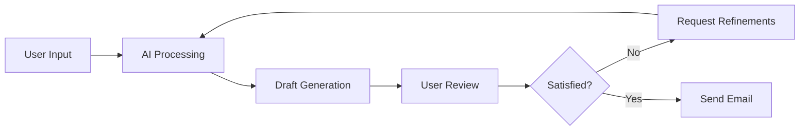

In today's fast-paced professional environment, communication efficiency is paramount. AI assistants like ChatGPT and Claude have emerged as powerful tools to help professionals draft and refine emails with remarkable speed and quality. Let's explore how these tools can transform your email workflow.

## Understanding AI Email Assistants

AI assistants like ChatGPT and Claude use advanced language models to understand context, generate human-like text, and adapt to specific writing styles. This makes them ideal partners for email creation.



## Key Benefits of Using AI for Email

### Time Savings
Research suggests professionals spend an average of 28% of their workday on emails. AI assistants can reduce this significantly by:
- Generating first drafts in seconds
- Handling repetitive responses
- Creating templates that can be customized

### Consistency and Tone Management
AI tools excel at maintaining a consistent tone across communications:
- Setting appropriate formality levels
- Adjusting language for different audiences
- Ensuring brand voice consistency

### Language Enhancement
Even skilled writers benefit from AI's language capabilities:
- Grammar and spelling checks
- Vocabulary suggestions
- Sentence structure improvements
- Clarity enhancements

## How to Use AI Assistants for Email Tasks

### 1. Drafting Emails from Scratch

Simply describe your email needs to the AI assistant:

**Example prompt:** "Draft a professional email to my team announcing our new project management software. Include key points about the transition timeline, required training, and expected benefits."

### 2. Improving Existing Drafts

AI excels at refining what you've already written:

**Example prompt:** "Here's my draft email to a prospective client. Can you make it more concise and professional while emphasizing our unique value proposition?"

### 3. Generating Response Templates

Create frameworks for common email scenarios:

**Example prompt:** "Create three templates for responding to customer inquiries about pricing, with options for different tiers of interest."

## Practical Examples

### Example 1: Converting Bullet Points to Polished Email

**Input:**
```
- Need to inform team about office closure
- Dates: December 24-26
- Emergency contact: IT helpdesk
- Remind about setting out-of-office replies
```

**AI-Generated Output:**
```
Subject: Office Closure Notice: December 24-26

Dear Team,

I'm writing to inform you that our office will be closed from December 24-26 for the holiday season.

During this period, please note:
- The IT helpdesk will be available for emergencies
- Please set your out-of-office replies before leaving
- Regular operations will resume on December 27

Wishing you and your families a wonderful holiday season.

Best regards,
[Your Name]
```

### Example 2: Tone Adjustment


# Email Tone Adjustment Examples

## Original (Too Casual)
```
Hey John,

Just wanted to check if you got a chance to look at that proposal yet? It's been a while and we're kinda waiting on your feedback to move forward with this. Let me know ASAP.

Cheers,
Sarah
```

## AI-Refined (Professional)
```
Dear John,

I'm writing to follow up on the proposal submitted on [date]. As we're planning our next steps based on your feedback, I wanted to check if you've had an opportunity to review the document.

Could you kindly share your thoughts or let me know when we might expect your feedback?

Thank you for your time.

Best regards,
Sarah
```

## Original (Too Formal/Stiff)
```
To Whom It May Concern:

With reference to the aforementioned meeting scheduled for Thursday, March 10th, 2025, I hereby confirm my attendance. I shall arrive punctually at 14:00 hours as specified in your previous correspondence.

Please advise if there are any preparatory materials that require my attention prior to the commencement of said meeting.

Yours faithfully,
Robert Johnson
```

## AI-Refined (Appropriately Warm)
```
Hi Jessica,

I'm writing to confirm my attendance at our team meeting scheduled for Thursday, March 10th at 2 PM.

Please let me know if there's anything I should prepare or review before the meeting.

Looking forward to our discussion!

Best regards,
Robert
```


## Best Practices for Working with AI Email Assistants

### 1. Provide Clear Context
The more information you provide, the better the results:
- Who is the recipient?
- What's your relationship with them?
- What's the purpose of the email?
- Any specific tone requirements?

### 2. Edit the Final Product
Always review AI-generated content before sending:
- Verify factual information
- Add personal touches
- Ensure the tone matches your relationship with the recipient

### 3. Use Iterative Refinement
Get the most from AI through iteration:
- Start with a basic request
- Review the output
- Ask for specific improvements
- Repeat until satisfied

## Comparing ChatGPT vs. Claude for Email Tasks

While both tools excel at email composition, they have different strengths:

| Capability | ChatGPT | Claude |
|------------|---------|--------|
| Tone consistency | Good | Excellent |
| Technical emails | Excellent | Very good |
| Long-form emails | Very good | Excellent |
| Creative suggestions | Excellent | Good |
| Context retention | Good | Excellent |

## Getting Started

1. **Choose your platform**: Both ChatGPT and Claude offer free tiers to get started
2. **Create account profiles**: Set up accounts on your preferred platforms
3. **Install browser extensions**: Consider extensions that integrate these tools with your email client
4. **Create prompts library**: Build a collection of effective prompts for common email tasks

## Conclusion

AI email assistants aren't replacing human communication—they're enhancing it. By leveraging tools like ChatGPT and Claude, professionals can create more effective, efficient, and polished email communications while saving valuable time.

The most effective approach combines AI efficiency with human judgment. Let the AI handle the heavy lifting of drafting and refining language, while you focus on the relationship-building and strategic elements that only humans can provide.

What email challenges are you facing that AI might help with? Start with a simple task today and experience how these tools can transform your communication workflow.