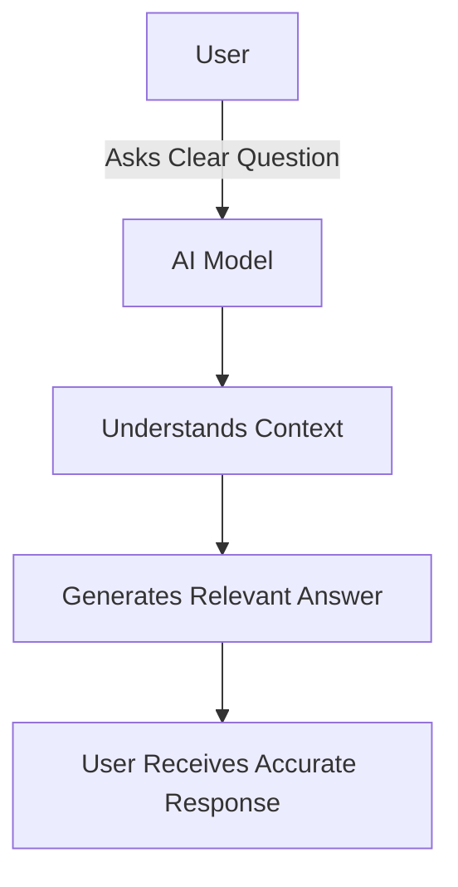
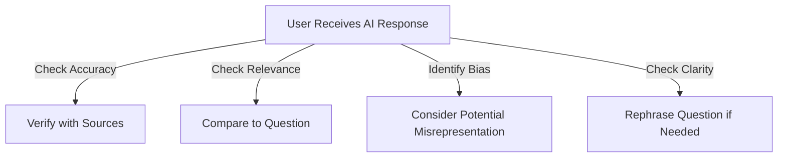

Asking well-structured questions helps in obtaining clearer and more useful AI-generated responses. This guide explores strategies for formulating questions effectively and interpreting AI-generated responses.

---

## **1. Structuring Your Questions**

A well-formulated question provides context and clarity, making it easier for AI to understand and generate a meaningful response.

### **Best Practices for Asking Questions**

| Do's  | Don'ts |
|-------|--------|
| Be specific (e.g., *"How does neural style transfer work?"*) | Be vague (e.g., *"Tell me about AI"*) |
| Provide context (e.g., *"I'm building a chatbot, how can I improve NLP responses?"*) | Ask in isolation (e.g., *"Make my bot better"*) |
| Use correct grammar and punctuation | Use ambiguous language |
| Specify the format of response (e.g., *"Explain in bullet points"*) | Ask multiple unrelated questions at once |

### **Mermaid Diagram: Effective Question Structure**

```

---

## **2. Examples of Well-Structured Questions**

### **Example 1: General Inquiry**
#### **Poorly Structured Question:**
```plaintext
Tell me about programming.
```
#### **Well-Structured Question:**
```plaintext
Can you explain the difference between functional and object-oriented programming with examples?
```
#### **Expected Response:**
```plaintext
Functional programming is a paradigm that treats computation as the evaluation of mathematical functions...
Object-oriented programming (OOP) is based on the concept of objects, which can encapsulate data and behavior...
```

### **Example 2: Coding Assistance**
#### **Poorly Structured Question:**
```plaintext
Fix my Python code.
```
#### **Well-Structured Question:**
```plaintext
I'm getting a `TypeError` in my Python function that adds two numbers. Here's my code:

def add_numbers(a, b):
    return a + b
print(add_numbers(5, "10"))

What is causing this error, and how can I fix it?
```
#### **Expected Response:**
```plaintext
The error occurs because you're trying to add an integer (`5`) and a string (`"10"`). You should convert the string to an integer before performing the addition:

def add_numbers(a, b):
    return a + int(b)

print(add_numbers(5, "10"))
```

---

## **3. Interpreting AI-Generated Responses**

Not all AI responses will be perfect. It’s essential to critically analyze them.

### **Key Considerations:**

| Factor | Description |
|--------|-------------|
| Accuracy | Verify the correctness of the response with additional sources. |
| Relevance | Ensure the response aligns with your intended question. |
| Bias | AI models can inherit biases; be mindful of potential misrepresentations. |
| Clarity | If an answer is unclear, rephrase the question for better results. |

### **Mermaid Diagram: Response Interpretation Process**

---


## **4. Refining Follow-up Questions**

If an AI response isn’t quite right, refining your question can help. Here are some ways to improve follow-ups:

### **Example 1: Getting More Details**
#### **Original Question:**
```plaintext
Explain quantum computing.
```
#### **Follow-up Question:**
```plaintext
Can you explain quantum computing in simple terms with a real-world example?
```

### **Example 2: Correcting AI Misunderstanding**
#### **Initial Question:**
```plaintext
How do black holes form?
```
#### **AI Response (Partial or Confusing):**
```plaintext
Black holes are mysterious objects in space.
```
#### **Refined Question:**
```plaintext
Can you explain the step-by-step process of black hole formation from a dying star?
```

---

## **Final Thoughts**
- **Ask clear and specific questions** to get more relevant AI responses.
- **Critically analyze AI responses** for accuracy and relevance.
- **Refine follow-up questions** when needed to get better insights.


