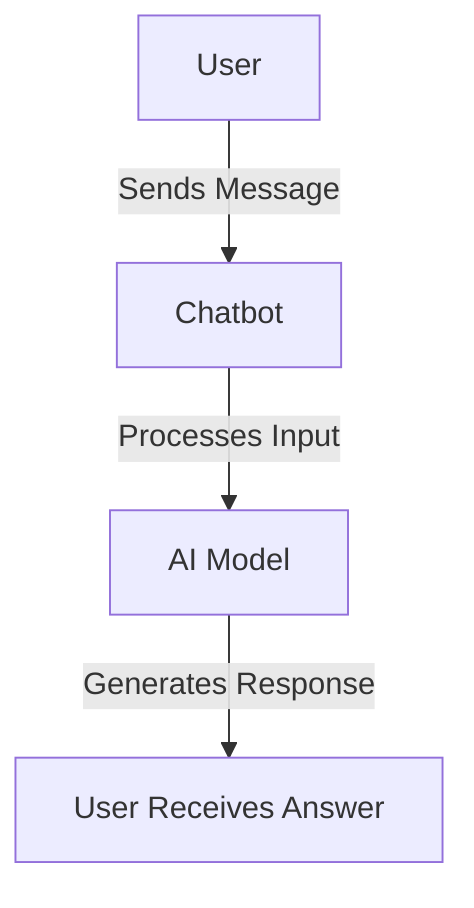
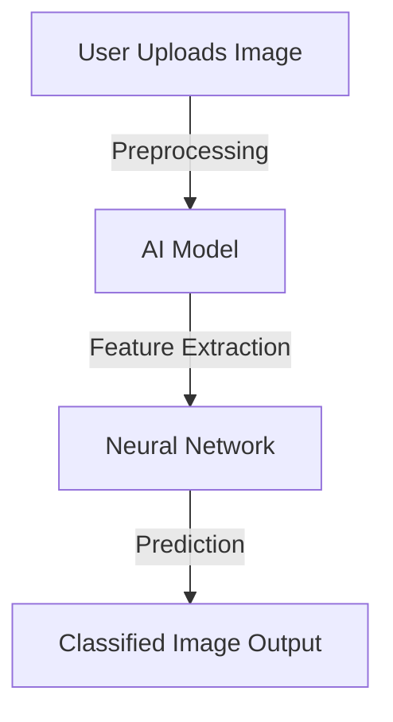

Understanding how to interact with AI can seem complex at first, but with simple examples and hands-on practice, anyone can grasp the basics. This guide provides beginner-friendly examples and practical use cases to get started.

---

## **1. Basic AI Interaction: Chatbot Example**

A chatbot is one of the simplest AI interfaces to interact with. Below is an example of a basic chatbot conversation.

### **Example:**
#### **User Input:**
```plaintext
Hello, how are you?
```
#### **AI Response:**
```plaintext
Hello! I'm just a bot, but I'm here to assist you. How can I help?
```

### **Mermaid Diagram: Chatbot Interaction**

---

## **2. AI-Powered Text Summarization**

Many AI tools can summarize long texts into concise points. Below is an example of how an AI summarization tool works.

### **Example:**
#### **Input:**
```plaintext
Artificial intelligence is a branch of computer science that aims to create machines that can perform tasks that typically require human intelligence. These tasks include learning, reasoning, problem-solving, perception, and language understanding.
```
#### **AI-Generated Summary:**
```plaintext
AI is a field of computer science focused on creating machines that mimic human intelligence in tasks like learning, reasoning, and problem-solving.
```

### **Table: AI Summarization Benefits**

| Feature | Benefit |
|---------|---------|
| Time-Saving | Reduces reading time |
| Accuracy | Extracts key points efficiently |
| Scalability | Handles large texts quickly |

---

## **3. AI for Image Recognition**

AI can analyze and recognize images, classifying them into different categories.

### **Example Code (Python - Using TensorFlow):**
```python
import tensorflow as tf
from tensorflow import keras
from tensorflow.keras.preprocessing import image
import numpy as np

# Load pre-trained model
model = keras.applications.MobileNetV2(weights='imagenet')

# Load an image and preprocess it
img_path = 'dog.jpg'
img = image.load_img(img_path, target_size=(224, 224))
img_array = image.img_to_array(img)
img_array = np.expand_dims(img_array, axis=0)
img_array = keras.applications.mobilenet_v2.preprocess_input(img_array)

# Predict the class
predictions = model.predict(img_array)
label = keras.applications.mobilenet_v2.decode_predictions(predictions, top=1)
print(label)
```
#### **Expected Output:**
```plaintext
[('n02112018', 'Pomeranian', 0.92)]
```
This means the AI classified the image as a **Pomeranian dog** with 92% confidence.

### **Mermaid Diagram: AI Image Processing Flow**

---

## **4. Voice Assistant Example**

AI-powered voice assistants like Siri and Alexa use speech recognition to understand and respond to voice commands.

### **Example Command:**
#### **User Input:**
```plaintext
What's the weather like today?
```
#### **AI Response:**
```plaintext
The weather today is sunny with a high of 25°C.
```

### **Table: Benefits of Voice Assistants**

| Feature | Benefit |
|---------|---------|
| Hands-Free | Enables multitasking |
| Speed | Faster response time than typing |
| Accessibility | Helps people with disabilities |

---

## **Final Thoughts**
- AI is accessible to everyone through **chatbots, text summarization, image recognition, and voice assistants**.
- Practicing with **basic inputs and analyzing AI responses** can help beginners build confidence in AI interactions.
- AI tools are becoming more **user-friendly** and provide immense benefits in everyday tasks.


