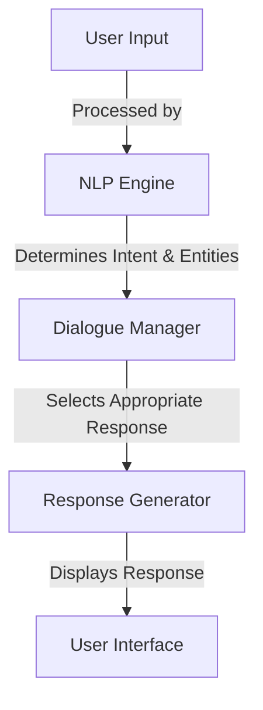
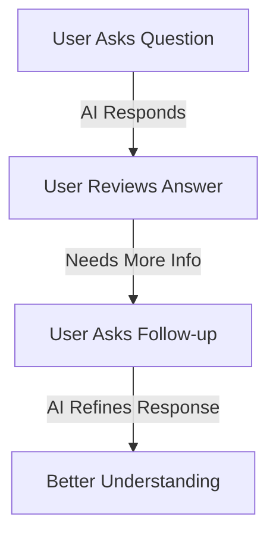

Conversational AI interfaces allow users to interact with AI systems using natural language. This guide explores their design, functionality, and best practices for intuitive navigation.

---

## **1. Components of a Conversational AI Interface**

A conversational AI system consists of multiple components working together to process user inputs and generate responses.

### **Key Components**

| Component  | Function  |
|------------|-----------|
| NLP Engine | Processes and interprets user inputs. |
| Dialogue Manager | Controls the flow of conversation and context. |
| Response Generator | Produces appropriate responses based on input and context. |
| User Interface (UI) | Provides a medium for interaction (text, voice, or visual). |

### **Mermaid Diagram: Conversational AI Flow**

---

## **2. Types of Conversational AI Interfaces**

| Type | Description |
|------|-------------|
| Chatbots | Text-based systems for customer support, FAQs, and automation. |
| Voice Assistants | AI-powered voice recognition systems like Alexa and Google Assistant. |
| Multimodal Interfaces | Combination of text, voice, and visuals for enhanced interaction. |

---

## **3. Best Practices for Navigating AI Interfaces**

### **1. Structuring Inputs for Better Responses**
- Use **clear and concise language**.
- Provide **context** when necessary.
- Avoid **ambiguous or vague queries**.

### **Example:**
#### **Poor Input:**
```plaintext
Tell me about cars.
```
#### **Improved Input:**
```plaintext
Can you explain the differences between electric and gas-powered cars?
```

### **2. Using Follow-ups to Improve Interaction**
- If the AI response is too broad, **ask follow-up questions**.
- Use **confirmation prompts** (e.g., *"Do you mean X or Y?"*).

### **Mermaid Diagram: Effective AI Interaction**

---

## **4. Challenges in Conversational AI**

### **Common Issues and Solutions**

| Challenge | Solution |
|-----------|----------|
| Misinterpretation of Queries | Use clearer and more structured inputs. |
| Lack of Context Retention | Design AI with memory and contextual understanding. |
| Bias in Responses | Train AI on diverse datasets to reduce bias. |

---

## **Final Thoughts**
- **Conversational AI interfaces** enhance user interaction by making AI more accessible.
- **Best practices in input structuring** can improve AI response quality.
- **Understanding AI limitations** helps users navigate challenges effectively.

🚀

